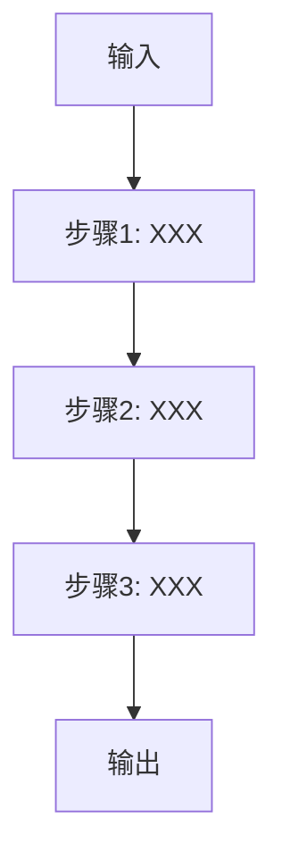

# Development Protocol Standard
# 开发规范标准文档

> **版本**: v1.0  
> **制定日期**: 2026-04-02  
> **适用范围**: 所有项目开发  
> **核心原则**: 先规划后实现，文档驱动开发

---

## 一、四阶段开发流程

每个功能开发必须经历以下四个阶段：

```
┌─────────────────────────────────────────────────────────────────┐
│  Phase 1: Input/Output Planning (输入输出规划)                   │
│  Phase 2: Step-by-Step Design (关键步骤设计)                     │
│  Phase 3: Code Implementation (代码实现)                         │
│  Phase 4: Technical Report (技术报告)                           │
└─────────────────────────────────────────────────────────────────┘
```

**禁止行为**:
- ✗ 直接开始写代码
- ✗ 边写边设计
- ✗ 完成后补文档

**强制要求**:
- ✓ Phase 1和Phase 2文档必须经过用户确认
- ✓ 代码必须与文档一致
- ✓ 技术报告必须包含完整的技术细节

---

## 二、Phase 1: 输入输出规划

### 2.1 输入定义模板

```markdown
### 输入数据

| 字段名 | 类型 | 来源 | 说明 | 必填 |
|--------|------|------|------|------|
| | | | | |

### 输入文件

| 文件名 | 格式 | 路径 | 大小预估 | 检查项 |
|--------|------|------|----------|--------|
| | | | | |

### 外部依赖

| 依赖项 | 版本 | 安装命令 | 备选方案 |
|--------|------|----------|----------|
| | | | |

### 预处理要求

- 数据清洗规则:
- 格式转换规则:
- 缺失值处理:
```

### 2.2 输出定义模板

```markdown
### 主输出

| 字段名 | 类型 | 说明 | 示例值 |
|--------|------|------|--------|
| | | | |

### 辅助输出

| 文件名 | 格式 | 路径 | 说明 |
|--------|------|------|------|
| | | | |

### 输出验证

- 完整性检查:
- 一致性检查:
- 格式检查:
```

### 2.3 接口契约

```python
# 必须定义清晰的函数接口

def process(
    input_data: InputType,  # 输入类型注解
    config: ConfigType,
) -> OutputType:  # 输出类型注解
    """
    功能描述

    Args:
        input_data: 输入数据描述
        config: 配置参数描述

    Returns:
        OutputType: 输出数据结构

    Raises:
        ValueError: 输入验证失败
        ProcessingError: 处理异常
    """
    pass
```

---

## 三、Phase 2: 关键步骤设计

### 3.1 流程图



### 3.2 步骤详细设计

每个步骤必须包含：

```markdown
### 步骤N: 步骤名称

**输入**:
- 数据: xxx
- 格式: xxx

**处理逻辑**:
1. 子步骤1: 说明
2. 子步骤2: 说明

**算法/公式**:
```
公式或伪代码
```

**输出**:
- 数据: xxx
- 格式: xxx

**异常处理**:
- 情况1: 处理方式
- 情况2: 处理方式

**验证方法**:
- 如何验证此步骤正确性
```

### 3.3 数据流图

```
输入文件A ──┐
            ├──→ [处理模块] ──→ 中间结果X ──┐
输入文件B ──┘                               ├──→ [合并模块] ──→ 最终输出
                                            │
输入文件C ──────────────────────────────────┘
```

### 3.4 关键决策点

```markdown
| 决策点 | 条件 | 选项A | 选项B | 选择依据 |
|--------|------|-------|-------|----------|
| | | | | |
```

---

## 四、Phase 3: 代码实现

### 4.1 代码规范

**文件结构**:
```
project/
├── scripts/           # 可执行脚本
├── src/              # 模块代码
│   ├── __init__.py
│   ├── models.py     # 数据模型
│   ├── core.py       # 核心逻辑
│   └── utils.py      # 工具函数
├── tests/            # 测试代码
├── docs/             # 文档
└── config/           # 配置文件
```

**代码要求**:
- 类型注解: 所有函数参数和返回值必须有类型注解
- 文档字符串: 所有模块、类、函数必须有docstring
- 错误处理: 每个可能出错的地方必须有try-except
- 日志记录: 关键步骤必须有日志输出
- 单元测试: 核心函数必须有测试用例

### 4.2 代码审查清单

```markdown
- [ ] 是否符合Phase 1/2的设计文档
- [ ] 是否有完整的类型注解
- [ ] 是否有完整的文档字符串
- [ ] 错误处理是否完善
- [ ] 是否有输入验证
- [ ] 是否有输出验证
- [ ] 是否有日志记录
- [ ] 是否有单元测试
- [ ] 性能是否可接受
```

---

## 五、Phase 4: 技术报告

### 5.1 报告结构

```markdown
# [功能名称] 技术报告

## 一、概述
- 功能目标
- 技术栈
- 版本信息

## 二、输入输出规范
(复制Phase 1的内容，填充实际值)

## 三、关键步骤实现
(复制Phase 2的内容，说明实际实现)

## 四、代码逻辑审查
### 4.1 模块A审查
- 代码位置: `path/to/file.py:line`
- 逻辑说明: xxx
- 审查结果: ✓ 正确 / ⚠️ 注意 / ✗ 需修复

### 4.2 模块B审查
...

## 五、测试结果
### 5.1 单元测试
| 测试项 | 预期结果 | 实际结果 | 状态 |
|--------|----------|----------|------|
| | | | |

### 5.2 集成测试
...

### 5.3 性能测试
...

## 六、发现的问题与修复
| 问题 | 严重程度 | 位置 | 修复方案 | 状态 |
|------|----------|------|----------|------|
| | | | | |

## 七、使用指南
### 7.1 快速开始
### 7.2 参数说明
### 7.3 示例代码

## 八、附录
### 8.1 依赖列表
### 8.2 参考文档
### 8.3 变更日志
```

### 5.2 审查标准

| 维度 | 权重 | 评分标准 |
|------|------|----------|
| 代码结构 | 20% | 模块化、职责清晰 |
| 类型安全 | 20% | 完整类型注解 |
| 错误处理 | 20% | 完善的异常处理 |
| 文档注释 | 20% | 详细docstring |
| 可维护性 | 20% | 易于扩展、测试覆盖 |

---

## 六、检查点与确认机制

### 6.1 阶段检查点

```
Phase 1完成 ──→ 用户确认 ──→ [确认通过] ──→ Phase 2开始
                └─→ [需要修改] ─┘

Phase 2完成 ──→ 用户确认 ──→ [确认通过] ──→ Phase 3开始
                └─→ [需要修改] ─┘

Phase 3完成 ──→ 代码审查 ──→ [审查通过] ──→ Phase 4开始
                └─→ [需要修改] ─┘

Phase 4完成 ──→ 用户验收 ──→ [验收通过] ──→ 功能交付
                └─→ [需要修改] ─┘
```

### 6.2 用户确认模板

```markdown
## 确认事项

### Phase 1: 输入输出规划
- [ ] 输入数据定义正确
- [ ] 输出格式满足需求
- [ ] 依赖项列表完整

### Phase 2: 关键步骤设计
- [ ] 流程图正确
- [ ] 每个步骤的逻辑清晰
- [ ] 异常处理完善

### Phase 3: 代码实现
- [ ] 代码符合设计文档
- [ ] 测试通过
- [ ] 性能可接受

### Phase 4: 技术报告
- [ ] 报告完整
- [ ] 审查结果可信
- [ ] 使用指南清晰

**确认人**: _______________
**确认日期**: _______________
**备注**: _______________
```

---

## 七、附录

### 7.1 快速检查清单

**开始开发前**:
- [ ] 已阅读本规范
- [ ] 已创建Phase 1文档
- [ ] 已获得用户确认

**开发过程中**:
- [ ] 代码符合设计文档
- [ ] 已添加类型注解
- [ ] 已添加错误处理
- [ ] 已添加日志记录

**开发完成后**:
- [ ] 已完成技术报告
- [ ] 已完成代码审查
- [ ] 已通过用户验收

### 7.2 常用模板

见本目录下的 `templates/` 文件夹。

---

**文档结束**

*本规范自2026-04-02起生效，所有新项目必须遵循。*
