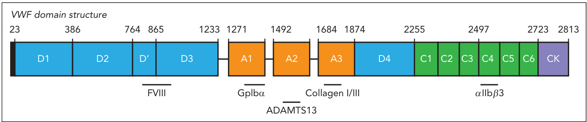
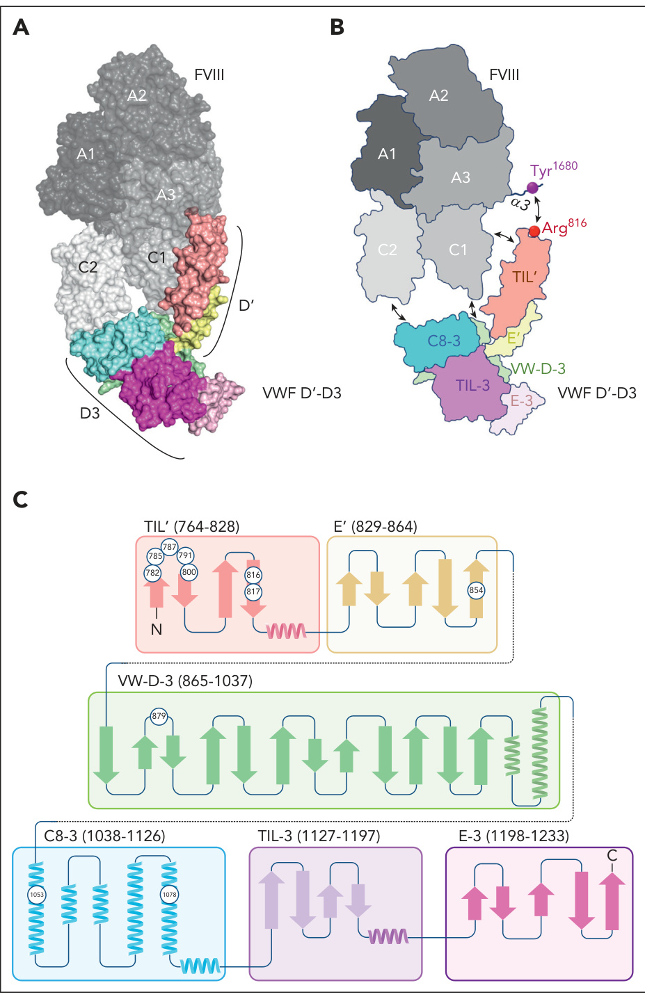
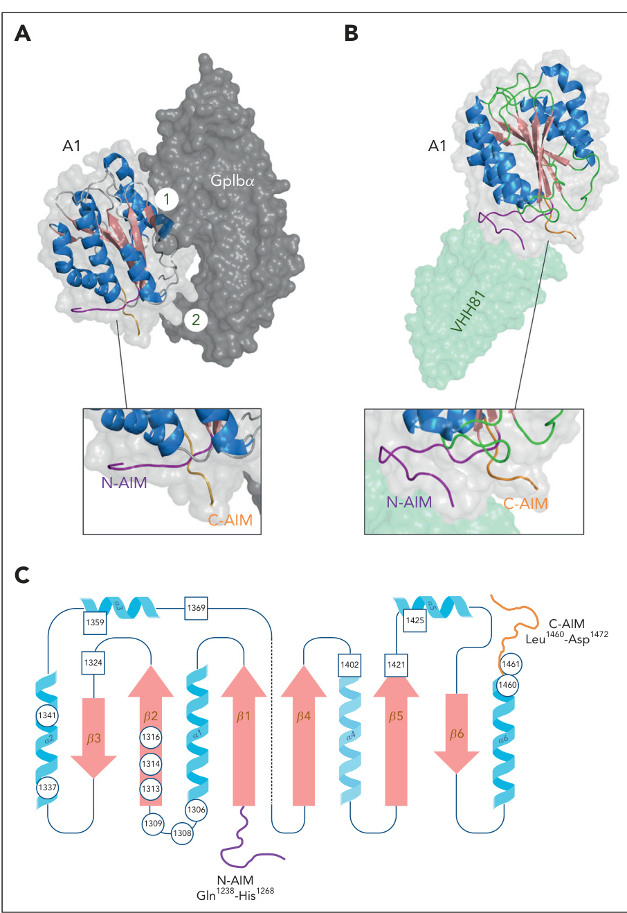
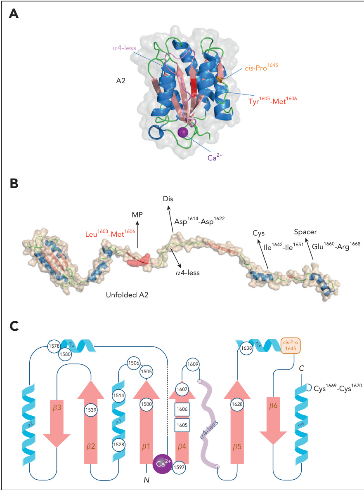
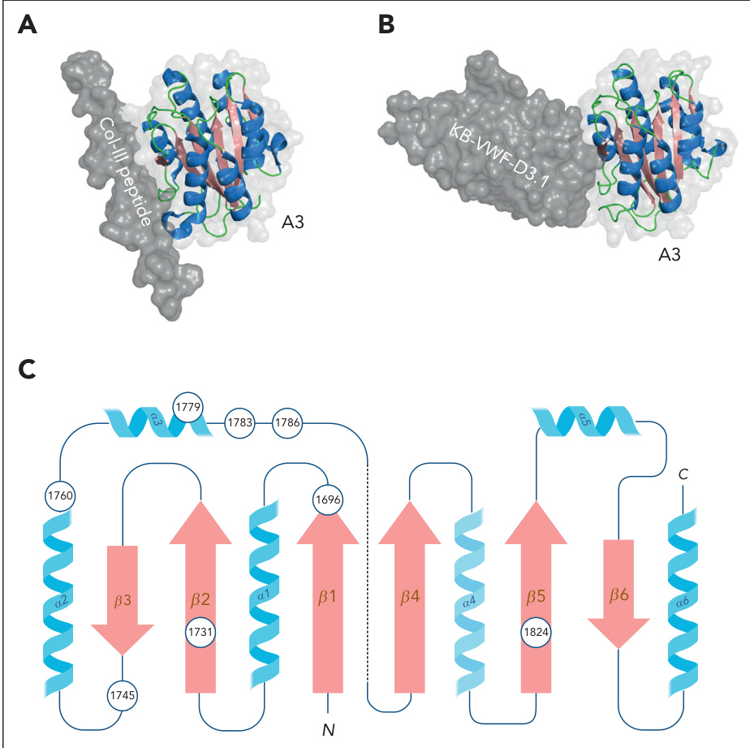
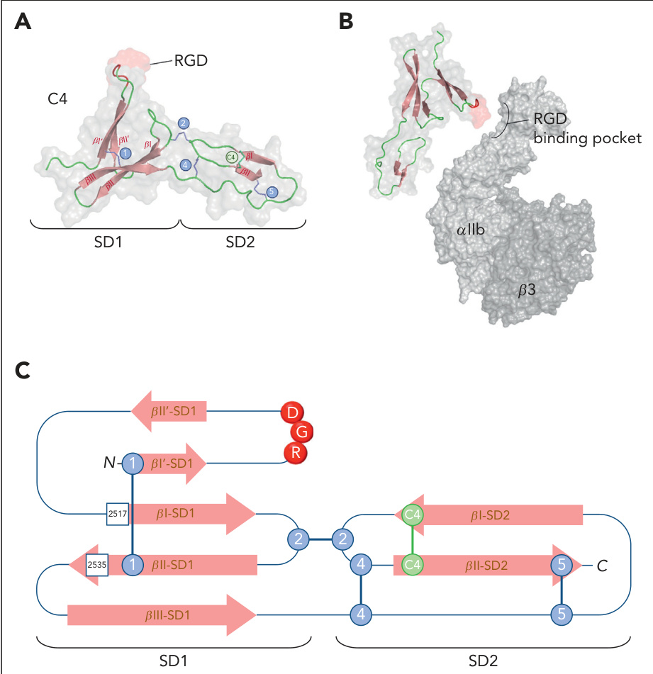

# von willebrand factor, factor viii, and factor ix  

# HOW UNIQUE STRUCTURAL ADAPTATIONS SUPPORT AND COORDINATE THE COMPLEX FUNCTION OF VON WILLEBRAND FACTOR  

PETER j. LENTING, cƗCILE v. DENIS, AND OLIVIER d. CHRISTOPHE jNIVERSITƗ PARIS-SACLAY, inserm, hƗMOSTASE INFLAMMATION THROMBOSE hitH u1176, lE KREMLIN-bICƘTRE, FRANCE  

VON WILLEBRAND FACTOR (vwf) IS A MULTIMERIC PROTEIN CONSISTING OF COVALENTLY LINKED MONOMERS, WHICH SHARE AN IDENTICAL DOMAIN ARCHITECTURE. ALTHOUGH INVOLVED IN PROCESSES SUCH AS INFLAMMATION, ANGIOGENESIS, AND CANCER METASTASIS, vwf IS MOSTLY KNOWN FOR ITS ROLE IN HEMOSTASIS, BY ACTING AS A CHAPERONE PROTEIN FOR COAGULATION FACTOR viii (fviii) AND BY CONTRIBUTING TO THE RECRUITMENT OF PLATELETS DURING THROMBUS FORMATION. tO SERVE ITS ROLE IN HEMOSTASIS, vwf NEEDS TO BIND A VARIETY OF LIGANDS, INCLUDING fviii, PLATELET-RECEPTOR GLYCOPROTEIN LB-Dž, vwf-CLEAVING PROTEASE adamts13, SUBENDOTHELIAL COLLAGEN, AND INTEGRIN Dž-LLB/dž-3. IMPORTANTLY, INTERACTIONS ARE DIFFERENTLY REGULATED FOR EACH OF THESE LIGANDS. HOW ARE THESE BINDING EVENTS ACCOMPLISHED AND COORDINATED? THE BASIC STRUCTURES OF THE DOMAINS THAT CONSTITUTE THE vwf PROTEIN ARE  

# INTRODUCTION  

VON WILLEBRAND FACTOR (vwf) IS AMONG THE LARGEST PROTEINS CIRCULATING IN PLASMA. ALTHOUGH RECOGNIZED TO PARTICIPATE IN PROCESSES SUCH AS INFLAMMATION, ANGIOGENESIS, AND CANCER METASTASIS, vwf IS PREDOMINANTLY KNOWN FOR ITS ROLE IN HEMOSTASIS.1-3 INDEED, ITS DEFICIENCY OR DYSFUNCTION IS ASSOCIATED WITH BLEEDING COMPLICATIONS IN A DISORDER KNOWN AS VON WILLEBRAND DISEASE (vwd). vwf IS SYNTHESIZED AS A SINGLE-CHAIN POLYPEPTIDE WITH A DISTINCT DOMAIN STRUCTURE: d1-d2-d'd3-a1-a2- a3-d4-c1-c2-c3-c4-c5-c6-ck (WITH ck REFERRING TO CYSTEINE KNOT DOMAIN; FGURTTRANSLATL PROCESSING INCLUDES THE REMOVAL OF THE d1-d2 REGION (ALSO KNOWN AS THE vwf PROPEPTIDE) AND THE GENERATION OF HETEROGENEOUSLY SIZED MULTIMERS VIA THE FORMATION OF INTERMOLECULAR DISULFIDE BRIDGES IN THE c-TERMINAL ck DOMAIN AND THE n-TERMINAL d'd3 REGION.6 REGARDING ITS ROLE IN HEMOSTASIS, vwf WILL NEED TO INTERACT WITH VARIOUS LIGANDS, INCLUDING COAGULATION FACTOR vii (fii, PLATELETRECEPTOR GLYCOPROTEIN LBDž (gPLBDž), vwf-CLEAVING PROTEASE adamts13, SUBENDOTHELIAL COLLAGEN, AND INTEGRIN DžLLBdž3 (FIGURE 1).1 IMPORTANTLY, THE INTERACTION WITH EACH OF THESE LIGANDS IS REGULATED IN A DIFFERENT MANNER. FOR INSTANCE, ALTHOUGH vwf SHOULD BIND fviii WITH HIGH AFFINITY IN THE  

FOUND IN HUNDREDS OF OTHER PROTEINS OF PROKARYOTIC AND EUKARYOTIC ORGANISMS. HOWEVER, THE DETERMINATION OF THE 3-DIMENSIONAL STRUCTURES OF THESE DOMAINS WITHIN THE vwf CONTEXT AND ESPECIALLY IN COMPLEX WITH ITS LIGANDS REVEALS THAT EXCLUSIVE, vwf-SPECIFIC STRUCTURAL ADAPTATIONS HAVE BEEN INCORPORATED IN ITS DOMAINS. THEY PROVIDE AN EXPLANATION OF HOW vwf BINDS ITS LIGANDS IN A SYNCHRONIZED AND TIMELY FASHION. iN THIS REVIEW, WE HAVE FOCUSED ON THE DOMAINS THAT INTERACT WITH THE MAIN LIGANDS OF vwf AND DISCUSS HOW ELUCIDATING THE 3-DIMENSIONAL STRUCTURES OF THESE DOMAINS HAS CONTRIBUTED TO OUR UNDERSTANDING OF HOW vwf FUNCTION IS CONTROLLED. wE FURTHER DETAIL HOW MUTATIONS IN THESE DOMAINS THAT ARE ASSOCIATED WITH VON WILLEBRAND DISEASE MODULATE THE INTERACTION BETWEEN vwf AND ITS LIGANDS.  

CIRCULATION, IT NEEDS TO AVOID INTERACTING WITH gPLBDž UNTIL PLATELET RECRUITMENT BECOMES RELEVANT. THE BEAUTY OF THE vwf MOLECULE IS THAT THE KEYS TO UNLOCK DIFFERENT LEVELS OF REGULATION ARE DIRECTLY PRESENT IN ITS STRUCTURE. aT FIRST GLANCE, THE DOMAINS THAT COMPOSE vwf ARE NOT UNIQUE, BECAUSE THE GENERAL FOLDING OF THE a, c, ck, AND d DOMAINS CAN BE FOUND IN MANY PROTEINS IN PROKARYOTIC AND EUKARYOTIC ORGANISMS. HOWEVER, SEVERAL DISTINCT ADJUSTMENTS HAVE BEEN INCORPORATED INTO THE vwf STRUCTURE TO MEET THE NECESSARY REQUIREMENTS REGARDING LIGANDSPECIFIC INTERACTIONS. THE MOST "FAMOUS" ADAPTATION IS THE UNUSUALLY LARGE SIZE OF vwf. ITS LARGE SIZE MAKES vwf SUSCEPTIBLE TO CONFORMATIONAL CHANGES UNDER THE INFLUENCE OF HYDRODYNAMIC FORCES, WHICH IS 1 MECHANISM TO CONTROL vwf FUNCTION.7,8  

WHEN REVIEWING vwf STRUCTURAL STUDIES PERFORMED OVER THE LAST 2 DECADES, THE SECRETS OF THIS FASCINATING MOLECULE HAVE SLOWLY BEEN UNRAVELED, HELPING US TO RECOGNIZE HOW COMPLEXATION BETWEEN vwf AND ITS LIGANDS IS REGULATED. iN THIS REVIEW, WE WILL, THEREFORE, CONCENTRATE ON THE MAIN LIGANDS OF vwf AND DISCUSS HOW ELUCIDATING THE 3-DIMENSIONAL STRUCTURES OF vwf DOMAINS, GENERALLY IN COMPLEX WITH ITS LIGANDS, HAS CONTRIBUTED TO OUR UNDERSTANDING OF HOW vwf FUNCTION IS CONTROLLED. iN ADDITION, THESE INSIGHTS ALSO IMPROVED OUR KNOWLEDGE ON WHY  

  
FIGURE 1. DOMAIN STRUCTURE OF vwf. STRUCTURALLY DEFINED DOMAIN ARCHITECTURE OF vwf, BASED ON ANNOTATION BY ZHOU ET AL.5 DEPICTED ARE APPROXIMATE BINDING SITES FOR THE IGANDS DISCUSSED IN THIS REVIEW.  

CERTAIN MUTATIONS ARE ASSOCIATED WITH vwf DYSFUNCTION AND SUBSEQUENT BLEEDING TENDENCIES.  

# fviii BINDING TO THE d'd3 REGION  

vwf CONTAINS 4 FULL d ASSEMBLIES AND ANOTHER PARTIAL ONE, WHICH TOGETHER ENCOMPASS NEARLY 60% OF THE TOTAL AMINO ACID CONTENT. a CLOSER LOOK AT THESE d ASSEMBLIES HAS REVEALED THE PRESENCE OF 4 DISTINCT STRUCTURES: A VON WILLEBRAND d (vw-d) DOMAIN, A c8-FOLD, A TRYPSIN INHIBITOR-LIKE (til) STRUCTURE, AND AN e MODULE.5 THESE STRUCTURES CAN BE FOUND IN THE d1, d2, d3, AND d4 ASSEMBLIES, WHEREAS THE d' SEGMENT CONTAINS ONLY THE til STRUCTURE AND THE e MODULE. TWO OF THE d ASSEMBLIES, THAT IS THE d'd3 REGION (IDUES SERHR LOCATED n-TERMINALLY IN THE MATURE SUBUNIT AND CONTRIBUTE TO THE MULTIMERIZATION PROCESS BY MAKING INTERSUBUNIT CYSTEINE BONDS WITH A d'd3 REGION OF ANOTHER vwf MOLECULE. 5,9-11 BESIDES ITS ROLE IN vwf MULTIMERIZATION, THE d'd3 REGION IS ALSO CRITICAL TO THE INTERACTION BETWEEN vwf AND fviii. 12 vwf IS A NECESSARY CHAPERONE PROTEIN FOR fviii, PROTECTING IT FROM RAPID CLEARANCE AND PROTEOLYTIC DEGRADATION. INDEED, THE ABSENCE OF vwf IS ASSOCIATED WITH STRONGLY REDUCED fviii LEVELS.13 EXPRESSION OF THE DIMERIC d'd3 PORTION IN vwf-DEFICIENT MICE FULLY NORMALIZED fvii LEVELS, SHOWING THAT THIS REGION HARBORS ALL THE INFORMATION TO BIND fviii. 14 NOTABLY, THE AFFINITY OF THE fviii/vwf INTERACTION IS UNUSUALLY HIGH (kd Š 0.5 Nm), ALLOWING >95% OF fviii TO CIRCULATE COMPLEXED WITH vwf.13,15-17  

ALTHOUGH CLASSIC MUTAGENESIS STUDIES IDENTIFIED AMINO ACIDS INVOLVED IN fviii BINDING,18-21 THE AVAILABILITY OF fviii AND vwf STRUCTURES HAS PROVIDED DETAILED INSIGHT INTO THEIR INTERACTION. FIRST, IN 2 BACK-TO-BACK PUBLICATIONS, CHIU ET AL AND YEE ET AL USED NEGATIVE-STAIN AND SINGLE-PARTICLE ELECTRON MICROSCOPY TO GENERATE LOW-RESOLUTION IMAGES OF THE COMPLEX BETWEEN fviii AND d'd3.22,23 THEY SHOWED THAT THE fviLL LIGHT CHAIN (A3-a3-c1- c2) IS ENVELOPED BY THE d'd3 REGION, WITH THE d3 ASSEMBLY INTERACTING WITH THE c1-c2 DOMAINS AND THE d' SEGMENT BINDING TO THE A3-a3 PORTION. ANOTHER STUDY CONFIRMED THE RELEVANCE OF THE d' SEGMENT IN BINDING fviii AND USED HYDROGEN-DEUTERIUM EXCHANGE MASS SPECTROMETRY AND MUTATIONAL ANALYSIS TO IDENTIFY THE d' aRG782-cYS99 SEGMENT AS PART OF THE fviL-BINDING INTERFACE.24 a COMPREHENSIVE VIEW OF THE d'd3/fviii COMPLEX WAS OBTAINED BY USING A fviii-d'd3 FUSION PROTEIN, DESIGNATED bivv001 (NOW RENAMED EFANESOCTOCOG ALFA).25 bY COMBINING CRYOGENIC ELECTRON MICROSCOPY AND EXISTING STRUCTURES OF fviii AND THE d'd3 REGION, A HIGHRESOLUTION (2.9 ŵ) VISUALIZATION OF THE d'd3/fviii COMPLEX WAS GENERATED (FIGURE 2a-b). THE SUBSTRUCTURES OF THE d'd3 ARE DISTINGUISHABLE, WITH THE c8-3-FOLD BINDING TO THE BOTTOM OF  

THE fviii c2 DOMAIN AND THE vw-d-3 DOMAIN TO THE fviii c1 DOMAIN. FURTHERMORE, THE til' STRUCTURE INTERACTS WITH THE fviii c1 AND a3 DOMAINS, INCLUDING THE ACIDIC A3 REGION. MORE SPECIFICALLY, THE ACIDIC fviii RESIDUES aSP1676 aSP1678 AND aSP1681 INTERACT WITH til' RESIDUES aRG20, aRG8 826 AND 8 RESPECTIVELY, WHEREAS SULFATED fviii-RESIDUE tE Y16800 INTERACTS DIRECTLY WITH til'-RESIDUE aRG816 (FIGURE 2a-b).25  

THE DETAILED STRUCTURE OF THE d'd3/fviii COMPLEX EXPLAINS MANY OF THE MUTATIONS THAT IMPAIR fviii BINDING. FOR EXAMPLE, MUTATIONS WITHIN vwf IN THE aRG782-cYS799 REGION AND AT aRG816 REDUCE fviii BINDING AND ARE KNOWN FOR THEIR ASSOCIATION WITH vwd-TYPE 2n (FIGURE 2c).26-28  

a RELEVANT QUESTION IS WHETHER fviii BINDING IS DEPENDENT ON MULTIMERIZATION. DIMERIC vwf, WHICH IS THE ONLY NATURAL vwf SPECIES THAT LACKS DIMERIZED n-TERMINI, HAS A FIVEFOLD LOWER AFFINITY FOR fviii THAN MULTIMERIC vwf.29 THIS SUGGESTS THAT COVALENT BONDING BETWEEN vwf n-TERMINI ENHANCES fviii BINDING. BECAUSE vwf-fviii-BINDING STUDIES COMPARING PREPARATIONS ENRICHED IN LOW AND HIGH MOLECULAR WEIGHT MULTIMERS IDENTIFIED SIMILAR AFFINITIES FOR fviii; ADDITIONAL MULTIMERIZATION DOES NOT SEEM TO FURTHER IMPROVE fviii BINDING.16 INDEED, THE fviii/vwf RATIO REMAINS RELATIVELY UNCHANGED IN PATIENTS CHARACTERIZED BY A LOSS OF HIGH MOLECULAR WEIGHT MULTIMERS.30  

# g PiBDž BINDING TO THE a1 DOMAIN  

ADJACENT TO THE d'd3 REGION IS THE a1 DOMAIN (RESIDUES tYR1271^ aSP1459), WITH THE n- AND c-TERMINI BEING CONNECTED BY A DISULFIDE BRIGE YcY THIS DOMAIN SHARES STRUCTURAL RESEMBLANCE WITH THE a2 AND a3 DOMAINS IN A VON WILLEBRAND a (vwa)FOLD THAT IS WIDELY SPREEAD AMONG PROTEIN FAMILIES IN EUKARYOTES AND PROKARYOTES. THE GENERAL STRUCTURE CONSISTS OF CENTRAL HYDROPHOBI dž-SHEETS FLANKED BY AMPHIPATHIC Dž-HELICES, MAKING UP A ROSSMANN-LIKE FOLD (FIGURE 3a).34 THE a1 DOMAIN MEDIATES THE BINDING OF vwf TO THE PLATELET-RECEPTOR gPLBDž, AND ITS CRYSTAL STRUCTURE WAS ELUCIDATED IN THE 1990S.35,36 SOLVING THE STRUCTURE OF THE wwf/gPLBDž COMPLEX WAS HAMPERED BECAUSE BOTH PROTEINS DO NOT INTERACT SPONTANEOUSLY, BECAUSE THEIR ASSOCIATION IS SHEAR FORCE DEPENDENT.37 bY USING FRAGMENTS CONTAINING GAIN-OF-FUNCTION MUTATIONS THAT FACILITATE COMPLEXATION, HOWEVER, HUIZINGA ET AL SOLVED THE STRUCTURE OF THE a1 DOMAIN BOUND TO THE n-TERMINAL DOMAIN OF gPLBDž.32 ADDITIONAL STRUCTURES OF vwf/gPLBDž COMPLEXES HAVE SINCE BEEN PRODUCED USING BOTH WILD-TYPE AND OTHER GAIN-OF-FUNCTION VARIANTS.38,39  

THE wf/gPLBDž COMPLEX INVOLVES 2 MAIN INTERACTIVE SITES, 1   
CONTAINING a1-DOMAIN HELIX Dž3, LOOP Dž3dž4, AND STRAND dž3  

  
FIGURE 2. STRUCTURE OF THE d'd3/fviii COMPLEX. (a) THREE-DIMENSIONAL REPRESENTATION OF THE vwf d'd3/fviii COMPLEX DERIVED FROM pdb-DEPOSIT 7kwo.25 FIGURE WAS GENERATED USING p Ymol SOFTWARE. (b) CARTOON IMPRESSION OF THE COMPLEX, HIGHLIGHTING vwf d'd3 SUBDOMAINS. PRINCIPAL INTERACTION INTERFACES ARE INDICATED BY ARROWS. THE DIRECT INTERACTION BETWEEN SULFATED fviii-RESIDUE tYR1680 AND vwf d'-RESIDUE aRG816 IS SHOWN AS WELL. (c) TWODIMENSIONAL REPRESENTATION OF THE d'd3 SUBDOMAINS. CIRCLES INDICATE POSITIONS OF RESIDUES WHERE MUTATIONS HAVE BEEN ASSOCIATED WITH REDUCED fviii BINDING IN PATIENTS WITH VON WILLEBRAND DISEASE-TYPE 2n. FIGURE PANEL b ADAPTED FROM FULLER ET AL.25  

(INTERACTIVE SITE ) AND A SECOND ONE CONTAINING a1-DOMAIN LOOPS Dž1dž2, dž3Dž2, AND Dž3dž4, LOCATED AT THE BOTTOM FACE OF THE a1 DOMAIN (INTERACTIVE SITE 2; FIGURE 3a-b). THE STRUCTURE OF THE COMPLEX REVEALED INSIGHTS INTO HOW DIFFERENT MUTATIONS AFFECT BINDING BETWEEN BOTH PROTEINS. FIRST, MUTATIONS IN THE a1 DOMAIN OR IN gPLBDž RESULTING IN A LOSS OF FUNCTION (ASSOCIATED WITH vwdTYPE 2m OR BERNARD-SOULIER SYNDROME, RESPECTIVELY) ARE FOUND WITHIN THE RESPECTIVE INTERACTIVE SITES.32 SECOND, GAIN-OF-FUNCTION MUTATIONS IN gPLBDž KNOWN TO PROVOKE PLATELET-TYPE wd WERE FOUND WITHIN A UNIQUE 16-RESIDUE dž-HAIRPIN CONFORMATION THAT PENETRATES INTO INTERACTIVE SITE 1 OF THE a1 DOMAIN. iN THE UNBOUND STATE, THIS REGION ADOPTS A DISORDERED OR Dž-HELICAL STATE, WHEREAS THE dž-HAIRPIN STRUCTURE IS FAVORED FOR vwf BINDING.32,38 MUTATIONS IN THIS REGION (EG, mET239vAL) STABILIZE THE dž-HAIRPIN STRUCTURE, CAUSING SPONTANEOUS BINDING OF gPLBDž TO vwf.  

SURPRISINGLY, NONE THE GAIN-OF-UCION MUTATIONS WITHIN THE a1 DOMAIN ASSOCIATED WITH vwd-TYPE 2b ARE LOCATED WITHIN EITHER INTERACTIVE SITE, SUGGESTING THAT OTHER REGIONS WITHIN THE a1 DOMAIN ARE INVOLVED IN REGULATING gPLBDž BINDING. INSIGHT INTO THE UNDERLYING MECHANISM WAS OBTAINED WHEN RECOMBINANT a1- DOMAIN FRAGMENTS WITH DIFFERENTLY SIZED FLANKING PEPTIDES WERE COMPARED FOR gPLBDž BINDING. 40,41 THE SHORTER THE FLANKING PEPTIDE, THE MORE EFFICIENT THE a1 DOMAIN BINDS gPLBDž. THE MOLECULAR BASIS BY WHICH THE FLANKING PEPTIDES CONTROL a1-gPLBDž INTERACTIONS WAS UNRAVELED BY lI ET AL.33,42,43 THEY DEMONSTRATED THAT RESIDUES gLN1238^hIS1268 AT THE n-TERMINUS OF THE a1 DOMAIN INTERACT DIRECTLY WITH RESIDUES LEU 460-aSP1472 AT THE c-TERMINUS OF THE a1 DOMAIN. THIS STRUCTURE IS REFERRED TO AS AUTOINHIBITORY MODULE (aim), AND IT BLOCKS ACCESS OF gPLBDž TO INTERACTIVE SITE 2 AT THE BOTTOM OF THE a1 DOMAIN.33,42 UNDER THE PRESSURE OF  

  
FIGURE 3. STRUCTURE OF THE a1/gPLBDž COMPLEX. (a) THREEDIMENSIONAL REPRESENTATION OF THE wwf a1 DOMAIN/gPLBDž COMPLEX DERIVED FROM pdb-DEPOSIT 1m1o.32 n- AND c-TERMINAL FLANKING PEPTIDE (n-aim AND c-aim) ARE COLORED IN PURPLE AND ORANGE, RESPECTIVELY; 1 AND 2 REFER TO INTERACTIVE SITES AND 2, RESPECTIVELY. FIGURE WAS GENERATED USING p Ymol SOFTWARE. (b) THREE-DIMENSIONAL REPRESENTATION OF THE a1 DOMAIN IN COMPLEX WITH vhh81 (A SEQUENCE IDENTICAL ANALOG OF CAPLACIZUMAB; PALE GREEN) DERIVED FROM pdb-DEPOSIT 7a6o.33 vhh81/CAPLACIZUMAB STABILIZES THE CONFORMATION OF THE n-aim/c-aim INTERACTION, THEREBY PREVENTING BINDING OF gPLBDž TO INTERACTIVE SITE 2. FIGURE WAS GENERATED USING p Ymol SOFTWARE. (c) TWO-DIMENSIONAL REPRESENTATION OF THE a1 DOMAIN. CIRCLES INDICATE POSITIONS OF RESIDUES WHERE MUTATIONS HAVE BEEN ASSOCIATED WITH INCREASED gPLBDž BINDING IN PATIENTS WITH VON WILLEBRAND DISEASE-TYPE 2b. SQUARES INDICATE POSITIONS OF RESIDUES WHERE MUTATIONS HAVE BEEN ASSOCIATED WITH REDUCED gPLBDž BINDING IN PATIENTS WITH VON WILLEBRAND DISEASE-TYPE 2m. NOTE, IN THE 3-DIMENSIONAL SPACE, THE n- AND c-TERMINAL ENDS OF THE a1 DOMAIN ARE IN CLOSE VICINITY VIA A DISULFIDE BRIDGE BETWEEN cYS1272 AND cYS1458.  

HYDRODYNAMIC FORCES, THE aim PEPTIDES DISSOCIATE, THEREBY EXPOSING gPLBDž-INTERACTIVE SITE 2 (FIGURE 3a-b).43 iT IS NOTEWORTHY THAT RISTOCETIN, AN ANTIBIOTIC THAT INDUCES vwf/gPLBDž BINDING, IS KNOWN TO INTERACT WITH PEPTIDES cYS1237^pRO1251 AND GLU 14663aSP 1472 BOTH OF WHICH ARE CONTAINED WITHIN THE aim.44 iT SEEMS CONCEIVABLE THAT RISTOCETIN DESTABILIZES THE aim STRUCTURE TO INDUCE gPLBDž BINDING. IMPORTANTLY, MUTATIONS KNOWN TO BE ASSOCIATED WITH vwd-TYPE 2b ARE GENERALLY LOCATED WITHIN OR NEAR THE aim AND DISRUPT THE INTERACTION BETWEEN BOTH PEPTIDES, PROVIDING AN EXPLANATION FOR SPONTANEOUS BINDING OF THESE MUTANTS TO gPLBDž (FIGURE 3c).  

TOGETHER, THESE STUDIES SHOW THAT CONFORMATIONAL CHANGES INTHE IMMEDIATE SURROUNDING OF THE a1 DOMAIN CONTROL ITS INTER-ACTIONS WITH gPLBDž. INTERESTINGLY, A NUMBER OF NANOBODIES HAVEBEEN DESCRIBED THAT SUPPORT THIS NOTION. FIRST, HULSTEIN ET ALDESCRIBED AN a1 DOMAIN-DIRECTED NANOBODY, NAMED au-vwfA-11, THAT ONLY BINDS vwf IN A gPLBDž-BINDING CONFORMA-TION. 45 THIS NANOBODY HAS BEEN USED TO DETERMINE THE ACTIVE  

CONFORMATION OF vwf IN A SPECTRUM OF DISEASES.46 ANOTHEREXAMPLE IS CAPLACIZUMAB, A BIVALENT NANOBODY THAT INHIBITSvwf-gPLBDž INTERACTIONS AND IS APPROVED FOR TREATMENT OFTHROMBOCYTOPENIC THROMBOTIC PURPURA.47,48 a MONOVALENTVARIANT OF CAPLACIZUMAB (DESIGNATED vhh81) WAS USED TO MAKEA COCRYSTAL WITH THE a1 DOMAIN. vhh81 BINDS TO AND STABILIZESTHE aim STRUCTURE, THEREBY PREVENTING ITS DISSOCIATION UNDERSHEAR STRESS (FIGURE 3b). aS SUCH, EXPOSURE OF INTERACTIVE SITE 2AND SUBSEQUENT gPLBDž BINDING ARE INHIBITED.33 ANOTHER NANO-BODY DESIGNATED 6d12 ALSO BINDS TO THE aim BUT HAS THEOPPOSITE EFFECT OF CAPLACIZUMAB: 6d12 PROMOTES DISSOCIATION OFTHE aim PEPTIDES, CONVERTING vwf INTO AN ACTIVE gPLBDž-BIND-ING CONFORMATION.43 APPARENTLY, NANOBODIES ARE VALUABLE TOOLSTO MONITOR CONFORMATIONAL CHANGES IN GENERAL AND IN vwf INPARTICULAR, AND ANOTHER EXAMPLE WILL BE DISCUSSED WHENADDRESSING THE vwf a3 DOMAIN.  

KNOWING THAT SHEAR FORCES ARE NEEDED TO UNBLOCK gPLBDž-INTERACTIVE SITES, THE QUESTION FOLLOWS WHETHER THIS PROCESS IS  

MULTIMER DEPENDENT. iN THE 1980S, CHOPEK ET AL DEMONSTRATED THAT gPLBDž BINDING IS STRICTLY MULTIMER-SIZE DEPENDENT, IN THAT LOW MOLECULAR WEIGHT MULTIMERS ARE TOO SMALL TO SUPPORT gPLBDž- DEPENDENT PLATELET ADHESION. 49 THIS EFFECT IS PARTICULARLY VISIBLE IN PATIENTS DISPLAYING IMPAIRED MULTIMERIZATION AND ASSOCIATED BLEEDING COMPLICATIONS (vwd-TYPE 2a). iT IS ASSUMED THAT UNFOLDING OF vwf IS SIZE DEPENDENT, WITH LARGER MULTIMERS BEING MORE SENSITIVE TO HYDRODYNAMIC FORCES THAN SMALLER MULTIMERS.7,8  

# adamts13 BINDING TO THE a2 DOMAIN  

THE a2 DOMAIN (DUE aRG1ER SPECIFIC ROLE INREGULATING vwf FUNCTION AND MULTIMER SIZE. STRUCTURALLY, THE a2DOMAIN DIFFERS FROM OTHER vwa DOMAINS BY LACKING THE DISULFIDEBRIDGE THAT CONNECTS THE n- AND c-TERMINAL ENDS OF THEDOMAIN.50 THIS ALLOWS THE a2 DOMAIN TO HAVE A MORE FLEXIBLESTRUCTURE AND ADAPT ITS CONFORMATION WHEN EXPOSED TO HYDRO-DYNAMIC FORCES, A NECESSARY CAPACITY KNOWING THAT PROTEOLYTICREGULATION OF vwf MULTIMERIC SIZE OCCURS VIA HYDROLYSIS OF THEtYR1605^ -mET1606 PEPTIDE BOND BY THE METALLOPROTEASEadamts13.50  

THE CRYSTAL STRUCTURE OF THE a2 DOMAIN REVEALED A NUMBER OFRELEVANT DIFFERENCES COMPARED WITH OTHER MEMBERS OF THE vwaFAMILY (FIGURE 4a).50 FIRST, THE CENTRAL Dž4-HELIX IS ABSENT IN THE a2DOMAIN AND IS REPLACED BY A LOOP LACKING IN SECONDARY STRUCTURE(REFERRED TO AS Dž4-LESS LOOP) THAT IS ABOUT 6 ŵ AWAY FROM THEadamts13 CLEAVAGE SITE (FIGURE 4a). SECOND, THE a2 DOMAINCONTAINS A UNIQUE VICINAL DISULFIDE BOND BETWEEN RESIDUEScYS 1669^CYS 167050 THIRD, A DISTINCTIVE ABIDIN IS PRE-SENT, COORDINATED BY RESIDUES IN THE 1-SHEET (ASP), THE DžHELIX (aSP1596 AND aRG597), AND THE Dž3dž4-LOOP (aLA1600 ANDaSN 1602. FIGURE 4a).51,52 FINALLY, AN UNUSUAL CIS-PRO RESIDUE ISPRESENT AT POSITION 1645 (FIGURE 4a).50 EACH OF THESE FEATURESSEEMS TO BE A FUNCTIONAL ADAPTATION REGULATING EXPOSURE OF THEtYR1605^mET1606 CLEAVAGE SITE. REGARDING THE Dž4-LESS LOOP, ITREDUCES ACCESS OF adamts13 TO THE SCISSILE BOND IN THE FOLDEDSTATE, WHEREAS ITS FLEXIBLE NATURE ALLOWS IT TO PROMPTLY MOVEAWAY FROM tYR1605-mET1606 DURING THE UNFOLDING OF THE a2DOMAIN.SIMULTANEOUSLY, THIS LOOP MAY REFOLD BACK OVER THEdž4-STRAND LESS RAPIDLY THAN IT WOULD IF IT WERE AN Dž-HELIX STRUCTURE,LEAVING SUFFICIENT TIME FOR adamts13 TO CLEAVE ITS TARGET.50fURTHERMORE, THE CIS-pRO1645 IS SUSPECTED TO DELAY REFOLDING OFTHE a2 DOMAIN.50 THE VICINAL DISULFIDE BOND ADDS RIGIDITY TO THEc-TERMINAL END OF THE a2 DOMAIN, INCREASING THE ENERGETICBARRIER FOR THE DOMAIN TO UNFOLD. SIMILARLY, THE cA}\`2+ SITE CON-TRIBUTES TO THE STABILITY OF THE a2-DOMAIN STRUCTURE, RESULTING INFURTHER RESISTANCE TO UNFOLDING.51,52 REMOVING THE cAÀ+-BINDINGSITE OR THE VICINAL DISULFIDE BRIDGE INDEED PROVOKES PREMATUREUNFOLDING AND INCREASES SENSITIVITY TO PROTEOLYSIS BYadamts13.52,53 iN CONTRAST, INTRODUCING AN ARTIFICIAL COVALENTCONNECTION BETWEEN THE dž1- AND dž2-SHEETS IMPAIRS UNFOLDINGAND PREVENTS adamts13-MEDIATED PROTEOLYSIS.54  

  
FIGURE 4. STRUCTURE OF THE a2 a2 DOMAIN. (a) THREE-DIMENSIONAL REPRESENTATION OF THE vwf a2 DOMAIN DERIVED FROM pdbDEPOSIT 3zqk.51 THE tYR1605-mET1606 SCISSILE BOND IS IN RED, THE Dž4-LESS Dž4-LESS LOOP IN VIOLET, THE UNIQUE cA2+-ION IS IN PURPLE, AND CIS-pRO1645 IS IN ORANGE. FIGURE WAS GENERATED USING p Ymol SOFTWARE. (b) CARTOON IMPRESSION THE a2 DOMAIN IN ITS UNFOLDED CONFORMATION. ONCE UNFOLDED, THE a2 DOMAIN EXPOSES SEVERAL INTERACTIVE SITES FOR adamts13, ALLOWING THE tYR5-mET1606 SCISSILE BOND TO BE HYDROLYZED BY THE adamts13 METALLOPROTEASE DOMAIN (mp). OTHER INTERACTIVE SITES INVOLVE THE Dž4- LESS LOOP RESIDUES aSP1614^aSP1622 INTERACTING WITH THE DISELIHE I BINDING TO THE CYSTEINE-RICH DOMAIN (CYS), AND THE Dž6-HELIX RESIDUES gLU1660aRG168ASSOCIATING TO THE SPACER DOMAIN OF adamts13. (c) TWO-DIMENSIONAL REPRESENTATION OF THE a2 DOMAIN INCLUDING THE cAÀ BINDING SITE AND THE VICINAL DISULFIDE BRIDGE, BOTH BEING UNIQUE TO THE a2 DOMAIN. THE tYR1605^ mET1606 SCISSILE BOND IS LOCATED IN THE MIDDLE OF THE dž4-STRAND. CIRCLES INDICATE POSITIONS OF RESIDUES WHERE MUTATIONS HAVE BEEN ASSOCIATED WITH INCREASED adamts13-MEDIATED DEGRADATION IN PATIENTS WITH GROUP 2 VON WILLEBRAND DISEASE-TYPE 2a. iN CONTRAST TO THE a1 AND a3 DOMAINS, THE a2 DOMAIN LACKS A DISULFIDE BRIDGE THAT CONNECTS THE n- AND c-TERMINI OF THIS DOMAIN.  

ONCE UNFOLDED, THE a2 DOMAIN CONTAINS AN EXTENDED INTERAC-TIVE SITE FOR SEVERAL DOMAINS THAT ARE CONTAINED WITHINadamts13. iN FACT, THE COMPLETE INTERACTION INTERFACE EXTENDSBEYOND THE a2 DOMAIN AND ALSO INVOLVES REGIONS WITHIN THE d4-ck FRAGMENT OF vwf, 55 AN ASPECT WHICH WILL NOT BE DISCUSSED INTHIS REVIEW. WITHIN THE UNFOLDED a2 DOMAIN, THE dž4-SHEET RESI-DUES lEU1603-mET1606 ARE ACCESSIBLE FOR THE ACTIVE SITE OF THEadamts13 METALLOPROTEASE DOMAIN, PERMITTING HYDROLYSIS OFTHE tYR1605^ -mET1606 SCISSILE BOND.56,57 FOR THIS PROCESS TO PRO-CEED EFFICIENTLY, THE Dž4-LESS LOOP RESIDUES aSP1614^aSP1622INTERACT WITH THE DISINTEGRIN DOMAIN, THE Dž5-HELIX/dž6-SHEETREGION LLE1642^LLE 1651 BINDS TO THE CYSTEINE-RICH DOMAIN, ANDTHE Dž6-HELIX RESIDUES gLU1660-aRG1668 ASSOCIATE WITH THE SPACERDOMAIN OF adamts13 (FIGURE 4b).56,57  

GIVEN THE STRICT CONTROL OF THE a2-DOMAIN CONFORMATION, IT IS UNSURPRISING THAT THIS REGULATION CAN BE DISTURBED BY A WIDE RANGE OF MUTATIONS (FIGURE 4c). FOR EXAMPLE, SOME MUTATIONS WILL PROMOTE EXPOSURE OF THE OTHERWISE BURIED CLEAVAGE SITE (SUCH AS mET1528vAL OR GLU 1638lYS), WHEREAS OTHERS WILL DELAY THE REFOLDING OF THE a2 DOMAIN (EG, aRG1597tRP), PROLONGING THE TIME THAT adamts13 CAN CLEAVE THE tYR1605-mET1606 BOND.58 THESE MUTATIONS ULTIMATELY RESULT IN INCREASED adamts13 MEDIATED vwf DEGRADATION AND ARE REFERRED TO AS GROUP 2 wwd-TYPE 2a MUTATIONS. PATIENTS CARRYING SUCH MUTATIONS DISPLAY A LOSS OF HIGH MOLECULAR WEIGHT MULTIMERS AND AN INCREASED RISK OF BLEEDING. INCREASED vwf DEGRADATION IS ALSO COMMON IN vwd-TYPE 2b.59  

vwf DEGRADATION IS FURTHER ENHANCED UPON BINDING OF fviii OR gPLBDž, SUGGESTING THAT THESE LIGANDS MODULATE THE UNFOLDING OR REFOLDING OF THE a2 DOMAIN.60,61 THE SUSCEPTIBILITY TO adamts13-MEDIATED PROTEOLYSIS IS MULTIMER-SIZE DEPENDENT. LARGER MULTIMERS UNFOLD MORE EASILY THAN SMALLER MULTIMERS WHEN EXPOSED TO IRREGULAR FLOW, ALLOWING adamts13 TO ATTACK THE PROTEOLYSIS SITE.7,8 THIS FEATURE IS PARTICULARLY VISIBLE IN PATIENTS MANIFESTING DISTURBED BLOOD FLOW; FOR EXAMPLE, IN PATIENTS WITH SEVERE AORTIC STENOSIS OR THOSE RECEIVING MECHANICAL CIRCULATORY SUPPORT. THESE PATIENTS ARE OFTEN CHARACTERIZED BY INCREASED vwf DEGRADATION, WITH A VISIBLE LOSS OF THE HIGH MOLECULAR WEIGHT MULTIMERS.62,63  

# COLLAGEN BINDING TO THE a3 DOMAIN  

THE a3 DOMAIN SPANS RESIDUES pRO1684^sER1873, CONTAINING A DISULFIDE BRIDGE THAT CONNECTS THE n- AND c-TERMINUS OF THIS DOMAIN (CYS 166cYS 1872. THE a3 DOMAIN MEDIATES BINDING TO COLLAGEN TYPES AND iii. 64 THE CRYSTAL STRUCTURE OF THE a3 DOMAIN WAS SOLVED INDEPENDENTLY BY 2 GROUPS, ALLOWING THEM TO CONFIRM THE TYPICAL wwa-FOLD WITH ALTERNATING Dž-HELICES AND dž-SHEETS.65,66 a POTENTIAL COLLAGEN-BINDING SITE INVOLVING THE dž3-SHEET AND THE Dž2- AND Dž3-HELICES WAS IDENTIFIED VIA EXTENSIVE MUTATIONAL  

ANALYSIS.67 THE IDENTIFICATION OF THE EXACT COLLAGEN INTERACTIVE SITEWAS FACILITATED WHEN A COLLAGEN iii PEPTIDE WAS IDENTIFIED THATSPECIFICALLY BINDS TO vwf.68 THIS PEPTIDE WAS USED TO GENERATE ACOCRYSTAL CONTAINING THE a3-DOMAIN/COLLAGEN PEPTIDE COMPLEX(FIGURE 5a-b).69 THE COLLAGEN PEPTIDE INDEED BINDS TO THE REGIONENCOMPASSING THE dž3-SHEET AND THE Dž2/Dž3-HELICES, COVERING ASURFACE \~24 ŵ WIDE AND 30 ŵ LONG. iN TOTAL, 14 AMINO ACIDS WITHINTHE a3 DOMAIN HAVE BEEN IDENTIFIED TO DIRECTLY INTERACT WITH THECOLLAGEN PEPTIDE. 69 ANALYSIS OF THE COMPLEX ALSO ALLOWED FOR THEIDENTIFICATION OF COMPLEMENTARY AMINO ACIDS IN COLLAGEN AND iiiINVOLVED IN BINDING TO wf. PARTICULARLY, THE STRUCTURE HAS HELPEDTO EXPLAIN WHY BOTH COLLAGEN AND iii ARE ABLE TO BIND vwf AT THESAME SITE DESPITE THEIR STRUCTURAL DIFFERENCES (FOR DETAILS SEEbRONDIJK ET AL69).  

UNEXPECTEDLY, ONLY 2 PATIENT MUTATIONS HAVE BEEN IDENTIFIEDTHAT ARE DIRECTLY WITHIN THE INTERACTIVE SURFACE: vAL1760LLE ANDaRG1779l; ALTHOUGH IT HAS NOT SPECIFICALLY BEEN REPORTEDWHETHER THESE MUTATIONS INDEED AFFECT COLLAGEN BINDING.PATIENT MUTATIONS THAT HAVE BEEN DESCRIBED TO MODULATECOLLAGEN BINDING ARE ACTUALLY OUTSIDE THIS SURFACE (LEU 1696aRG,SER 1731tHR, tRP1745lYS, sER1 1783aLA, HIS 1786aSP, AND PRO 1824hIS;FIGURE 5c).71-75 THE UNDERLYING MECHANISM BY WHICH THEYIMPAIR COLLAGEN BINDING IS YET UNCLEAR BUT MAY BE RELATED TO ANINDIRECT DISTURBANCE OF THE COLLAGEN-BINDING SURFACE.  

BINDING TO COLLAGEN RESEMBLES THAT TO gPLBDž IN THAT LARGER MULTIMERS ARE MORE EFFICIENT IN COLLAGEN BINDING THAN SMALLER MULTIMERS. 76 iN CONTRAST, COLLAGEN BINDING DIFFERS FROM gPLBDž BINDING BECAUSE IT MAY OCCUR ALREADY UNDER STATIC CONDITIONS, INDICATING THAT THE a3 DOMAIN DOES NOT REQUIRE SHEAR-INDUCED CONFORMATIONAL CHANGES TO EXPOSE ITS COLLAGEN-BINDING SITE. DOES THIS MEAN THAT THE a3 DOMAIN IS RATHER STATIC IN TERMS OF CONFORMATION? PROBABLY NOT, AND THERE ARE 2 INDICATIONS THAT POINT IN THIS DIRECTION. FIRST, AFTER THE ASSOCIATION OF vwf TO COLLAGEN, THE AFFINITY OF vwf FOR fviii IS REDUCED, RESULTING IN THE RELEASE OF fviii.77 THUS, COLLAGEN BINDING VIA THE a3 DOMAIN CAUSES STRUCTURAL CHANGES TOWARD THE d'd3 REGION. SECOND, WE RECENTLY IDENTIFIED A NANOBODY (kb-vwf-d3.1), WHOSE BINDING SITES OVERLAPS THE COLLAGEN-BINDING SITE FIGURE ITS BINDING WAS STRICTLY DEPENDENT ON THE a2 DOMAIN BEING INTACT, AND adamts13-MEDIATED PROTEOLYSIS WAS ASSOCIATED WITH A LOSS OF BINDING. ONE POTENTIAL EXPLANATION IS THAT CLEAVAGE IN THE a2 DOMAIN INDUCES CHANGES IN THE ADJACENT a3 DOMAIN, NOTABLY THE COLLAGEN-BINDING SITE. aS SUCH, adamts13 NOT ONLY MODULATES COLLAGEN BINDING BY REDUCING MULTIMER SIZE BUT ALSO BY INDIRECTLY MODIFYING THE EXPOSURE OF THE COLLAGEN-BINDING SITE.  

# DžiiBdž3 BINDING TO THE c4 DOMAIN  

THE c-TERMINAL PORTION OF THE MATURE vwf SUBUNIT CONTAINS 6 CONSECUTIVE VON WILLEBRAND c (vwc) DOMAINS, ALSO KNOWN AS CHORDIN-LIKE CYSTEINE-RICH DOMAINS. EACH DOMAIN IS RELATIVELY SMALL COMPARED WITH THE a AND d DOMAINS, CONTAINING 68 TO 80 RESIDUES. THE GENERAL vwc-FOLD COMPRISES 2 SUBDOMAINS (sdS; sd1 AND sd2) THAT ARE LINKED BY A DISULFIDE BRIDGE. 78 sd1 CONTAINS 5 ANTIPARALLEL dž-STRANDS AND THE sd2 DOMAIN CONTAINS 2 ANTIPARALLEL dž-STRANDS, AND INTERNAL DISULFIDE BRIDGES BETWEEN dž-STRANDS HELP TO STABILIZE THE OVERALL FOLD OF THE vwc MODULE. INDEED, EACH vwc DOMAIN CONTAINS A cXXc Xc MOTIF AND A ccXXc MOTIF, WHICH MEDIATE THE FORMATION OF THESE DISULFIDE BRIDGES. .5,79  

  
FIGURE 5. STRUCTURE OF THE a3 DOMAIN/COLLAGEN COMPLEX. (a) THREE-DIMENSIONAL REPRESENTATION OF THE vwf a3 DOMAIN IN COMPLEX WITH A COLLAGEN iii TRIPLE-HELICAL PEPTIDE DERIVED FROM pdb-DEPOSIT 4dmu.69 FIGURE WAS GENERATED USING p Ymol SOFTWARE. (b) THREE-DIMENSIONAL REPRESENTATION OF NANOBODY kb-vwf-d3.1 DOCKED ONTO THE a3 DOMAIN. 70 THE NANOBODY'S BINDING SITE OVERLAPS THE INTERACTIVE SURFACE INVOLVED IN COLLAGEN BINDING. FIGURE WAS GENERATED USING p Ymol SOFTWARE. (c) TWO-DIMENSIONAL REPRESENTATION OF THE a3 DOMAIN. CIRCLES INDICATE POSITIONS OF RESIDUES WHERE MUTATIONS HAVE BEEN ASSOCIATED WITH REDUCED COLLAGEN BINDING IN PATIENTS WITH VON WILLEBRAND DISEASE-TYPE 2m. NOTE, IN THE 3-DIMENSIONAL SPACE, THE n- AND c-TERMINAL ENDS OF THE a3 DOMAIN ARE IN CLOSE VICINITY VIA A DISULFIDE BRIDGE BETWEEN cYS1686 AND cYS1872  

ALTHOUGH STRUCTURES OF HOMOLOGOUS vwc DOMAINS WERE PREVIOUSLY SOLVED,808 IT TOOK UNIL 2019 BEFORE THE FIRST STRUCTURE OF A vwf c DOMAIN WAS REPORTED, THAT IS THE c4 DOMAIN (RESIDUES sER2497-gLU2577).83 THE RELEVANCE OF SOLVING THE STRUCTURE OF THE c4 DOMAIN IS THAT IT CONTAINS AN ARG-GLY-ASP (rgd) MOTIF THAT MEDIATES BINDING OF vwf TO INTEGRINS DžLLBdž3 AND Džvdž3.84-87 aS EXPECTED, THE c4 DOMAIN DISPLAYS A TYPICAL vwc-FOLD CHARACTERIZED BY SEVERAL ANTIPARALLEL dž-STRANDS IN sd1 AND sd2 (FIGURE 6a-b). HOWEVER, THE DISTRIBUTION OF THE DISULFIDE BRIDGES DIFFERS FROM OTHER INSTANCES OF THE FOLD. COLLAGEN iia, CELLULAR COMMUNICATION NETWORK FACTOR 3, AND CROSSVEINLESS-2 ALL SHARE 5 DISULFIDES.83 FOUR OF THESE ARE ALSO FOUND IN THE vwf c4 DOMAIN (FIGURE 6a). HOWEVER, A CONSERVED DISULFIDE CONNECTING dž-STRANDS džLL AND džiLL IN sd1 OF OTHER PROTEINS IS NOT FOUND IN THE vwf c4 DOMAIN, WHICH INSTEAD CONTAINS A UNIQUE DISULFIDE LINKING STRANDS dž{ AND džLL IN sd2 (FIGURE 6a).  

a SECOND UNIQUE FEATURE IS THE PRESENCE OF THE rgd MOTIF IN THEvwf c4 DOMAIN, WHICH IS LOCATED IN THE n-TERMINAL PORTION OFTHE sd1 DOMAIN, BETWEEN THE džL' AND džiL' STRANDS. iN THE MAJORITYOF vwc DOMAINS, THESE dž-STRANDS ARE SEPARATED BY A VERY SHORT2-AMINO ACID LOOP, WHEREAS IN THE vwf c4 DOMAIN, THISSEQUENCE CONSISTS OF A 10-AMINO ACID HAIRPIN STRUCTURE, ALLOWINGOUTWARD EXPOSURE OF THE rgd MOTIF (FIGURE 6a-b).83  

THE CONTINUOUS EXPOSURE OF THE rgd SITE IS COMPATIBLE WITH THE NOTION THAT vwf CAN BIND DžLLBdž3 UNDER STATIC CONDITIONS. iN TERMS OF VISUALIZATION, THERE IS CURRENTLY NO HIGH-RESOLUTION COCOMPLEX OF THE c4 DOMAIN WITH DžLLBdž3 REPORTED. HOWEVER, ZHOU ET AL GENERATED LOW-RESOLUTION ELECTRON MICROSCOPY IMAGES OF THE vwf d4-ck FRAGMENT IN COMPLEX WITH DžLLBdž3. iN THESE IMAGES, DžLLBdž3 IS PERPENDICULARLY BOUND TO THE c4 DOMAIN, FURTHER CONFIRMING THAT THE rgd MOTIF IS WELL EXPOSED. NEVERTHELESS, THE EXPOSURE OF THE rgd IS SOMEHOW CONFORMATION DEPENDENT, ILLUSTRATED BY THE FINDING THAT MUTATIONS WITHIN NEIGHBORING c DOMAINS HAVE BEEN ASSOCIATED WITH REDUCED vwf BINDING TO DžLLBdž3.88 iT SEEMS PROBABLE THAT THESE MUTATIONS PERTURB THE CONFORMATION OF THE rgd-INTERACTIVE SURFACE.  

aS FOR THE c4 DOMAIN ITSELF, MUTATIONS WITHIN THIS DOMAIN AFFECTING DžLLBdž3 BINDING ARE RARE, AND TO THE BEST OF OUR KNOWLEDGE, ONLY 2 HAVE BEEN REPORTED: vAL2517pHE AND aRG2535pRO (FIGURE 6c).89 THESE MUTATIONS ARE ASSOCIATED WITH A MILD BLEEDING TENDENCY AND MAY BE CLASSIFIED AS vwd-TYPE 2m. iN LINE WITH THIS MILD BLEEDING TENDENCY ARE THE OBSERVATIONS THAT BLOCKING THE rgd MOTIF USING A MONOCLONAL ANTIBODY OR VIA MUTAGENESIS RESULTS IN A MILD BLEEDING TENDENCY IN MICE.90,91iNTERESTINGLY, DETAILED ANALYSIS OF REAL-TIME THROMBUS FORMATION IN THESE MICE REVEALED AN INCREASED INSTABILITY OF THE THROMBUS.90 THIS SUGGESTS THAT THE vwf/DžLLBdž3 INTERACTION CONTRIBUTES TO THE STABILIZATION OF PLATELET-PLATELET INTERACTIONS, AKIN TO THE ROLE OF FIBRINOGEN.  

iN TERMS OF MULTIMERIZATION, IT SEEMS THAT BINDING OF vwf TODžLLBdž3 IS MULTIMER-SIZE INDEPENDENT. bY COMPARING PLASMASFROM 85 HEALTHY PARTICIPANTS AND 115 PATIENTS WITH DIFFERENTTYPES OF vwd, INCLUDING TYPE 2a AND TYPE 2b, NO DIFFERENCES INDžLLBdž3 BINDING WERE DETECTED.92  

  
FIGURE 6. STRUCTURE OF THE c4 DOMAIN. (a) THREE-DIMENSIONAL REPRESENTATION OF THE vwf c4 DOMAIN DERIVED FROM pdbDEPOSIT 6fwn.83 THE rgd MOTIF IS HIGHLIGHTED IN RED. sd1 AND sd2 REPRESENT SUBDOMAINS 1 AND 2, RESPECTIVELY. CONSERVED DISULFIDE BRIDGES (1, 2, 3, AND 5) ARE INDICATED IN BLUE, AND THE c4-SPECIFIC DISULFIDE BRIDGE (c4) IS IN GREEN. FIGURE WAS GENERATED USING p Ymol SOFTWARE. (b) PROVISIONAL ALIGNMENT (NOT AT SCALE) OF THE rgd MOTIF WITHIN THE c4 DOMAIN (pdb-DEPOSIT 6fwn) WITH THE rgd-BINDING POCKET OF DžLLBdž3 (pdb-DEPOSIT 3zdx). FIGURE WAS GENERATED USING p Ymol SOFTWARE. (c) TWO-DIMENSIONAL REPRESENTATION OF THE c4 DOMAIN. sd1 AND sd2 REFER TO SUBDOMAINS AND 2, RESPECTIVELY. BLUE CIRCLES INDICATE DISULFIDE BRIDGES CONSERVED AMONG WC DOMAINS, WHEREAS GREEN CIRCLES REPRESENT THE DISULFIDE BRIDGE THAT IS UNIQUE TO THE c4 DOMAIN. rgd MOTIF IS INDICATED WITH RED CIRCLES. SQUARES INDICATE POSITIONS OF RESIDUES WHERE MUTATIONS HAVE BEEN ASSOCIATED WITH REDUCED DžLLBdž3 BINDING IN PATIENTS WITH VON WILLEBRAND DISEASE-TYPE 2m.  

# RESPONSE TO SHEAR STRESS  

CONFORMATIONAL CHANGES DUE TO PHYSICAL FORCES ARE KEY TO THECONTROL OF vwf FUNCTION. COILED vwf MULTIMERS UNFOLD INTO ANELONGATED CONFORMATION, THE EXTENSION OF WHICH INCREASES WITHHIGHER SHEAR.93,94 HOWEVER, EXTENSION IN ITSELF IS INSUFFICIENT TOALLOW FOR BINDING. FOR INSTANCE, fU ET AL OBSERVED ELONGATION OFvwf AT SHEARS BETWEEN 80 AND 480 DYN/CMÀ, WHEREAS gPLBDžBINDING REQUIRED MINIMAL 720 DYN/CMÀ. .93 APPARENTLY, THE FORCENEEDED TO BREAK INTERNAL INTERACTIONS BETWEEN vwf MONOMERSWITHIN A SINGLE MULTIMER (ESTIMATED TO BE <0.1 Pn AT 80 DYN/CM}À) IS LOWER THAN THE FORCE THAT IS REQUIRED TO UNLOCK THE aimSTRUCTURE TO INDUCE THE HIGH-AFFINITY gPLBDž-BINDING CONFORMA-TION (ESTIMATED TO BE 21 Pn).93 THE FORCES REQUIRED FOR gPLBDžBINDING ARE ALSO HIGHER THAN THE FORCES NEEDED TO UNFOLD THE a2DOMAIN, WHICH HAVE BEEN DETERMINED TO BE \~1 Pn. 8 REGARDINGTHE OTHER LIGANDS (fviii, COLLAGEN, AND DžLLBdž3), IT SEEMS THATSHEAR CONTRIBUTES LITTLE TO THEIR INTERACTION, BECAUSE THESELIGANDS BIND ALREADY EFFICIENTLY UNDER STATIC CONDITIONS.  

INTERESTINGLY, SHEAR DOES NOT ONLY CONTRIBUTE TO SOME OF THE vwfLIGAND INTERACTIONS BUT ALSO DIRECTS INTERMOLECULAR SELF-ASSOCIATION, A MEANS TO GENERATE LONGER AND THICKER vwf FIBERS. vwf SELFASSOCIATION WAS FIRST REPORTED BY SAVAGE ET AL, WHO OBSERVED THAT CIRCULATING vf COULD ASSOCIATE WITH SURFACE-BOUND vwf UNDER HIGH SHEAR.5 MORE RECENTLY, IT WAS SHOWN THAT THIS PROCESS IS REVERSIBLE, SELF-LIMITING, AND REQUIRES A MINIMAL SHEAR OF 240 TO 480 DYN/CMÀ2, LOWER THAN WHAT IS NEEDED FOR gPLBDž BINDING.96 APART FROM SHEAR, OTHER MECHANISMS ALSO REGULATE SELFASSOCIATION. FIRST, adamts13 WILL LIMIT SELF-ASSOCIATION VIA  

PROTEOLYSIS OF EXTENDED vwf MULTIMERS.97 SECOND, LIPOPROTEINSCHANGE THE EXTENT TO WHICH vf MULTIMERS CAN SELF-ASSOCIATE:LOW-DENSITY LIPOPROTEINS ENHANCE SELF-ASSOCIATION, WHEREASHIGH-DENSITY LIPOPROTEINS HAVE THE OPPOSITE EFFECT.97,98 FINALLY,wwf MUTATIONS aRG1 197tRP (vwd-TYPE 2a) AND VAL {1316mET (vwd-TYPE 2b) ARE ASSOCIATED WITH INCREASED SELF-ASSOCIATION.99,100  

# CONCLUSION  

THE GENERATION OF HIGH-RESOLUTION 3-DIMENSIONAL STRUCTURES HAVE IDENTIFIED vwf-SPECIFIC CONFIGURATIONS THAT DISTINGUISHES ITS DOMAINS FROM HOMOLOGOUS DOMAIN STRUCTURES IN OTHER PROTEINS. THESE STRUCTURAL ADAPTATIONS PROVIDE vwf WITH THE ABILITY TO REGULATE ITS INTERACTIONS WITH A SPECTRUM OF LIGANDS AT THE SUBMOLECULAR LEVEL TO BIND EACH LIGAND AT THE RIGHT TIME. THIS TIGHT REGULATION ALSO MAKES THE vwf PROTEIN VULNERABLE IN THAT IT CAN BE PERTURBED BY A WIDE RANGE OF MUTATIONS. INDEED, vwdRELATED MUTATIONS ARE NOT RESTRICTED TO A PARTICULAR HOT SPOT BUT ARE DISPERSED OVER THE WHOLE PROTEIN. WITH THE SUPPORT OF NOVEL STRUCTURAL INSIGHTS, WE BETTER UNDERSTAND HOW EACH GROUP OF MUTATIONS MAY IMPAIR vwf FUNCTION.  

sO FAR, THE STRUCTURAL STUDIES THAT WE HAVE HIGHLIGHTED IN THISREVIEW HAVE FOCUSED ON THE CLASSIC LIGANDS FOR vwf. HOWEVER,vwf INTERACTS WITH A LARGE NUMBER OF OTHER LIGANDS, INCLUDINGCIRCULATING PROTEINS AS WELL AS CELLULAR RECEPTORS.2,3 CURRENTLY, WEKNOW LITTLE ABOUT WHERE THESE LIGANDS EXACTLY BIND TO vwf ANDHOW THEIR BINDING IS REGULATED. COMBINING FUNCTIONAL STUDIESWITH THE GENERATION OF ADDITIONAL 3-DIMENSIONAL STRUCTURES MAY  

HELP US TO BETTER VISUALIZE THIS PARTICULAR ASPECT. THIS IS OF RELEVANCE IN VIEW OF THE NOTION THAT THERE IS CONVINCING EVIDENCE THAT vwf FUNCTIONS EXTEND BEYOND HEMOSTASIS, AND IT IS IMPORTANT TO APPRECIATE HOW THESE FUNCTIONS ARE REGULATED AT THE MOLECULAR LEVEL.  

# ACKNOWLEDGMENTS  

THE AUTHORS THANK CATERINA CASARI FOR HER CONTRIBUTION TO THE DESIGN AND EDITING OF THE MANUSCRIPT AND IVAN PEYRON FOR PREPARATION OF THE FIGURES.  

CONFLICT-OF-INTEREST DISCLOSURE: p.j.l., c.v.d., AND o.d.c. ARE INVENTORS ON PATENTS RELATED TO VON WILLEBRAND FACTOR. p.j.l. CURRENTLY RECEIVES RESEARCH FUNDING (TO THE INSTITUTION) FROM bIOmARIN, SOBI, AND SANOFI.  

orcid PROFILES: p.j.l., 0000-0002-7937-3429; c.v.d., 0000-0001-5152- 9156; o.d.c., 0000-0002-9080-6336.  

CORRESPONDENCE: PETER j. LENTING, inserm u1176, 80 RUE DU gƗNƗRAL LECLERC, 94276 lE KREMLIN-bICƘTRE, FRANCE; EMAIL: PETER.LENTING@INSERM. FR.  

# AUTHORSHIP  

CONTRIBUTION: p.j.l., c.v.d., AND o.d.c. DESIGNED AND WROTE THE MANUSCRIPT.  

# FOOTNOTE  

SUBMITTED 7 MARCH 2024; ACCEPTED 17 JUNE 2024; PREPUBLISHED ONLINE ON BLOOD FIRST EDITION 5 JULY 2024. HTTPS://DOI.ORG/10.1182/ BLOOD.2023023277.  

# references  

SADLER je. BIOCHEMISTRY AND GENETICS OF VON WILLEBRAND FACTOR. ANNU REV BIOCHEM. 1998; 67:395-424.   
2. LENTING pj, CASARI CHRISTOPHE od, DENIS cv. VON WILLEBRAND FACTOR: THE OLD, THE NEW AND THE UNKNOWN. j THROMB HAEMOST. 2012;10(12):2428-2437.   
3. ATIQ f, o'DONNELL js. NOVEL FUNCTIONS FOR VON WILLEBRAND FACTOR. BLOOD. 2024;144(12): 1247-1256.   
+ LEEBEEK fw, EIKENBOOM jc. VON WILLEBRAND'S DISEASE. n ENGL j MED. 2016; 375(21):2067-2080.   
5. ZHOU yf, ENG et, ZHU j, et, ZHU j, lU c, WALZ t, SPRINGER ta. SEQUENCE AND STRUCTURE RELATIONSHIPS WITHIN VON WILLEBRAND FACTOR. BLOOD. 2012;120(2):449-458.   
6. LENTING pj, CHRISTOPHE od, DENIS cv. VON WILLEBRAND FACTOR BIOSYNTHESIS, SECRETION, AND CLEARANCE: CONNECTING THE FAR ENDS. BLOOD. 2015;125(13):2019-2028.   
7. SPRINGER ta. VON WILLEBRAND FACTOR, JEDI KNIGHT OF THE BLOODSTREAM. BLOOD. 2014; 124(9):1412-1425.   
8. ZHANG x, HALVORSEN k, ZHANG cz, WONG wp, SPRINGER ta. ta. MECHANOENZYMATIC CLEAVAGE VON WILLEBRAND FACTOR. SCIENCE. 2009;324(5932): 1330-1334.   
9. VOORBERG j, FONTIJN r, VAN j, FONTIJN r, VAN MOURIK ja, PANNEKOEK h. DOMAINS INVOLVED IN MULTIMER ASSEMBLY OF VON WILLEBRAND FACTOR (Vwf): MULTIMERIZATION IS INDEPENDENT OF DIMERIZATION. embo j. 1990;9(3):797-803.   
10. PURVIS ar, GROSS j, DANG lt, ET AL. TWO TWO CYS RESIDUES ESSENTIAL FOR VON WILLEBRAND FACTOR MULTIMER ASSEMBLY IN THE GOLGI. PROC NATL ACAD SCI u s a. 2007;104(40):15647-15652.   
11. ANDERSON jr, lI j, SPRINGER ta, BROWN a. STRUCTURES OF wf TUBULES BEFORE AND AFTER CONCATEMERIZATION REVEAL A MECHANISM OF DISULFIDE BOND EXCHANGE. BLOOD. 2022; 140(12):1419-1430.   
12. FOSTER pa, FULCHER ca, MARTI t, TITANI k, ZIMMERMAN ts. a MAJOR FACTOR viL BINDING DOMAIN RESIDES WITHIN THE AMINO-TERMINAL  

272 AMINO ACID RESIDUES OF VON WILLEBRAND  

FACTOR. j BIOL CHEM. 1987;262(18): 8443-8446.   
13. PIPE sw, MONTGOMERY rr, PRATT kp, l  LILLICAP IE N THE AD A DOMINANT PARTNER: THE fviii-wf ASSOCIATION AND ITS ITS CLINICAL IMPLICATIONS FOR HEMOPHILIA a. BLOOD. 2016;128(16): 2007-2016.   
14. YEE a, GILDERSLEEVE rd, gU s, ET AL. a VON WILLEBRAND FACTOR FRAGMENT CONTAINING THE d'd3 DOMAINS SUFFICIENT TO STABILIZE COAGULATION FACTOR viii IN MICE. BLOOD. 2014; 124(3):445-452.   
15. LEYTE a, VERBEET mp, BRODNIEWICZ-PROBA t, VAN MOURIK ja, MERTENS k. THE INTERACTION BETWEEN HUMAN BLOOD-COAGULATION FACTOR viLL AND VON WILLEBRAND FACTOR. CHARACTERIZATIONOF A HIGH-AFFINITY BINDING SITE ON FACTOR viii. BIOCHEM j. 1989;257(3): 679-683.   
16. VLOT aj, KOPPELMAN sj, VAN DEN BERG mh, BOUMA bn, SIXMA jj. jj. THE THE AFFINITY AND STOICHIOMETRY OF BINDING OF HUMAN FACTOR vii TO VON WILLEBRAND FACTOR. BLOOD. 1995; 85(11):3150-3157.   
17. DIMITROV jd, jd, CHRISTOPHE od, KANG j, ET AL. THERMODYNAMIC ANALYSIS OF F THE INTERACTION OF FACTOR viii WITH VON WILLEBRAND FACTOR. BIOCHEMISTRY. 2012;51(20):4108-4116.   
18. JORIEUX s, GAUCHER c, GOUDEMAND j, MAZURIER c. a NOVEL MUTATION IN THE d3 DOMAIN OF VON WILLEBRAND FACTOR MARKEDLY DECREASES ITS ABILITY TO BIND FACTOR viLL AND AFFECTS ITS MULTIMERIZATION. BLOOD. 1998; 92(12):4663-4670.   
19. HILBERT l, JORIEUX s, PROULLE v, ET AL. TWO NOVEL MUTATIONS, q1053h AND c1060r, LOCATED IN THE d3 DOMAIN OF VON WILLEBRAND FACTOR, ARE RESPONSIBLE FOR DECREASED fviiBINDING CAPACITY. bR j HAEMATOL. 2003; 120(4):627-632.   
20. MAZURIER c, HILBERT l. TYPE 2n VON WILLEBRAND DISEASE. CURR HEMATOL REP. 2005;4(5):350-358.   
21. CASTAMAN g, GIACOMELLI sh, JACOBI p, ET AL. HOMOZYGOUS TYPE 2n r854w r854w VON WILLEBRAND FACTOR IS POORLY SECRETED AND CAUSES A SEVERE VON WILLEBRAND DISEASE PHENOTYPE. j THROMB HAEMOST. 2010;8(9): 2011-2016.   
22. CHIU pl, BOU-ASSAF gm, CHHABRA es, ET AL. MAPPING THE INTERACTION INTERACTION BETWEEN FACTOR viii AND VON WILLEBRAND FACTOR BY ELECTRON MICROSCOPY AND MASS SPECTROMETRY. BLOOD. 2015;126(8):935-938.   
23. YEE a, OLESKIE an, DOSEY am, ET AL. vISALIZATIOn-TEMINAL GM VON WILLEBRAND FACTOR IN COMPLEX WITH FACTOR viii. BLOOD. 2015;126(8):939-942.   
24. PRZERADZKA ma, VAN GALEN j, EBBERINK e, ET AL. d' DOMAIN REGION aRG782-cYS799 OF VON WILLEBRAND FACTOR CONTRIBUTES TO FACTOR viii BINDING. HAEMATOLOGICA. 2020;105(6): 1695-1703.   
25. FULLER jr, KNOCKENHAUER ke, LEKSA nc, PETERS rt, BATCHELOR jd. MOLECULAR DETERMINANTS OF THE FACTOR viii/VON WILLEBRAND FACTOR COMPLEX REVEALED BY bivv001 CRYO-ELECTRON MICROSCOPY. BLOOD. 2021;137(21):2970-2980.   
26. MAZURIER c, GOUDEMAND j, HILBERT l, CARON c, FRESSINAUD e, MEYER d. TYPE TYPE 2n ONwILLEBRAND DISEASE:AL MANIFESTATIONS, PATHOPHYSIOLOGY, LABORATORY DIAGNOSIS AND MOLECULAR BIOLOGY. BEST PRACT RES CLIN HAEMATOL. 2001;14(2):337-347.   
27. SWYSTUN ll, GEORGESCU MEWBURN j, ET AL. ABNORMAL VON WILLEBRAND FACTOR SECRETION, FACTOR vii STABILIZATION AND THROMBUS DYNAMICS IN TYPE 2n VON WILLEBRAND DISEASE MICE. j THROMB HAEMOST. 2017;15(8): 1607-1619.   
28. SHI q, FAHS sa, MATTSON jg, ET AL. a NOVEL MOUSE MODEL OF TYPE 2n wwd WAS DEVELOPED BY crispr/cAS9 GENE EDITING AND RECAPITULATES HUMAN TYPE 2n vwd. BLOOD ADV. 2022;6(9):2778-2790.   
29. BENDETOWICZ av, MORRIS MORRIS ja, WISE rj, GILBERT ge, KAUFMAN rj. BINDING OF FACTOR viii TO VON WILLEBRAND FACTOR IS ENABLED BY CLEAVAGE OF THE VON WILLEBRAND FACTOR PROPEPTIDE AND ENHANCED BY FORMATION OF DISULFIDE-LINKED MULTIMERS. BLOOD. 1998; 92(2):529-538.   
30. EIKENBOOM jc, CASTAMAN g, KAMPHUISEN pw, ROSENDAAL fr, BERTINA rm. THE FACTOR vi Li/VON WILLEBRAND FACTOR RATIO  

DISCRIMINATES BETWEEN REDUCED SYNTHESISAND INCREASED CLEARANCE OF VON WILLEBRANDFACTOR. THROMB HAEMOST. 2002;87(2):252-257.  

31. WHITTAKER ca, HYNES ro. DISTRIBUTION AND EVOLUTION OF VON WILLEBRAND/INTEGRIN a DOMAINS: WIDELY WIDELY DISPERSED DOMAINS WITH ROLES IN CELL ADHESION AND ELSEWHERE. MOL BIOL CELL. 2002;13(10):3369-3387.   
32. HUIZINGA eg, TSUJI s, ROMIJN ra, ET AL. SCTUR AHA COMPLEX WITH VON WILLEBRAND FACTOR a1 DOMAIN. SCIENCE. 2002;297(5584): 11776-179.   
33. ARCE na, CAO w, BROWN ak, ET AL. ACTIVATION OF VON WILLEBRAND FACTOR VIA MECHANICAL UOLDIICNTINUOUS UTOHIBY MODULE. NAT COMMUN. 2021;12(1):2360.   
34. LEE jo, RIEU p, ARNAOUT ma, LIDDINGTON r. CRYSTAL STRUCTURE OF THE a DOMAIN FROM THE ALPHA SUBUNIT OF INTEGRIN cr3 (cd11B/ cd18). CELL. 1995;80(4):631-638.   
35. CELIKEL r, VARUGHESE ki, VARUGHESE ki, MADHUSUDAN ya, WARE j, RUGGERI zm. CRYSTAL STRUCTURE OF THE VON WILLEBRAND FACTOR a1 DOMAIN a1 DOMAIN IN COMPLEX WITH THE FUNCTION BLOCKING nmc-4 FAB. NAT STRUCT BIOL. 1998;5(3):189-194.   
36. EMSLEY CRUZ m, HANDIN r, LIDDINGTON r. CRYSTAL STRUCTURE OF THE VON WILLEBRAND FACTOR a1 a1 DOMAIN AND AND IMPLICATIONS FOR THE N CHEM. 1998;273(17):10396-10401.   
37. RUGGERI zm, ORJE jn, HABERMANN r, FEDERICI ab, ab, REININGER aj. ACTIVATIONINDEPENDENT PLATELET ADHESION AND AGGREGATION UNDER ELEVATED SHEAR STRESS. BLOOD. 2006;108(6):1903-1910.   
38. DUMAS j, KUMAR r, m CdONAGH t, T AL. CRYSTAL WILLEBRAND FACTOR FACTOR a1-GLYCOPROTEIN IBALPHA COMPLEX REVEALS CONFORMATION DIFFERENCES WITH A COMPLEX BEARING VON WILLEBRAND ISEASE MUTATIONS. BIOL CHEM. 200; 279(22):23327-23334.   
39. BLENNER ma, DONG x, SPRINGER ta. STRUCTURAL BASIS OF REGULATION OF VON VON WILLEBRAND FACTOR BINDING TO GLYCOPROTEIN iB. BIOL CHEM. 2014;289(9):5565-5579.   
40. jU l, DONG jf, CRUZ ma, ZHU c. THE n-TERMINAL FLANKING REGION OF THE a1 DOMAIN RULATNDENI VON WILLEBRAND FACTOR TO PLATELET GLYCOPROTEIN IBALPHA. j BIOL CHEM. 2013; 288(45):32289-32301.   
41. TISCHER a, CRUZ ma, AUTON m. THE LINKER BETWEEN THE d3 THE d3 AND a1 AND a1 DOMAINS OF Vwf SUPPRESSES a1-gpLBALPHA CATCH a1-gpLBALPHA CATCH BONDS BY SITE-SPECIFIC BINDING TO THE a1 DOMAIN. PROTEIN SCI. 2013;22(8):1049-1059.   
42. DENG w, w, WANG y, DRUZAK sa, ET AL. a DISCONTINUOUS AUTOINHIBITORY MODULE MASKS THE a1 DOMAIN DOMAIN OF VON WILLEBRAND FACTOR. j THROMB HAEMOST. 2017;15(9): 1867-1877.   
43. ARCE na, MARKHAM-LEE z LIANG , ET AL. CONFORMATIONAL ACTIVATION AND INHIBITION OF VON WILLEBRAND FACTOR BY TARGETING ITS AUTOINHIBITORY MODULE. BLOOD. 2024;143(19): 1992-2004.   
44. GIRMA jp, TAKAHASHI y, YOSHIOKA a, a, DIAZ j, MEYER d. RISTOCETIN AND BOTROCETIN INVOLVE TWO DISTINCT DOMAINS OF VON VON WILLEBRAND FACTOR FOR BINDING TO PLATELET MEMBRANE GLYCOPROTEIN iB THROMB HAEMOST. 1990; 64(2):326-332.   
45. HULSTEIN jj, DE GROOT pg, SILENCE k, VEYRADIER a, FIJNHEER r, LENTING pj. a pj. a NOVEL NANOBODY THAT DETECTS THE GAIN-OF-FUNCTION PHENOTYPE OF VON WILLEBRAND FACTOR IN adamts13 DEFICIENCY AND VON WILLEBRAND DISEASE TYPE 2b. BLOOD. 2005;106(9): 3035-3042.   
46. GROOT e, DE GROOT pg FIJNHEER r, LENTING pj. THE PRESENCE OF ACTIVE VON WILLEBRAND FACTOR UNDER VARIOUS PATHOLOGICAL CONDITIONS. CURR OPIN HEMATOL. 2007;14(3): 284-289.   
47. ULRICHTS h, SILENCE k, SCHOOLMEESTER a ET AL. ANTITHROMBOTIC DRUG CANDIDATE alx-0081 COMPARED WITH CURRENTLY MARKETED ANTIPLATELET DRUGS. BLOOD. 2011;118(3): 757-765.   
48. PEYVANDI f, SCULLY SCULLY m, KREMER KREMER HOVINGA ja, ET AL. CAPLACIZUMAB FOR ACQUIRED THROMBOTIC THROMBOCYTOPENIC PURPURA. n ENGL j MED. 2016;374(6):511-522.   
49. CHOPEK mw, GIRMA GIRMA jp, FUJIKAWA k, DAVIE ew, TITANI k. HUMAN VON WILLEBRAND FACTOR: A MULTIVALENT PROTEIN COMPOSED OF ENICA Bb. 1986; 25(11):3146-3155.   
50. ZHANG q, ZHOU yf, ZHANG cz, ZHANG x, lU c, SPRINGER ta. STRUCTURAL SPECIALIZATIONS OF a2, A FORCE-SENSING DOMAIN IN THE ULTRALAREVASCULAR PROTEIN VON WILLEBRAND FACTOR. PROC NATL ACAD SCI u s a. 2009; 106(23):9226-9231.   
51. JAKOBI aj, MASHAGHI a, TANS sj, HUIZINGA g. CACIMODULATE SENSING BY THE VON WILLEBRAND FACTOR a2 DOMAIN. NAT COMMUN. 2011;2:385.   
52. ZHOU m, DONG x BALDAUF c, ET AL. a NOVEL CALCIU-BINDINGwILLRAND FACTOR a2 DOMAIN REGULATES ITS GULATES ITS CLEAVAGE BY adamts13. BLOOD. 2011;117(17): 4623-4631.   
53. LYNCH cj, LANE da, LUKEN bm. CONTROL OF a2 DOMAIN STABILITY AND adamts13 ACCESS TO THE SCISSILE BOND OF FULL-LENGTH vwf. BLOOD. 2014;123(16):2585-2592.   
54. MORIOKA y, CASARI c, WOHNER n, ET AL. EXPRESSION OF A STRUCTURALLY CONSTRAINED WIL THROMBOTIC THROMBOCYTOPENIC PURPURA IN MICE. BLOOD. 2014;123(21): 3344-3353.   
55. ZANARDELLI s, CHION ac, GROOT e, ET AL. a NOVEL BINDING SITE FOR adamts13 CONSTITUTIVELY EXPOSED ON THE THE SURFACE OF GLOBULAR vwf. BLOOD. 2009;114(13): 2819-2828.   
56. PETRI a, KIM hj, xU y, ET AL. CRYSTAL STRUCTURE AND SUBSTRATE-INDUCED ACTIVATION OF adamts13. NAT COMMUN. 2019;10(1): 3781.   
57. CRAWLEY jt, DE GROOT r, XIANG y, y, LUKEN bm, lANa.RAVELIN ISSI BOND: adamts13 RECOGNIZES AND CLEAVES VON WILLEBRAND FACTOR. BLOOD. 2011;11812): 3212-3221.   
58. xU aj, SPRINGER ta. MECHANISMS BY WHICH VON WILLEBRAND DISEASE MUTATIONS DESTABILIZE THE a2 DOMAIN. BIOL CHEM. 2013;288(9):6317-6324.   
59. RAYES j, HOMMAIS a, LEGENDRE p, LEGENDRE p, ET AL. EFFECT OF VON WILLEBRAND DISEASE TYPE 2b AND TYPE 2m MUTATIONS ON THE SUSCEPTIBILITY OF VON WILLEBRAND FACTOR TO adamts-13. j THROMB HAEMOST. 2007;5(2):321-328.   
60. SHIM k, ANDERSON pj, TULEY ea, WISWALL e, SDER je. PLATELET-f LE PREFERRED SUBSTRATES OF adamts13 UNDER FLUID SHEAR STRESS. BLOOD. 2008;111(2): 651-657.   
61. CAO w, KRISHNASWAMY s CAMIRE rm, LENTING pj, ZHENG xl. FACTOR viLL ACCELERATES PROTEOLYTIC CLEAVAGE OF VON WILLEBRAND FACTOR BY adamts13. PROC NATL ACAD SCI u s a. 2008;105(21):7416-7421   
62. VAN BELLE e, RAUCH a, VINCENTELLI a, ET AL. VON WILLEBRAND FACTOR AS A BIOLOGICAL SENSOR OF BLOOD FLOW TO MONITOR PERCUTANEOUS AORTIC VALVE VALVE INTERVENTIONS. CIRC RES. 2015; 116(7):1193-1201.   
63. VAN BELLE e RAUCH a, VINCENT f, ET AL. VON WILLEBRAND FACTOR MULTIMERS DURING TRANSCATHETER AORTIC-VALVE REPLACEMENT. n ENGL j MED. MED. 2016;375(4):335-344.   
64. LANKHOF h, VAN HOEIJ m, m, SCHIPHORST me, ET AL. a3 DOMAIN ESSENTIAL FOR FOR INTERACTION WILLL iii. THROMB HAEMOST. 1996;75(6):950-958.   
65. HUIZINGA eg, MARTIJN VAN DER PLAS r, KRN j, SIXMA jj, GRO .CRYSTAL TRCUE CRYSTAL STRUCTURE OF THE a3 DOMAIN OF HUMAN VON WILLEBRAND FACTOR: IMPLICATIONS FOR COLLAGEN BINDING. STRUCTURE. 1997;5(9):1147-1156.   
66. BIENKOWSKA j, CRUZ m ATIEMO a, HANDIN r, LIDDINGTON r. THE VON WILLEBRAND FACTOR a3 DOMAIN DOES NOT CONTAIN A METAL IONDEPENDENT ADHESION SITE MOTIF. j BIOL CHEM. 1997;272(40):25162-25167.   
67. ROMIJN ra, WESTEIN e, BOUMA b, ET AL. MAPPING THE COLLAGEN- -BINDING SITE IN THE ON WILLEBRAND FACTOR-a3 DOMAIN. j BIOL CHEM. 2003;278(17):15035-15039.   
68. LISMAN t, RAYNAL n, GROENEVELD d. ET AL. a SINGLE HIGH-AFFINITY BINDING SITE FOR VON WILLEBRAND FACTOR IN COLLAGEN iii, IDENTIFIED USING SYNTHETIC TRIPLE-HELICAL PEPTIDES. BLOOD. 2006;108(12):3753-3756.   
69. BRONDIJK th, BIHAN d, FARNDALE rw, HUIZINGA eg. IMPLICATIONS FOR COLLAGEN CHAIN REGISTRY FROM THE STRUCTURE OF THE COLLAGEN VON WILLEBRAND FACTOR a3 DOMAIN COMPLEX. PROC NATL ACAD SCI u s a. 2012; 109(14):5253-5258.   
70. KIZLIK-MASSON c, PEYRON c, PEYRON i, GANGNARD s, E AL. a NANOBODY AGAINST THE wwf a3 DOMAIN  

DETECTS adamts13-INDUCED PROTEOLYSIS IN  

CONGENITAL AND ACQUIRED vwd. BLOOA. Dzuz3; 141(12):1457-1468.   
71. RIBBA as, LOISEL i, LAVERGNE jm, ET AL. sER968tHR MUTATION WITHIN THE a3 DOMAIN OF VON WILLEBRAND FACTOR (vwf) IN IN TWO RELATED PATIENTS LEADS TO A DEFECTIVE BINDING OF wwf TO COLLAGEN. THROMB HAEMOST. 2001;86(3): 848-854.   
72. LEENDRE  NAVARRETE , RAYE j. MUTATIONS IN THE a3 DOMAIN OF VON WILLEBRAND FACTOR INDUCING COMBINED QUALITATIVE AND QUANTITATIVE DEFECTS IN THE PROTEIN. BLOOD. 2013;121(11):2135-2143.   
73. RIDDELL af, GOMEZ k, MILLAR cm, ET AL. CHARACTERIZATION OF w1745c AND s1783a: 2 NOVEL MUTATIONS CAUSING DEFECTIVE COLLAGEN Nw FACTOR. bLO0D. 2009;114(16):3489-3496.   
74. FLOOD vh, LEDERMAN ca, WREN js, WREN js, ET AL. ABSENT COLLAGEN BINDINGN IN A vwf a3 DOMAIN MUTANT: UTILITY OF THE vwf:cb IN DIAGNOSIS OF vwd. j THROMB HAEMOST. 2010;8(6):1431-1433.   
75. SHIDA y RYDZ n, STEGNER d, ET AL. ANALYSIS OF THE ROLE OF VON WILLEBRAND FACTOR, PLATELET GLYCOPROTEIN vi-AND ALPHA2BETA1-MEDIATED COLLAGEN BINDING IN THROMBUS FORMATION. BLOOD. 2014;124(11):1799-1807.   
76. SANTORO sa. PREFERENTIAL BINDING OF HIGH MOLECULAR WEIGHT FORMS OF VON WILLEBRAND FACTOR TO FIBRILLAR COLLAGEN. BIOCHIM BIOPHYS ACTA. 1983;756(1):123-126.   
77. BENDETOWICZ av, WISE rj, GILBERT ge. COLLAGEN-BOUND VON WILLEBRAND FACTOR HAS REDUCED AFFINITY FOR FACTOR vii j BIOL CHEM. 1999;274(18):12300-12307.   
78. BORK p. THE MODULAR THE MODULAR ARCHITECTURE OF A NEW FAMILY OF GROWTH REGULATORS RELATED TO CONNECTIVE TISSUE GROWTH FACTOR. febs LETT. 1993;327(2):125-130.   
79. GARCIA ABREU j, ABREU j, COFFINIER c, LARRAIN j, OELGESCHLAGER m, dE ROBERTIS em. CHORDINLIKE cr DOMAINS AND THE REGULATION OF EVOLUTIONARILY CONSERVED EXTRACELLULAR SIGNALING SYSTEMS. GENE. 2002;287(1-2): 39-47.   
80. o'LEARY jm, HAMILTON jm, DEANE cm, VALEYEV nv, SANDELL lj, DOWNING ak. SOLUTION STRUCTURE AND DYNAMICS OF A PROTOTYPICAL CHORDIN-LIKE CYSTEINE-RICH REPEAT (VON WILLEBRAND FACTOR TYPE c MODULE) FROM COLLAGEN iia. j BIOL CHEM. 2004;279(51):53857-53866.   
81. ZHANG jl, QIU ly, KOTZSCH a, ET AL. CRYSTAL STRUCTURE ANALYSIS REVEALS HOW THE CHORDIN FAMILY MEMBER CROSSVEINLESS 2 BLOCKS bmp-2 RECEPTOR BINDING. DEV DEV CELL. CELL. 2008;14(5): 739-750.   
82. xU er, BLYTHE ee, FISCHER g, FISCHER g, HYVONEN m. STRUCTURAL ANALYSES OF VON WILLEBRAND FACTOR c DOMAINS OF COLLAGEN 2a AND ccn3 REVEAL AN ALTERNATIVE MODE OF BINDING OF BINDING TO BONE MORPHOGENETIC PROTEIN-2. j BIOL CHEM. 2017;292(30):12516-12527.   
83. xU er, VON BULOW s, CHEN pc, ET AL. STRUCTURE AND DYNAMICS OF THE PLATELET INTEGRIN-BINDING c4 DOMAIN OF VON WILLEBRAND FACTOR. BLOOD. 2019;133(4): 366-376.   
84. RUGGERI zm, dE MARCO dE MARCO l, GATTI l, BADER r, MONTGOMERY rr. PLATELETS HAVE MORE THAN E BINDING SITE FOR VON WILLEBRAND FACTOR. j CLIN INVEST. 1983;72(1):1-12.   
85. PIETU g, CHEREL g, MARGUERIE g, MEYER d. INHIBITION OF VON WILLEBRAND FACTOR-PLATELET INTERACTION BY FIBRINOGEN. NATURE. 1984; 308(5960):648-649.   
86. LANKHOF h, wU yp, VINK t, ET AL. ROLE OF THE GLYCOPROTEIN iB-BINDING a1 REPEAT AND THE rgd SEQUENCE IN PLATELET ADHESION TO HUMAN RECOMBINANT VON WILLEBRAND FACTOR. BLOOD. 1995;86(3):1035-1042.   
87. DENIS c, WILLIAMS ja, lU x, ja, lU x, MEYER d, BARUCH d. SOLID-PHASE VON WILLEBRAND FACTOR CONTAINS CONTAINS A CONFORMATIONALLY ACTIVE rgd MOTIF THAT MEDIATES ENDOTHELIAL CELL ADHESION THROUGH THE ALPHA v BETA 3 RECEPTOR. BLOOD. 1993;82(12):3622-3630.   
88. KONIG g, OBSER t, MARGGRAF o,  L. ALTERATION IN gpiLB/LLA BINDING OF vwdASSOCIATED VON VON WILLEBRAND FACTOR VARIANTS WITH c-TERMINAL MISSENSE MUTATIONS. THROMB HAEMOST. 2019;119(7):1102-1111.   
89. LEGENDRE p, DELRUE m, BOISSEAU p, ET AL. FUNCTIONAL STUDY OF TWO MUTATIONS IN THE c4 DOMAIN OF VON WILLEBRAND FACTOR [ABSTRACT]. j THROMB HAEMOSTAS. 2015; 13(s2):748.   
90. MARX i CHRISTOPHE od, LENTING pj, ET AL. ALTERED THROMBUS FORMATION IN VON WILLEBRAND FACTOR-DEFICIENT MICE EXPRESSING VON WILLEBRAND FACTOR VARIANTS WITH DEFECTIVE BINDING TO COLLAGEN OR gpiLBLLLA. BLOOD. 2008;112(3):603-609.   
91. NAVARRETE am, CASARI c, LEGENDRE p, ET AL. a MURINE MODEL TO CHARACTERIZE THE ANTITHROMBOTIC EFFECT OF MOLECULES TARGETING  

HUMAN VON WILLEBRAND FACTOR. BLOOD. 2012;  

120(13):2723-2732.   
92. VEYRADIER a, JUMILLY al, RIBBA as, ET AL. NEW ASSAY FOR MEASURING BINDING OF PLATELET GLYCOPROTEIN ILB/LLA TO UNPURIFIED VON WILLEBRAND FACTOR. THROMB HAEMOST. 1999;   
82(1):134-139.   
93. f h, jIAGy, YAN d SCHEIFN f, WONG wp, SPRINGER ta. FLOW-INDUCED ELONGATION OF VON WILLEBRAND FACTOR PRECEDES TENSION-DEPENDENT ACTIVATION. NAT COMMUN. 2017;8(1):324.   
94. BERGAL ht, JIANG y, YANG d SPRINGER ta, WONG wp. CONFORMATION  VON WILLEBRAND FACTOR IN SHEAR FLOW REVEALED WITH STROBOSCOPIC SINGLE-MOLECULE IMAGING. BLOOD. 2022;140(23):   
2490-2499.   
95. SAVAGE b, SIXMA jj, RUGGERI zm. FUNCTIONAL SELF-ASSOCIATION OF VON WILLEBRAND FACTOR DURING PLATELET ADHESION UNDER FLOW. PROC NATL ACAD SCI u s a. 2002;   
99(1):425-430.   
96. fU h, JIANG JIANG y, WONG wp, WONG wp, SPRINGER ta. SINGLE-MOLECULE IMAGING OF VON WILLEBRAND FACTOR REVEALS TENSION-DEPENDENT SELFASSOCIATION. BLOOD. 2021;138(23):   
2425-2434.   
97. CHUNG dw, PLATTEN k, OZAWA k, ET AL. LOWDENSITY LIPOPROTEIN PROMOTES MICROVASCULAR THROMBOSIS BY ENHANCING VON WILLEBRAND FACTOR SELF-ASSOCIATION. BLOOD. 2023;142(13):   
1156-1166.   
98. CHUNG dw, CHEN j, LING m, ET AL. HIGH-DENSITY LIPOPROTEIN MODULATES THROMBOSIS BY PREVENTING VON WILLEBRAND FACTOR SELF-ASSOCIATION AND SUBSEQUENT PLATELET ADHESION. BLOOD. 2016;127(5):   
637-645.   
99. ZHANG c, KELKAR a, NEELAMEGHAM s. VON WILLEBRAND FACTOR SELF-ASSOCIATION IS REGULATED BY THE SHEAR-DEPENDENT UNFOLDING OF THE a2 DOMAIN. BLOOD ADV.   
2019;3(7):957-968.   
100. ADAM f, CASARI c, PREVOST n, ET AL. a GENETICALLY-ENGINEERED VON WILLEBRAND DISEASE TYPE 2b MOUSE MODEL DISPLAYS DEFECTS IN HEMOSTASIS AND INFLAMMATION. SCI REP. 2016;6:26306.   
2024 AMERICAN SOCIETY OF HEMATOLOGY. PUBLISHED BY  

ELSEVIER INC. ALL RIGHTS ARE RESERVED, INCLUDING THOSE FORTEXT AND DATA MINING, aL TRAINING, AND SIMILARTECHNOLOGIES.  