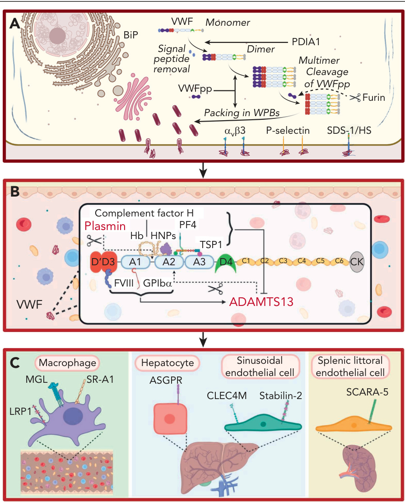
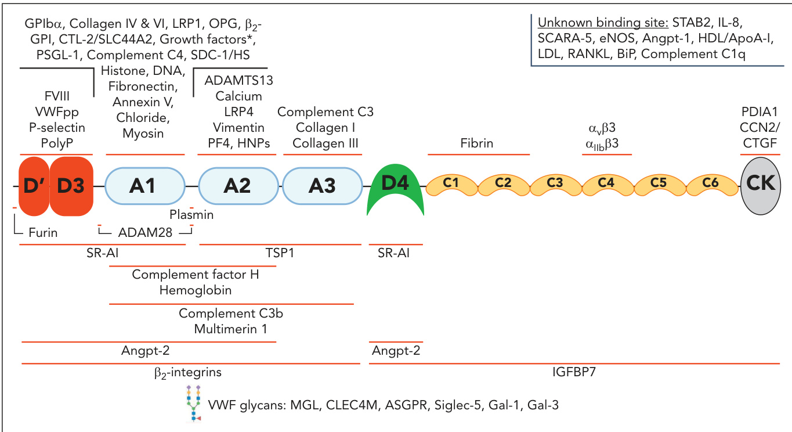
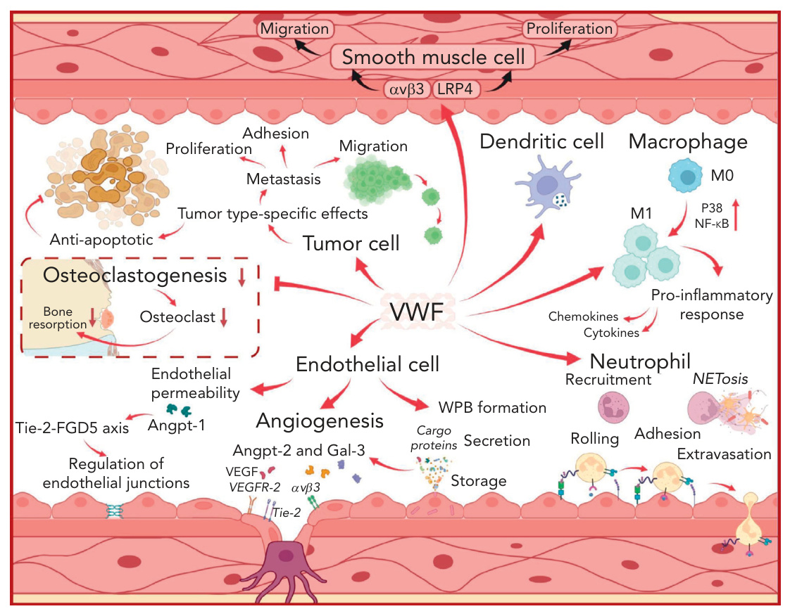
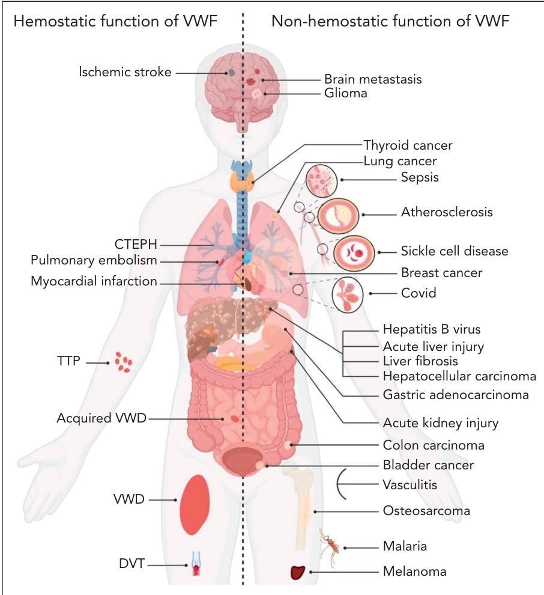

# NOVEL FUNCTIONS FOR VON WILLEBRAND FACTOR  

FERDOWS aTIQ1 AND JAMES s. o'dONNELL1,2  

1iRISH CENTRE FOR VASCULAR BIOLOGY, SCHOOL OF PHARMACY AND BIOMOLECULAR SCIENCES, ROYAL COLLEGE OF SURGEONS IN IRELAND, DUBLIN, IRELAND; AND 2nATIONALcOAGULATION CENTRE, sT JAMES'S HOSPITAL, DUBLIN, IRELAND  

FOR MANY YEARS, IT HAS BEEN KNOWN THAT VON WILLEBRAND FACTOR (vwf) INTERACTS WITH FACTOR viii, COLLAGEN, AND PLATELETS. iN ADDITION, THE KEY ROLES PLAYED BY vwf IN REGULATING NORMAL HEMOSTASIS HAVE BEEN WELL DEFINED. HOWEVER, ACCUMULATING RECENT EVIDENCE HAS SHOWN THAT vwf CAN INTERACT WITH A DIVERSE ARRAY OF OTHER NOVEL LIGANDS. tO DATE, OVER 60 DIFFERENT BINDING PARTNERS HAVE BEEN DESCRIBED, WITH INTERACTIONS MAPPED TO SPECIFIC vwf DOMAINS IN SOME CASES. ALTHOUGH THE BIOLOGICAL SIGNIFICANCE OF THESE vwf-BINDING INTERACTIONS HAS NOT BEEN FULLY ELUCIDATED, RECENT STUDIES HAVE IDENTIFIED SOME OF THESE NOVEL LIGANDS AS REGULATORS OF VARIOUS ASPECTS OF vwf BIOLOGY, INCLUDING BIOSYNTHESIS, PROTEOLYSIS, AND CLEARANCE. CONVERSELY, vwf BINDING HAS BEEN SHOWN TO DIRECTLY AFFECT THE FUNCTIONAL PROPERTIES FOR  

# INTRODUCTION  

SOME OF ITS LIGANDS. iN KEEPING WITH THOSE OBSERVATIONS, EXCITING NEW ROLES FOR vwf IN REGULATING A SERIES OF NONHEMOSTATIC BIOLOGICAL FUNCTIONS HAVE ALSO EMERGED. THESE INCLUDE INFLAMMATION, WOUND HEALING, ANGIOGENESIS, AND BONE METABOLISM. FINALLY, RECENT EVIDENCE SUPPORTS THE HYPOTHESIS THAT THE NONHEMOSTATIC FUNCTIONS OF vwf DIRECTLY CONTRIBUTE TO PATHOGENIC MECHANISMS IN A VARIETY OF DIVERSE DISEASES INCLUDING SEPSIS, MALARIA, SICKLE CELL DISEASE, AND LIVER DISEASE. iN THIS MANUSCRIPT, WE REVIEW THE ACCUMULATING DATA REGARDING NOVEL LIGAND INTERACTIONS FOR vwf AND CRITICALLY ASSESS HOW THESE INTERACTIONS MAY AFFECT CELLULAR BIOLOGY. iN ADDITION, WE CONSIDER THE EVIDENCE THAT NONHEMOSTATIC vwf FUNCTIONS MAY CONTRIBUTE TO THE PATHOGENESIS OF HUMAN DISEASES BEYOND THROMBOSIS AND BLEEDING.  

VON WILLEBRAND FACTOR (vwf) IS A LARGE MULTIMERIC PLASMA GLYCOPROTEIN THAT PLAYS KEY ROLES IN NORMAL HEMOSTASIS BY BINDING TO EXPOSED COLLAGEN AT SITES OF VASCULAR INJURY AND RECRUITING PLATELETS TO THE SITE OF INJURY. iN ADDITION, vwf ALSO ACTS A CARRIER MOLECULE FOR FACTOR vii (fvi. UNDER NORMAL CONDITIONS, \~95% OF PLASMA fviii CIRCULATES IN HIGH AFFINITY COMPLEX (DISSOCIATION CONSTANT [kD], \~0.2-0.5 NMOL/l) WITH vwf. QUANTITATIVE OR QUALITATIVE REDUCTIONS IN PLASMA vwf LEVELS RESULT IN VON WILLEBRAND DISEASE (vwd), WHICH CONSTITUTES THE COMMONEST INHERITED BLEEDING DISORDER.3 CONVERSELY, ELEVATED PLASMA LEVELS OF THE vwf-fviii COMPLEX REPRESENT A DOSE-DEPENDENT RISK FACTOR FOR THROMBOSIS.4,5 RECENT STUDIES HAVE HIGHLIGHTED THAT vwf IS ABLE TO INTERACT WITH A DIVERSE ARRAY OF OTHER PROTEINS AND REPORTED NOVEL BIOLOGICAL FUNCTIONS EXTENDING BEYOND COAGULATION. iN THIS ARTICLE WE REVIEW THESE DATA, TOGETHER WITH ACCUMULATING EVIDENCE THAT NONHEMOSTATIC wwf FUNCTIONS MAY CONTRIBUTE TO THE PATHOGENESIS OF HUMAN DISEASES BEYOND THROMBOSIS AND BLEEDING.  

# LIGANDS THAT INFLUENCE vwf LIFE CYCLE, INCLUDING BIOSYNTHESIS, PROTEOLYSIS, AND CLEARANCE  

FOR MANY YEARS, vwf WAS PERCEIVED TO BIND A LIMITED NUMBER OF LIGANDS IMPORTANT IN REGULATING ITS HEMOSTATIC EFFICACY. THESE  

INCLUDED THE FOLLOWING:) A fviLL BINDING SITE BINDING SITE IN THE d'd3 REGION; (2) BINDING SITES FOR COLLAGEN IN THE a1 AND a3 DOMAINS; AND (3) BINDING SITES FOR PLATELET RECEPTORS GLYCOPROTEIN iBDž (gpLBDž) AND Dž{dž3 LOCATED IN THE a1 DOMAIN AND c4 DOMAIN, RESPECTIVELY.6-10 HOWEVER, ACCUMULATING DATA HAVE SHOWN THAT ADDITIONAL BINDING PARTNERS PLAY DIRECT ROLES IN THE LIFE CYCLE OF wwf (FIGURE 1). FOR EXAMPLE, DURING POSTTRANSLATIONAL MODIFICATION WITHIN ENDOTHELIAL CELLS (ecS), vwf INTERACTS WITH A SERIES OF GLYCOSYLTRANSFERASES AND GLYCOSIDASES IN THE er AND GOLGI, AS WELL AS CHAPERONE BINDING PROTEINS (EG, BINDING-IMMUNOGLOBULIN PROTEIN) AND THE PROTEIN DISULFIDE ISOMERASE a1 (FIGURE 1a).11 IMPORTANTLY, THE vwf PROPEPTIDE (vwfPP) BINDS TO THE n-TERMINAL d'd3 DOMAINS AND REGULATES wwf MULTIMERIZATION AND TRAFFICKING INTO WEIBEL-PALADE BODIES (wpbS; FIGURE 1a).12 wwfPP IS CLEAVED FROM MATURE vwf BY FURIN AND STORED WITHIN wpb (FIGURE 1a). AFTER ec ACTIVATION, wwfPP IS SECRETED IN EQUIMOLAR AMOUNTS TO vwf BUT HAS A MUCH SHORTER PLASMA HALF-LIFE (\~2-3 HOURS). ALTHOUGH THE vwfPP HAS NO DEFINED EXTRACELLULAR FUNCTION, SOME vwfPP DIMERS ASSOCIATE WITH THE d'd3 DOMAIN OF MATURE vwf IN A NONCOVALENT MANNER.13 FINALLY, AFTER wpb EXOCYTOSIS, ELONGATED vwf STRINGS CAN BE TETHERED ON THE SURFACE OF ACTIVATED ecS BY A NUMBER OF REPORTED LIGANDS INCLUDING THE INTEGRIN ALPHA-V BETA-3 INTEGRIN (DžǑdž3), p-SELECTIN, AND SYNDECAN1-LINKED HEPARAN SULFATE (FIGURE 1a).14-16  

AFTER SECRETION FROM ec, vwf INTERACTS WITH adamts13 (A DISINTEGRIN AND METALLOPROTEINASE WITH THROMBOSPONDIN TYPE-1  

  
FIGURE 1. LIGANDS INVOLVED IN THE LIFE CYCLE OF vwf. (a)LIGANDS INVOLVED IN vwf BIOSYNTHESIS AND SECRETION. vwfTRAFFICKING THROUGH THE ENDOPLASMIC RETICULUM IS REGULATEDBY INTERACTION WITH LIGANDS INCLUDING BINDING-IMMUNOGLOB-ULIN PROTEIN (b Ip). vwfPP PLAYS KEY ROLES IN REGULATING wwfMULTIMERIZATION AND PACKING IN wpb. FURIN CLEAVES wwfPPFROM MATURE vwf. vwf STRINGS CAN BE TETHERED ON THESURFACE OF ACTIVATED ecS BY LIGANDS INCLUDING INTEGRIN DžVdž3,p-SELECTIN, AND SYNDECAN-1 (sdc-1)-LINKED HEPARAN SULFATE(hs). THIS FIGURE INCLUDES MANY BUT NOT ALL LIGANDS INVOLVED INvwf BIOSYNTHESIS AND SECRETION. (b) LIGANDS INVOLVED INvwf PROTEOLYSIS. adamts13 AND PLASMIN INDEPENDENTLYPROTEOLYZE vwf. fviL AND gpLBDž BINDING TO wwf PROMOTEadamts13-MEDIATED PROTEOLYSIS. CONVERSELY, BINDING OFpf4, COMPLEMENT FACTOR h, HEMOGLOBIN, HUMAN NEUTROPHILEPEPTIDES, AND THROMBOSPONDIN (tsp1) TO vwf ALL ATTEN-UATE vwf PROTEOLYSIS BY adamts13. THIS FIGURE INCLUDESMANY BUT NOT ALL LIGANDS INVOLVED IN vwf PROTEOLYSIS. (c)LIGANDS INVOLVED IN REGULATING wwf CLEARANCE. MACROPHAGERECEPTORS IMPLICATED IN REGULATING wwf CLEARANCE INCLUDETHE LOW-DENSITY LIPOPROTEIN RECEPTOR-RELATED PROTEIN 1(lrp1), MACROPHAGE GALACTOSE LECTIN (mgl), AND SCAVENGERRECEPTOR CLASS a MEMBER (sr-a1). iN ADDITION, THE ASIALO-GLYCOPROTEIN RECEPTOR (asgpr) ON HEPATOCYTES, AND c-TYPELECTIN DOMAIN FAMILY 4 MEMBER m (clec4m) AND STABILIN-2(stab2) ON SINUSOIDAL ecS ALSO CONTRIBUTE TO vwf CLEAR-ANCE. FINALLY, SCAVENGER RECEPTOR CLASS a MEMBER 5(scara5) ON SPLENIC LITTORAL ecS HAS ALSO BEEN REPORTED TOINTERACT WITH vwf.  

REPEATS), WHICH CLEAVES AT tYR1605-mET1606 WITHIN THE a2DOMAIN (FIGURE 1b).17 RECENT CRYSTAL STUDIES HAVE PROVIDEDINSIGHTS INTO THE MECHANISMS THROUGH WHICH adamts13 EXO-SITES INTERACT WITH vwf TO ENABLE SPECIFIC a2 DOMAIN CLEAVAGEIN A SHEAR-DEPENDENT MANNER.17 SEVERAL OTHER vwf-BINDINGLIGANDS INFLUENCE SUSCEPTIBILITY TO adamts13 PROTEOLYSIS(FIGURE 1b). fviii BINDING TO THE d'd3 REGION AND gpLBDž BINDINGTO THE a1 DOMAIN SIGNIFICANTLY ENHANCE vwf a2 DOMAINCLEAVAGE BY adamts13. 17 CONVERSELY, BINDING OF PLATELETFACTOR 4, HUMAN NEUTROPHILE PEPTIDE, COMPLEMENT FACTOR h,HEMOGLOBIN, AND THROMBOSPONDIN ALL ATTENUATE vwf PROTE-OLYSIS BY adamts13 (FIGURE 1b).18-22 FINALLY, OTHER vwf-BINDING LIGANDS HAVE BEEN IMPLICATED IN REDUCING MULTIMERS,INCLUDING PLASMIN, WHICH CLEAVES IN THE a1-a2 LINKER REGION(FIGURE 1b).23  

RECENT STUDIES HAVE IDENTIFIED CELL SURFACE RECEPTORS THAT BIND TO PLASMA vwf AND REGULATE ITS CLEARANCE (FIGURE 1c). c-TYPE LECTIN RECEPTORS SHOWN TO BIND vwf GLYCANS INCLUDE ASIALOGLYCOPROTEIN RECEPTOR EXPRESSED PREDOMINANTLY ON HEPATOCYTES, MACROPHAGE GALACTOSE LECTIN, AND c-TYPE LECTIN DOMAIN FAMILY 4 MEMBER m, WHICH IS EXPRESSED ON LIVER SINUSOIDAL ecS (FIGURE 1c).24-26 SCAVENGER RECEPTORS HAVE ALSO BEEN REPORTED TO INTERACT WITH vwf AND CONTRIBUTE TO ITS CLEARANCE. THESE  

INCLUDE THE LOW-DENSITY LIPOPROTEIN RECEPTOR-RELATED PROTEIN 1, SCAVENGER RECEPTOR CLASS a MEMBER 1, STABILIN-2, AND SCAVENGER RECEPTOR CLASS a MEMBER 5 (FIGURE 1 c).27-30 THE SPECIFIC vwf DOMAINS INVOLVED IN MODULATING INTERACTION WITH INDIVIDUAL CLEARANCE RECEPTORS HAVE NOT BEEN FULLY DEFINED (FIGURE 2). iN ADDITION, IN CONTRAST TO THE ABILITY OF vwf-BINDING PARTNERS TO MODULATE SUSCEPTIBILITY TO adamts13 PROTEOLYSIS, IT REMAINS UNCLEAR WHETHER ANY LIGAND BINDING INTERACTIONS AFFECT vwf CLEARANCE IN VIVO.  

# NOVEL LIGANDS FOR vwf  

RECENT STUDIES HAVE DESCRIBED A DIVERSE ARRAY OF NOVEL BINDING PARTNERS FOR vwf (FIGURE 2). SOME OF THESE LIGANDS HAVE BEEN SHOWN TO BIND DURING vwf BIOSYNTHESIS WITHIN ecS. FOR EXAMPLE, THE vwf a1 DOMAIN HAS BEEN SHOWN TO MEDIATE BINDING TO ANGIOPOIETIN-2 (ANGPT-2) AND OSTEOPROTEGERIN (opg).31-33 BOTH ANGPT-2 AND opg ARE COTRAFFICKED WITH vwf INTO wpb STORES. p-SELECTIN AND fviii BOTH BIND TO THE d'd3 DOMAINS OF vwf AND ARE ALSO RECRUITED INTO wpbS.6,34 MORE RECENTLY, IT HAS BEEN ELUCIDATED THAT COMPLEMENT FACTOR h, INSULIN-LIKE GROWTH FACTOR-BINDING PROTEIN 7, AND INTERLEUKIN-8 CAN ALSO BIND vwf AND BE RECRUITED INTO wpbS.21,35,36 ALTHOUGH ANGPT-2 AND opg FIRST BIND TO vwf DURING ITS  

  
FIGURE 2. a BROAD SPECTRUM OF LIGANDS INTERACTS WITH vwf THROUGH BINDING SITES ACROSS ALL ITS DOMAINS. vwf HAS BEEN REPORTED TO INTERACT WITH A WIDE VARIETY OFSTRUCTURALLY DIVERSE BINDING PARTNERS. THE BINDING SITES FOR SOME OF THESE LIGANDS HAS BEEN LOCALIZED TO SPECIFIC DOMAINS. THIS FIGURE INCLUDES MANY BUT NOT ALL THE REPORTEDvwf-LIGANDS. THE ASTERISK (\*) INDICATES GROWTH FACTOR INTERACTIONS: vegf-a165, pigf-2, pdgf-aa/bb/cc/dd, fgf-2/7/18, tgf-dž1, bmp-2, ngf-dž, nt-3, AND cxcl-12LJ.adam28, a DISINTEGRIN AND METALLOPROTEINASE 28; aPOa-i, APOLIPOPROTEIN a-L asgpr, ASIALOGLYCOPROTEIN RECEPTOR; dž2-gpi, dž2 GLYCOPROTEIN bmp-2, BONE MORPHOGENETICPROTEIN 2; ccn2/ctgf, CONNECTIVE TISSUE GROWTH FACTOR; ctl-2, CHOLINE TRANSPORTER-LIKE PROTEIN 2; cxcl-12LJ, c-x-c MOTIF CHEMOKINE LIGAND 12 GAMMA; Enos, ENDOTHELIALNITRIC OXIDE SYNTHASE; hdl, HIGH-DENSITY LIPOPROTEIN; hnpS, HUMAN NEUTROPHIL PEPTIDES; igfbp7, INSULIN-LIKE GROWTH FACTOR-BINDING PROTEIN 7; il-8, INTERLEUKIN-8; ldl, LOW-DENSITY LIPOPROTEIN; mgl, MACROPHAGE GALACTOSE LE ngf, NERVEGROWTH FACTOR; nt-3, NEUROTROPHIN-3; pdgf, PLATELET-DERIVED GROWTH FACTOR; pdia1, PROTEIN DISULFIDEISOMERASE a1; pf4, PLATELET FACTOR 4; pigf-2, PLACENTAL GROWTH FA;LYLYHHATEsgl ELECLYRO AND-rankl ran IGAN; SGLEACID-BINDING IMMUNOGLOBULIN-LIKE LECTIN 5; sLC44A2, SOLUTE CARRIER FAMILY 44 MEMBER 2; tgf, TRANSFORMING GROWTH FACTOR.  

BIOSYNTHESIS WITHIN ecS, THESE INTERACTIONS REMAIN INTACT AFTER vwf SECRETION INTO THE PLASMA. MOBAYEN ET AL RECENTLY REPORTED THAT \~70% OF PLASMA ANGPT-2 IS CIRCULATING IN HIGH AFFINITY COMPLEX WITH vwf.33 IMPORTANTLY WITH RESPECT TO FUNCTION, ANGPT-2 BINDING TO THE vwf a1 DOMAIN DID NOT ALTER PLATELET CAPTURE FUNCTION.33 SIMILARLY, opg HAS BEEN SHOWN TO REMAIN ATTACHED TO vwf STRINGS AFTER wpb EXOCYTOSIS31 AND CIRCULATE IN COMPLEX WITH vwf IN NORMAL HUMAN PLASMA.37 iN CONTRAST TO ANGPT-2, opg BINDING TO THE vwf a1 DOMAIN SIGNIFICANTLY ATTENUATED PLATELET ADHESION TO vwf STRINGS TETHERED ON THE SURFACE OF ACTIVATED ecS.38  

vwf IS HEAVILY GLYCOSYLATED WITH 12 n-LINKED (nlg) AND 10 OLINKED GLYCANS (olgS) ON EACH MONOMER.39 PREVIOUS STUDIES HAVE DEMONSTRATED THAT THE nlgS OF vwf INTERACT WITH GALECTIN1 (GAL-1) AND GAL-3 (FIGURE 2). 40 vwf COLOCALIZED WITH GALECTINS IN ecS AND REMAINED ATTACHED AFTER wpb EXOCYTOSIS.40 SIMILAR TO opg, vwf-PLATELET STRING FORMATION WAS REDUCED IN THE PRESENCE OF GALECTIN BINDING. FURTHERMORE, THROMBUS FORMATION IN A FERRIC CHLORIDEÑINDUCED INJURY MODEL WAS SIGNIFICANTLY MORE RAPID IN GAL-1/GAL-3 DOUBLE-DEFICIENT MICE.40  

BESIDES THE LIGANDS THAT ENGAGE WITH vwf WITHIN ecS, OTHER LIGANDS ENCOUNTER vwf FOR THE FIRST TIME AFTER IT HAS BEEN SECRETED INTO THE PLASMA OR EXTRAVASCULAR VESSEL WALL. aN ARRAY OF BINDING PARTNERS HAS BEEN REPORTED, INCLUDING FIBRONECTIN, MYOSIN, COMPLEMENT FACTORS, HISTONES, POLY p, VIMENTIN, THROMBOSPONDIN 1, AND MULTIPLE GROWTH FACTORS (FIGURE 2). iT IS IMPORTANT TO EMPHASIZE THAT THE STRENGTH OF THE BIOCHEMICAL  

EVIDENCE SUPPORTING THE INTERACTION OF vwf WITH THESE INDIVIDUAL BINDING PARTNERS VARIES CONSIDERABLY (SUPPLEMENTAL TABLE 1, AVAILABLE ON THE BLOOD WEBSITE). FOR SOME LIGANDS, SPECIFIC vwf DOMAINS HAVE BEEN IMPLICATED IN BINDING (SUPPLEMENTAL TABLE 1). OTHER LIGANDS, NOTABLY PUTATIVE CLEARANCE RECEPTORS, HAVE BEEN SHOWN TO INTERACT WITH MULTIPLE DISCRETE vwf DOMAINS (FIGURE 2). tO DATE, THE RELATIVE IMPORTANCE OF THESE DIFFERENT vwf-BINDING SITES IN REGULATING CLEARANCE HAS NOT BEEN ELUCIDATED. NEVERTHELESS, SPECIFIC vwf MISSENSE VARIANTS HAVE BEEN SHOWN TO PROMOTE ENHANCED CLEARANCE IN VIVO. SOME vwf-BINDING PARTNERS HAVE BEEN INVESTIGATED USING BOTH IN VIVO AND IN VITRO STUDIES (SUPPLEMENTAL TABLE 1). CONVERSELY, OTHER PARTNER INTERACTIONS HAVE ONLY BEEN ASSESSED USING IN VITRO STUDIES, SO IT REMAINS UNCLEAR WHETHER THESE LIGANDS WILL BIND vwf IN THE PRESENCE OF OTHER ABUNDANT PLASMA GLYCOPROTEINS SUCH AS ALBUMIN OR IMMUNOGLOBULIN. iN ADDITION, BINDING AFFINITIES HAVE BEEN DETERMINED FOR ONLY A MINORITY OF PUTATIVE vwf LIGANDS. FINALLY, SOME REPORTED vwf-BINDING PARTNERS HAVE YET TO VALIDATED BY STUDIES PERFORMED IN OTHER INDEPENDENT LABORATORIES (SUPPLEMENTAL TABLE 1).  

# INTERACTION OF vwf WITH STRUCTURALLY DIVERSE BINDING LIGANDS  

NOTWITHSTANDING ISSUES THAT NEED TO BE ADDRESSED IN FUTURE STUDIES, IT IS INTRIGUING THAT vwf HAS THE POTENTIAL TO INTERACT WITH SUCH A WIDE VARIETY OF STRUCTURALLY DIVERSE BINDING PARTNERS. THIS IS UNUSUAL COMPARED WITH OTHER COAGULATION FACTORS BUT  

WELL ESTABLISHED FOR OTHER PLASMA GLYCOPROTEINS SUCH AS ALBUMIN THAT DISPLAYS MARKED LIGAND HETEROGENEITY. 41 BINDING PROMISCUITY MAY REFLECT THE FACT THAT vwf IS A LARGE ADHESIVE MOLECULE PRESENT IN PLASMA AT HIGHER CONCENTRATIONS THAN MOST OTHER COAGULATION PROTEINS. EACH vwf MONOMER IS ALSO HIGHLY GLYCOSYLATED, WITH nlgS AND olgS TOGETHER CONSTITUTING \~20% OF THE TOTAL MONOMERIC MASS. MASS SPECTROSCOPY STUDIES HAVE SHOWN THAT MANY DIFFERENT vwf GLYCOFORMS MAY BE PRESENT IN A GIVEN INDIVIDUAL AT ANY SPECIFIC TIME. ALTHOUGH THE COMPLEX nlgS ON vwf HAVE BEEN IMPLICATED IN LIMITING SOME LIGAND INTERACTIONS THROUGH STERIC HINDRANCE, THESE CARBOHYDRATES CAN ALSO MEDIATE BINDING TO LIGANDS THAT POSSESS CARBOHYDRATERECOGNITION DOMAINS.42  

THE UNUSUAL ARRAY OF vwf-BINDING PARTNERS IS AT LEAST IN PART ATTRIBUTABLE TO THE FACT THAT IT CIRCULATES IN NORMAL PLASMA AS A SERIES OF HETEROGENEOUS MULTIMERS THAT MAY CONTAIN BETWEEN 40 AND 100 MONOMERS. THIS UNUSUAL PROPERTY FACILITATES CLUSTERING OF LIGAND BINDING SITES IN MULTIMERIC vwf. THE IMPORTANCE OF vwf MULTIMER SIZE HAS BEEN STUDIED FOR A LIMITED NUMBER OF LIGANDS BUT CAN INFLUENCE SOME BINDING INTERACTIONS (EG, gpLBDž, COLLAGEN, AND COMPLEMENT c3B). FINALLY, RECENT STUDIES HAVE DEMONSTRATED THAT vwf ALSO HAS THE POTENTIAL TO CIRCULATE IN A RANGE OF DIFFERENT ALLOSTERIC CONFORMATIONAL VARIANTS DETERMINED BY VARIABILITY IN INTRAMOLECULAR DISULFIDE BOND FORMATION.43 THIS SERVES TO FURTHER INCREASE THE NUMBER OF vwf EPITOPES THAT MAY BE AVAILABLE FOR POTENTIAL LIGAND INTERACTIONS.  

ANOTHER INTRIGUING OBSERVATION IS THAT SO MANY vwf-BINDING PARTNERS APPEAR TO TARGET THE a1 DOMAIN (FIGURE 2). tO DATE, IT REMAINS UNCLEAR WHETHER THERE CAN BE a1 OCCUPANCY WITH DIFFERENT LIGAND COMBINATIONS OR HOW THESE BINDING PARTNERS MAY COMPETE FOR ADJACENT BINDING SITES WITHIN a1. HOWEVER, IT HAS BEEN SHOWN THAT SOME a1 DOMAIN LIGANDS (EG, GALECTINS AND opg) CAN INHIBIT INTERACTION WITH PLATELET gpLBDž. FURTHER STUDIES WILL BE REQUIRED TO DEFINE WHY THE a1 DOMAIN IS SO IMPORTANT AND TO EXCLUDE THE POSSIBILITY THAT SOME OF THESE REPORTED INTERACTIONS MAY BE ARTIFACTUAL IN NATURE DUE TO THE PRESENCE OF RISTOCETIN. NEVERTHELESS, THE a1 DOMAIN DOES HAVE SEVERAL IMPORTANT FEATURES. FIRST, THE DOMAIN IS FLANKED BY 2 olg CLUSTERS, WHICH HAVE BEEN SHOWN TO INFLUENCE CONFORMATION OF THE a1 DOMAIN AND REGULATE INTERACTION WITH SPECIFIC LIGANDS (EG, gpLBDž AND MACROPHAGE GALACTOSE LECTIN). SECOND, THE n- AND c-TERMINAL FLANKING REGIONS OF THE a1 DOMAIN HAVE BEEN SHOWN TO FORM AN AUTOINHIBITORY MODULE. THIS MEANS THAT a1 CAN ADOPT DIFFERENT ACTIVE OR INACTIVE CONFORMATIONAL STATES. CONSEQUENTLY, THE PRECISE a1 CONSTRUCT (PARTICULARLY THE n- AND c-TERMINI LIMITS) USED IN BINDING STUDIES HAS THE POTENTIAL TO AFFECT INTERACTIONS.  

# vwf: NOVEL BIOLOGICAL FUNCTIONS BEYOND HEMOSTASIS  

TOGETHER WITH THE IDENTIFICATION OF DIVERSE BINDING LIGANDS, AN ARRAY OF NOVEL BIOLOGICAL FUNCTIONS FOR vwf BEYOND HEMOSTASIS HAVE ALSO BEEN PROPOSED (FIGURE ). THE EVIDENCE SUPPORTING  

  
FIGURE 3. vwf INTERACTS WITH VARIETY OF DIFFERENT CELL TYPES TO INFLUENCE BOTH PHYSIOLOGICAL AND PATHOLOGICAL PROCESSES. THE DIVERSE BIOLOGICAL ROLES OF vwf ARE MEDIATED THROUGH EFFECTS UPON ecS, NEUTROPHILS, LEUCOCYTES, MACROPHAGES, DENDRITIC CELLS, TUMOR CELLS, SMOOTH MUSCLE CELLS, AND OSTEOCLASTS AS ILLUSTRATED. wwf MAY POTENTIALLY EFFECT OTHER TYPES OF CELLS WHICH ARE NOT INCLUDED IN THIS FIGURE. lrp4, LOW-DENSITY LIPOPROTEIN RECEPTORÑRELATED PROTEIN 4; m0, UNDIFFERENTIATED MACROPHAGE; m1, PROINFLAMMATORY MACROPHAGE; netOSIS, FORMATION OF NEUTROPHIL EXTRACELLULAR TRAPS; p38, PROTEIN KINASE 38; TIE-2, TYROSINE KINASE WITH IMMUNOGLOBULIN-LIKE AND EPIDERMAL GROWTH FACTOR-LIKE DOMAINS 2; fgd5, fyve, rHOgef, AND ph DOMAIN-CONTAINING PROTEIN 5; vegfr-2, VASCULAR ENDOTHELIAL GROWTH FACTOR RECEPTOR 2.  

ROLES FOR vwf IN THESE PROCESSES IS UNDOUBTEDLY STRONGER FOR SOME THAN OTHERS. iN ADDITION, INTERPRETATION OF RESULTS FROM EXPERIMENTS PERFORMED IN vwf-/- MICE NEEDS TO BE CONSIDERED CAREFULLY BECAUSE THESE ANIMALS ALSO LACK wpb STORAGE ORGANELLES WITHIN THEIR ecS. NONETHELESS, ACCUMULATING DATA SUGGEST THAT AT LEAST SOME OF THESE NOVEL vwf FUNCTIONS HAVE DIRECT PHYSIOLOGICAL OR PATHOLOGICAL SIGNIFICANCE, NOTABLY WITH RESPECT TO INFLAMMATION, ANGIOGENESIS, AND WOUND HEALING.44-46  

# EFFECTS OF vwf ON INFLAMMATION  

iT IS WELL RECOGNIZED THAT ec ACTIVATION TRIGGERS EXOCYTOSIS OFvwf ANTIGEN (vwf:aG) AND vwfPP STORES FROM wpbS.MOREOVER, PLASMA vwf:aG AND wwfPP LEVELS HAVE BEENUSED AS BIOMARKERS OF CLINICAL SEVERITY IN PATIENTS WITH A VARIETYOF INFLAMMATORY AND SEPTIC CONDITIONS. RATHER THAN MERELYSERVING AS A MEASURE OF ec ACTIVATION AND DAMAGE, MORERECENT STUDIES HAVE DEMONSTRATED THAT vwf PLAYS DIRECT ROLESIN REGULATING INFLAMMATORY RESPONSES. PENDU ET AL DEMON-STRATED THAT vwf BINDS TO POLYMORPHONUCLEAR LEUKOCYTES(pmnS). .50 UNDER SHEAR, THIS vwf-LEUCOCYTE INTERACTION CON-SISTED OF INITIAL TRANSIENT ROLLING MEDIATED BY vwf-a1 DOMAINBINDING TO p-SELECTIN GLYCOPROTEIN LIGAND 1 ON LEUCOCYTES. THISWAS SUBSEQUENTLY FOLLOWED BY MORE STABLE ADHESION, MEDIATEDBY THE vwf-d'd3 AND a1a3 DOMAINS INTERACTING WITH dž2-INTEGRINS ON LEUCOCYTES (FIGURE 3).50 iN ADDITION, sLC44A2 ONNEUTROPHIL SURFACES HAS ALSO BEEN SHOWN TO INTERACT WITH THEvwf a1 DOMAIN.51 FUNCTIONAL POLYMORPHISMS AT THE slc44a2LOCUS DEFINE EXPRESSION OF HUMAN NEUTROPHIL ANTIGENS 3aAND 3b. INTERESTINGLY, RECENT STUDIES HAVE SHOWN THAT vwfINTERACTION IS SIGNIFICANTLY ATTENUATED FOR HUMAN NEUTROPHILANTIGEN 3B.51 iN VIVO STUDIES HAVE CONFIRMED THAT vwf REGU-LATES VASCULAR PERMEABILITY AND pmn EXTRAVASATION INTOINFLAMED TISSUES (FIGURE 3). iN vwf-/- MICE OR AFTER vwfINHIBITION IN WILD-TYPE MICE, SIGNIFICANTLY REDUCED NEUTROPHILRECRUITMENT HAS BEEN OBSERVED IN DIFFERENT INFLAMMATIONMODELS INCLUDING (1) THIOGLYCOLLATE-INDUCED PERITONITIS; (2)KERATINOCYTE-DERIVED CHEMOKINE-STIMULATED CREMASTER MUS-CLE; (3) IMMUNE-COMPLEX-MEDIATED VASCULITIS; AND (4) IRRITATIVECONTACT DERMATITIS.52,53  

iN ADDITION TO BINDING TO pmnS, vwf HAS ALSO BEEN SHOWN TOBIND TO MACROPHAGES BUT NOT TO UNDIFFERENTIATED MONO-CYTES. 54 RECENT DATA HAVE HIGHLIGHTED THAT vwf INTERACTIONWITH SPECIFIC MACROPHAGE RECEPTORS (NOTABLY, LOW-DENSITYLIPOPROTEIN RECEPTOR-RELATED PROTEIN 1) INITIATES SIGNIFICANTDOWNSTREAM INFLAMMATORY SIGNALING (INCLUDING ACTIVATION OFmapkINASE PROTEIN KINASE 38 AND NUCLEAR FACTOR KAPPA ǎb)THAT ULTIMATELY TRIGGERS MACROPHAGES TO ADOPT AN m1 PROIN-FLAMMATORY PHENOTYPE (FIGURE 3). 54 CONSEQUENTLY, vwfBINDING LEADS TO A SIGNIFICANT INCREASE IN MACROPHAGE GLYCOL-YSIS, TOGETHER WITH UPREGULATED SECRETION OF PROINFLAMMATORYCYTOKINES AND CHEMOKINES.54 ALTOGETHER, THESE DATA DEFINE ANOVEL BIOLOGICAL ROLE FOR vwf IN LINKING PRIMARY HEMOSTASISAND INNATE IMMUNITY, WHICH MAY BE IMPORTANT AT SITES OFVASCULAR INJURY.  

BEYOND ITS EFFECTS ON pmnS AND MACROPHAGES, vwf CAN INFLU-ENCE INFLAMMATORY RESPONSES IN OTHER WAYS. FOR EXAMPLE, vwfHAS ALSO BEEN REPORTED TO BIND TO DENDRITIC CELLS (FIGURE 3).55tHIS RAISES THE POTENTIAL FOR vwf TO ALSO AFFECT ADAPTIVEIMMUNE RESPONSES. iN ADDITION, vwf HAS ALSO BEEN IMPLICATED  

IN THE FORMATION OF NEUTROPHIL EXTRACELLULAR TRAPS (netS).56 INPARTICULAR, THE vwf a1 DOMAIN CAN BIND DIRECTLY TO BOTH HIS-TONES AND EXTRACELLULAR dna (FIGURE 2).56 FURTHERMORE, THEINCLUSION OF vwf IN netS WAS ASSOCIATED WITH SIGNIFICANTLYENHANCED LEUCOCYTE RECRUITMENT.51 FINALLY, vwf HAS ALSO BEENREPORTED TO INFLUENCE COMPLEMENT ACTIVATION (FIGURE 3). COM-PLEMENT FACTOR h BINDS TO THE vwf a1 AND a2 DOMAINS AND HASBEEN REPORTED TO INHIBIT vwf CLEAVAGE BY adamts13.21,57 INADDITION, vwf ALSO BINDS TO COMPLEMENT c1Q, c3, AND c3B ANDSERVES AS A COFACTOR FOR FACTOR iÑMEDIATED CLEAVAGE OF COMPLE-MENT c3B.58,59  

# EFFECTS OF vwf ON ANGIOGENESIS  

a ROLE FOR vwf IN REGULATING ANGIOGENESIS IS SUPPORTED BY VARIOUS LINES OF EVIDENCE. FIRST, ANGIODYSPLASIA, PARTICULARLY INVOLVING THE gi TRACT, IS A RECOGNIZED COMPLICATION IN PATIENTS WITH BOTH INHERITED AND ACQUIRED vwd (EG, IN HEYDE SYNDROME WITH AORTIC STENOSIS).60 FOR REASONS THAT REMAIN POORLY DEFINED, ANGIODYSPLASIA APPEARS TO BE MORE MARKED IN vwd SUBTYPES CHARACTERIZED BY LOSS OF HIGH MOLECULAR WEIGHT (hmw)-vwf MULTIMERS.60 SECOND, ANGIOGENESIS AND VASCULAR DENSITY ARE SIGNIFICANTLY INCREASED IN vwf-/- MICE.61 THIRD, SMALL INTERFERING rna (SIrna) INHIBITION OF vwf EXPRESSION IN ec EX VIVO IS ASSOCIATED WITH ENHANCED PROLIFERATION, MIGRATION VELOCITY, AND ANGIOGENESIS. 61 FOURTH, ABNORMAL ANGIOGENESIS HAS ALSO BEEN OBSERVED IN STUDIES OF ENDOTHELIAL COLONY FORMING CELLS (ecfcS) DERIVED FROM PATIENTS WITH vwd WITH SPECIFIC vwf SEQUENCE VARIANTS AND DIFFERENT TYPES OF vwd.61,62 OVERALL, THESE DATA DEMONSTRATE THAT vwf PLAYS A PREDOMINANTLY INHIBITORY ROLE IN REGULATING ANGIOGENESIS THROUGH SEVERAL DISTINCT MECHANISMS. THESE INCLUDE PUTATIVE ROLES FOR PARTNERS ANGPT-2 AND GAL-3, WHICH ARE BOTH NORMALLY TRAFFICKED INTO wpb STORES VIA INTERACTION WITH vwf.63 RECENT REVIEW MANUSCRIPTS HAVE CONSIDERED IN DETAIL THE MECHANISMS THROUGH WHICH vwf MAY AFFECT ANGIOGENIC REGULATION.44,64  

# EFFECTS OF vwf ON WOUND HEALING  

RECENT STUDIES SUGGEST A ROLE FOR vwf IN PROMOTING WOUND HEALING (FIGURE 3). ISHIHARA ET AL OBSERVED THAT HEALING OF DERMAL SKIN WOUNDS WAS SIGNIFICANTLY DELAYED IN vwf/- MICE COMPARED WITH WILD-TYPE CONTROLS.46 FURTHERMORE, WOUNDS IN THE wwf-/ï MICE CONTAINED REDUCED LEVELS OF VASCULAR ENDOTHELIAL GROWTH FACTOR a (vegf-a) AND FIBROBLAST GROWTH FACTOR 2 (fgf-2) AND EXHIBITED ATTENUATED ec AND SMOOTH MUSCLE PROLIFERATION.46 SUBSEQUENTLY, THE HEPARIN-BINDING DOMAIN IN THE vwf a1 DOMAIN (tYR1328-aLA1350) WAS SHOWN TO BIND TO IMPORTANT GROWTH FACTORS, INCLUDING MEMBERS OF THE PLATELET-DERIVED GROWTH FACTOR, vegf, fgf, AND TRANSFORMING GROWTH FACTOR dž FAMILIES (FIGURE 2).46 FURTHERMORE, vegf-a2 COLOCALIZED WITH vwf IN wpb STORES AND WAS COSECRETED AFTER ec ACTIVATION. FINALLY, COIMMUNOPRECIPITATION EXPERIMENTS SHOWED THAT vegf-a AND fgf-2 IN NORMAL HUMAN PLASMA BOTH CIRCULATE IN COMPLEX WITH vwf.46 iN CONTRAST TO THE CONCEPT THAT vwf IS PREDOMINANTLY AN INHIBITOR OF ANGIOGENESIS, THERE WAS IMPAIRED LOCAL ANGIOGENESIS AT WOUND SITES IN vwf-/- MICE, WHICH MAY CONTRIBUTE TO THE IMPAIRED WOUND HEALING OBSERVED.46 STUDIES IN SEVERAL OTHER ANIMAL MODELS OF ISCHEMIA HAVE ALSO REPORTED PROANGIOGENIC AND ANTIANGIOGENIC ROLES FOR vwf, SUGGESTING THAT THESE EFFECTS MAY VARY UNDER SPECIFIC CONDITIONS AND IN DIFFERENT TISSUES.  

# ADDITIONAL NOVEL CELLULAR INTERACTIONS AND BIOLOGICAL FUNCTIONS FOR vwf  

ALTHOUGH THE EVIDENCE IS LESS DEVELOPED, STUDIES HAVE SUG-GESTED ADDITIONAL BIOLOGICAL ROLES FOR vwf. SIMILAR TO PLATELETSAND MACROPHAGES, vwf BINDING TO VASCULAR SMOOTH MUSCLE CELLS(vsmcS) HAS ALSO BEEN SHOWN TO TRIGGER INTRACELLULAR SIGNALING(FIGURE 3).65,6 THESE CELLS REGULATE VASOCONSTRICTION, VASODILA-TATION, AND, THEREBY, BLOOD PRESSURE CONTROL. iN ADDITION, vsmcSALSO HAVE AN IMPORTANT ROLE IN ATHEROSCLEROSIS.67 LAGRANGE ET ALRECENTLY DEMONSTRATED THAT THE LOW-DENSITY LIPOPROTEINRECEPTOR-RELATED PROTEIN 4 RECEPTOR ON THE SURFACE OF vsmcSBINDS TO THE vwf a2 DOMAIN.66 THIS BINDING TRIGGERS SIGNALINGTHROUGH INTEGRIN DžVdž3, LEADING TO ACTIVATION OF PROTEIN KINASE 38-mapk AND SRC, FOLLOWED BY DOWNSTREAM PHOSPHORYLATION OF AKTAND erk1/2. FURTHERMORE, THIS THIS vwf SIGNALING THROUGH THE LOW-DENSITY LIPOPROTEIN RECEPTOR-RELATED PROTEIN 4/Džŕdž3 COMPLEXLED TO vsmc PROLIFERATION, MIGRATION, AND AND INTIMAL HYPERPLASIA.66iNTERESTINGLY, PREVIOUS IN VIVO STUDIES REPORTED SIGNIFICANT DIF-FERENCES IN ATHEROMA DEVELOPMENT IN vwf-/ï MICE COMPAREDWITH WILD-TYPE CONTROLS. IMPORTANTLY, MACROPHAGE RECRUITMENTINTO THE ATHEROMATOUS PLAQUES WAS ATTENUATED IN THE vwf-/-MICE.68 CUMULATIVELY, THESE FINDINGS RAISE THE INTRIGUING POSSI-BILITY THAT vwf MAY CONTRIBUTE TO ATHEROMA PROGRESSION BYINFLUENCING BOTH MACROPHAGE AND vsmc BIOLOGY.69  

aS ALREADY DISCUSSED, opg BINDS TO THE vwf a1 DOMAIN WITHIN ecS, IS STORED WITHIN wpbS, AND CIRCULATES IN PLASMA IN COMPLEX  

WITH vwf.31 opg ALSO HAS IMPORTANT INTRINSIC FUNCTIONS IN REGULATING BONE METABOLISM. iN PARTICULAR, opg FUNCTIONS AS A SOLUBLE DECOY RECEPTOR FOR rank LIGAND AND THEREBY INHIBITS OSTEOCLASTOGENESIS (FIGURE 3).70 INTERESTINGLY, INTERACTION OF vwf-fviii COMPLEX WITH opg HAS BEEN SHOWN TO INCREASE THE BINDING OF opg TO rank LIGAND, WHICH IN TURN PROMOTED DOWNREGULATION OF OSTEOCLAST DIFFERENTIATION.70,71 ADDITIONAL STUDIES WILL BE REQUIRED TO DETERMINE WHETHER THE EFFECT OF vwf IN REGULATING OSTEOCLAST BIOLOGY HAS A CLINICALLY RELEVANT EFFECT ON BONE METABOLISM IN VIVO.  

# PATHOGENIC ROLES FOR vwf BEYOND HEMOSTASIS  

iN ADDITION TO ITS ESTABLISHED ROLES IN THE ETIOLOGY OF BOTHBLEEDING AND THROMBOTIC DISORDERS (INCLUDING vwd, THROMBO-EMBOLIC THROMBOCYTOPENIC PURPURA, DEEP VEIN THROMBOSIS, pe,mi, AND ISCHEMIC STROKE; FIGURE 4), 4,5,72 ADDITIONAL PATHOGENICROLES FOR vwf IN A RANGE OF OTHER NONHEMOSTATIC DISEASES HASALSO BEEN PROPOSED (FIGURE 4; SUPPLEMENTAL TABLE 2). THESEPUTATIVE NOVEL PATHOGENIC ROLES FOR vwf ARE SUPPORTED IN SOMECASES BY SIGNIFICANT DATA FROM IN VIVO STUDIES INVOLVING A VARIETYOF DIFFERENT MURINE MODELS. NEVERTHELESS, THE LEVEL OF EVIDENCEREGARDING THE INVOLVEMENT OF wwf IN THESE PATHOLOGIES EXHIBITSCONSIDERABLE VARIABILITY, WITH CERTAIN DISORDERS STILL IN EARLYSTAGES OF INVESTIGATION.  

  
FIGURE 4. vwf MAY CONTRIBUTE TO DISEASE PATHOBIOLOGY FOR A VARIETY OF BOTH HEMOSTATIC AND NONHEMOSTATIC DISORDERS. ILLUSTRATION OF HEMOSTATIC DISORDERS IN WHICH vwf HAS BEEN IMPLICATED IN PLAYING A DIRECT PATHOGENIC ROLE (LEFT). ILLUSTRATION OF A SERIES OF NONHEMOSTATIC DISORDERS IN WHICH PUTATIVE PATHOGENIC ROLES FOR vwf HAVE BEEN PROPOSED (RIGHT). SOME EVIDENCE SUGGESTS THAT vwf MAY POTENTIALLY AFFECT OTHER TYPES OF DISEASES WHICH ARE NOT INCLUDED IN THIS FIGURE. cteph, CHRONIC THROMBOEMBOLIC PULMONARY HYPERTENSION; dvt, DEEP VEIN THROMBOSIS; ttp, THROMBOEMBOLIC THROMBOCYTOPENIC PURPURA.  

# vwf IN scd AND MALARIA  

ELEVATED PLASMA vwf LEVELS, PATHOLOGICAL ULTRA-LARGE (ul) vwf MULTIMERS AND MILD DECREASES IN PLASMA adamts13 LEVELS HAVE BEEN REPORTED IN PATIENTS WITH SICKLE CELL DISEASE (scd).48,73 iN ADDITION, vwf HAS BEEN IMPLICATED IN THE PATHOGENESIS OF scd VASO-OCCLUSIVE CRISES (vocS) (SUPPLEMENTAL TABLE ).48,74 iN PARTICULAR, ul-vwf MULTIMERS SECRETED FROM ecS HAVE BEEN SHOWN TO BIND AND TETHER SICKLE ERYTHROCYTES UNDER SHEAR CONDITIONS. RECENT STUDIES IN IN A MURINE scd MODEL DEMONSTRATED THAT vwf-/- ANIMALS WERE PROTECTED AGAINST HEMOLYSIS, vocS, AND ORGAN DAMAGE.74 MOREOVER, TREATMENT WITH RECOMBINANT adamts13 ALSO SIGNIFICANTLY REDUCED HEMOLYSIS AND ORGAN DAMAGE IN A HUMANIZED scd MURINE MODEL.74 DESPITE THESE EXCITING MURINE DATA, THE ROLE OF THE vwf-adamts13 AXIS IN CONTRIBUTING TO voc DEVELOPMENT IN HUMAN PATIENTS WITH scd HAS NOT YET BEEN DEFINED. FOR EXAMPLE, THERE IS NO CLEAR EVIDENCE THAT abo BLOOD GROUP (WHICH AFFECTS PLASMA vwf:aG LEVELS AND SUSCEPTIBILITY TO adamts13 PROTEOLYSIS) HAS ANY EFFECT ON scd SEVERITY. iN ADDITION, IT REMAINS UNCLEAR WHETHER THE EFFECT OF vwf IN THE MURINE scd MODEL IS ENTIRELY EXPLAINED VIA vwf BINDING TO SICKLE ERYTHROCYTES OR WHETHER vwf EFFECTS ON INFLAMMATION MAY ALSO BE IMPORTANT.  

SIMILAR TO scd, MARKEDLY INCREASED PLASMA vwf LEVELS AND ABNORMAL ul-vwf MULTIMERS HAVE ALSO BEEN POSTULATED TO CONTRIBUTE TO DISEASE PATHOGENESIS IN BOTH MALARIA AND ACUTE covid-19.47,75 IMPORTANTLY, PLATELET DECORATED vwf STRINGS HAVE BEEN SHOWN TO BIND TO PLASMODIUM FALCIPARUM-INFECTED ERYTHROCYTES AND THUS MAY CONTRIBUTE TO ec CYTOADHESION. iN PARTICULAR, THE a1 DOMAIN OF vwf HAS ALSO BEEN SHOWN TO BIND TO p FALCIPARUM ERYTHROCYTE MEMBRANE PROTEIN 1 ON THE SURFACE OF MALARIA-INFECTED ERYTHROCYTES.76 iN ADDITION, IN VIVO STUDIES HAVE SHOWN THAT vwf-/- MICE ARE SIGNIFICANTLY PROTECTED IN A MURINE MODEL OF p BERGHEI-INDUCED EXPERIMENTAL CEREBRAL MALARIA. 47 iN CONTRAST TO scd, abo BLOOD HAS BEEN SHOWN TO SIGNIFICANTLY REGULATE MALARIA SEVERITY IN HUMAN PATIENTS.77  

# vwf IN LIVER DISEASE  

ACUTE AND CHRONIC LIVER DISEASE ARE BOTH ASSOCIATED WITHMARKED INCREASES IN PLASMA vwf:aG LEVELS (FIVEFOLD TO 10-FOLD).78 iN CONTRAST TO MALARIA, scd, OR covid-19, hmw-vwfMULTIMERS ARE TYPICALLY REDUCED IN PATIENTS WITH LIVER DISEASE,DESPITE THE FACT THAT PLASMA adamts13 LEVELS ARE SIGNIFICANTLYREDUCED (THREEFOLD TO FIVEFOLD).78 THIS PARADOX MAY BE DUE TOhmw-vwf MULTIMER CONSUMPTION IN PLATELET-RICH MICRO-THROMBI WITHIN THE LIVER. ALTERNATIVELY, vwf PROTEOLYSIS VIAadamts-13-INDEPENDENT MECHANISMS MAY BE OCCURRING.IMPORTANTLY, RECENT ANIMAL STUDIES HAVE DEMONSTRATED ROLES FORvwf IN CONTRIBUTING TO ACUTE AND CHRONIC LIVER PATHOBIOLOGY(FIGURE 4; SUPPLEMENTAL TABLE 2).79,80 NOTABLY, GROENEVELDET AL DEMONSTRATED THAT vwf-PLATELET AGGREGATES FORMED IN THELIVER OF MICE AFTER ACETAMINOPHEN OVERDOSE. 79 iN wwf-/- MICE,THESE PLATELET AGGREGATES WERE CLEARED MORE RAPIDLY, WHICH LEDTO ACCELERATED LIVER REPAIR. SIMILARLY, ANTI-vwf ANTIBODIES ALSOREDUCED HEPATIC PLATELET ACCUMULATION IN WILD-TYPE MICE,LEADING TO FASTER LIVER REPAIR. a DIRECT ROLE FOR vwf IN THEPATHOGENESIS OF CARBON TETRACHLORIDEÑINDUCED EXPERIMENTALLIVER FIBROSIS HAS ALSO BEEN REPORTED. 80 ONCE AGAIN, wwf-/ïMICE WERE SHOWN TO DEVELOP SIGNIFICANTLY REDUCED LIVER FIBROSISCOMPARED WITH WILD-TYPE CONTROL ANIMALS.80 FURTHER STUDIES WILLBE NEEDED TO ELUCIDATE THE BIOLOGICAL MECHANISM(S) THROUGH  

WHICH vwf AFFECTS ACUTE AND CHRONIC LIVER DISEASE AND ITS IMPORTANCE IN HUMAN PATIENTS.  

# vwf AND TUMOR CELL BIOLOGY  

INCREASED PLASMA vwf LEVELS HAVE BEEN ASSOCIATED WITH WORSE OUTCOMES IN MULTIPLE DIFFERENT TYPES OF CANCER, INCLUDING BREAST, THYROID, AND GASTRIC MALIGNANCIES.45 INCREASED vwf-fviii COMPLEX LEVELS ALSO LIKELY CONTRIBUTE TO CANCER-ASSOCIATED THROMBOSIS RISK.45 INTERESTINGLY, MORE RECENT STUDIES HAVE SUGGESTED THAT vwf MAY ALSO PLAY ROLES IN REGULATING SPECIFIC ASPECTS OF TUMOR CELL BIOLOGY, NOTABLY WITH RESPECT TO METASTASIS, APOPTOSIS, AND TUMOR ANGIOGENESIS (SUPPLEMENTAL TABLE 3).45,81 IMPORTANTLY, HOWEVER, PREVIOUS IN VIVO STUDIES PERFORMED IN vwf-/- MICE PRODUCED SOME UNEXPECTED RESULTS, WITH SIGNIFICANTLY ENHANCED METASTASIS IN THE ABSENCE OF vwf. THESE FINDINGS MAY RELATE TO THE THE FACT THAT vwf AFFECTS CANCER BIOLOGY DIFFERENTLY DEPENDING UPON THE CANCER TYPE AND STAGE. THE PUTATIVE MECHANISMS MECHANISMS THROUGH WHICH vwf MAY INFLUENCE TUMOR CELL BIOLOGY HAVE RECENTLY BEEN REVIEWED IN DETAIL.82  

# TARGETING NOVEL FUNCTIONS OF vwf AS A THERAPEUTIC STRATEGY  

RECENT STUDIES SUGGEST THAT TARGETING NOVEL FUNCTIONS OF vwfMAY OFFER AN EXCITING NOVEL THERAPEUTIC APPROACH. FOR EXAMPLE,A NOVEL a1 DOMAIN-TARGETED NANOBODY SIGNIFICANTLY REDUCEDLEUKOCYTE RECRUITMENT AND VASCULAR PERMEABILITY IN 2 DIFFERENTMURINE MODELS OF INFLAMMATION (IMMUNE-COMPLEX-MEDIATEDVASCULITIS AND IRRITANT CONTACT DERMATITIS, RESPECTIVELY).53cOLLECTIVELY, THESE FINDINGS SUPPORT THE CONCEPT THAT ANTI-vwfTARGETED THERAPIES MAY HAVE CLINICAL UTILITIES BEYONDHEMOSTASIS.  

iT IS INTERESTING TO CONSIDER THE POTENTIAL IMPORTANCE OF NONHEMOSTATIC ROLES OF vwf IN PATIENTS WITH vwd. ANGIODYSPLASIA UNDOUBTEDLY HAS DIRECT SIGNIFICANCE WITH RESPECT TO INCREASED RISK FOR gi BLEEDING, PARTICULARLY IN PATIENTS WITH TYPE 2a vwd AND ACQUIRED vwd.60 ALTHOUGH THERE IS LIMITED EVIDENCE, IT SEEMS LIKELY THAT NONHEMOSTATIC FUNCTIONS OF vwf MAY ALSO BE IMPORTANT IN THE CONTEXT OF HEAVY MENSTRUAL BLEEDING. THE MENSTRUAL CYCLE IS CHARACTERIZED BY MONTHLY BLEEDING, FOLLOWED BY A PERIOD OF LOCAL INFLAMMATION AND WOUND REPAIR IN THE UTERUS.83 iN TURN, THIS IS FOLLOWED BY LOCAL ANGIOGENESIS THAT ULTIMATELY LEADS TO REBLEEDING. BASED ON OUR CURRENT UNDERSTANDING REGARDING NOVEL ROLES FOR vwf IN REGULATING NOT ONLY BLEEDING BUT ALSO INFLAMMATION, WOUND REPAIR, AND ANGIOGENESIS, IT IS EVIDENT THAT vwf HAS THE POTENTIAL TO AFFECT MULTIPLE ASPECTS OF THE MENSTRUAL CYCLE. THIS "PERFECT STORM" MAY EXPLAIN THE ENORMOUS CLINICAL BURDEN ASSOCIATED WITH HEAVY MENSTRUAL BLEEDING, EVEN IN WOMEN WITH ONLY MILD-TO-MODERATE REDUCTIONS IN PLASMA vwf LEVELS IN THE LOW vwf RANGE (30-50 iu/Dl).84  

# CONCLUSIONS  

THE RAPIDLY EXPANDING LIST OF BINDING LIGANDS HAS LED TO THE SUGGESTION THAT vwf MAY BE CONSIDERED AS A "SHUTTLE BUS" IN VIVO.85 THUS, SOME PASSENGERS BOARD THE vwf BUS AT ITS HOME TERMINUS (IE, WITHIN ecS). OTHER PASSENGERS GET ONTO THE vwf BUS AS IT TRAVELS ALONG ITS ROUTE (IE, IN THE CIRCULATION). PASSENGERS MAY DISEMBARK THE vwf BUS AT TIMES AND MAY BE REPLACED BY  

OTHER NEW PASSENGERS. aT TIMES, PASSENGERS MAY BE INVOLVED IN COMPETITION FOR SEATS ON THE vwf BUS. UNDER SPECIFIC PHYSIOLOGICAL OR PATHOLOGICAL CONDITIONS, THE NUMBER OF vwf BUSES MAY BE INCREASED OR DECREASED. FURTHERMORE, THE vwf BUS MAY BE MORE ACCESSIBLE FOR SPECIFIC PASSENGER TYPES UNDER CERTAIN CONDITIONS (EG, AFTER a1 DOMAIN ACTIVATION). FINALLY, THE ULTIMATE DESTINATION OF vwf BUSES MAY VARY. UNDER NORMAL CONDITION, MOST vwf WILL BE CLEARED FROM THE CIRCULATION BY MACROPHAGES, LIVER SINUSOIDAL ecS, AND HEPATOCYTES.6 ALTERNATIVELY AT TIMES OF HEMOSTATIC CHALLENGE, vwf ALONG WITH ITS PASSENGERS WILL INSTEAD BE RECRUITED TO SITES OF VASCULAR INJURY. iN ADDITION, vwf BUSES MAY BE DIRECTED TO ADDITIONAL SITES UNDER SPECIFIC PATHOLOGICAL CONDITIONS (EG, TO LEUCOCYTES AT SITES OF INFLAMMATION). FINALLY, IN SOME CIRCUMSTANCES, THE vwf BUS CAN BE HIJACKED AND USED BY NONHUMAN LIGANDS. iN PARTICULAR, DIFFERENT MICROORGANISMS (INCLUDING STAPHYLOCOCCUS AUREUS, HELICOBACTER PYLORI, AND SCHISTOSOMA MANSONI) HAVE BEEN SHOWN TO BIND AND USE vwf TO FACILITATE DISSEMINATION.87-89 CLEARLY, THIS ANALOGY IS A GROSS SIMPLIFICATION BUT SERVES TO INTEGRATE THE PLETHORA OF NOVEL BINDING PARTNERS FOR vwf PROPOSED IN RECENT STUDIES. VALIDATING THESE INDIVIDUAL vwf INTERACTIONS AND ELUCIDATING THE MOLECULAR MECHANISMS INVOLVED WILL REQUIRE SIGNIFICANT FURTHER RESEARCH. NEVERTHELESS, DISENTANGLING THESE ADDITIONAL ROLES OF vwf EXTENDING BEYOND ITS CLASSICAL PROHEMOSTATIC FUNCTIONS MAY OFFER EXCITING OPPORTUNITIES TO DEVELOP NOVEL TREATMENT APPROACHES FOR IMPORTANT UNMET CLINICAL NEEDS.  

# ACKNOWLEDGMENTS  

f.a. IS SUPPORTED BY A RUBICON GRANT (452022310) FROM THE NETHERLANDS ORGANISATION FOR HEALTH RESEARCH AND DEVELOPMENT (zONmW). j.s.o. IS SUPPORTED BY FUNDS FROM THE NATIONAL INSTITUTES OF HEALTH, NATIONAL HEART, LUNG, AND BLOOD INSTITUTE FOR THE ZIMMERMAN PROGRAM (hl081588) AND A SCIENCE FOUNDATION IRELAND PRINCIPAL FRONTIERS FOR THE FUTURE AWARD (20/ffp-a/8952).  

# AUTHORSHIP  

CONTRIBUTION: f.a. AND j.s.o. CONTRIBUTED TO LITERATURE REVIEW, INTERPRETATION OF DATA, FINAL DRAFT WRITING, AND CRITICAL REVISION; AND BOTH AUTHORS HAVE PARTICIPATED SUFFICIENTLY IN THIS WORK, TAKE PUBLIC RESPONSIBILITY FOR THE CONTENT, AND HAVE GIVEN CONSENT TO THE FINAL VERSION OF THE ARTICLE.  

CONFLICT-OF-INTEREST DISCLOSURE: f.a. RECEIVED RESEARCH SUPPORT FROM csl BEHRING, TAKEDA, OCTAPHARMA, AND SOBI; AND RECEIVED TRAVEL GRANTS FROM SOBI. j.s.o. HAS SERVED ON THE SPEAKER'S BUREAU FOR BAXTER, BAYER, NOVO NORDISK, SOBI, BOEHRINGER INGELHEIM, LEO PHARMA, TAKEDA, AND OCTAPHARMA; HAS SERVED ON THE ADVISORY BOARDS OF BAXTER, SOBI, BAYER, OCTAPHARMA, csl BEHRING, DAIICHI SANKYO, BOEHRINGER INGELHEIM, TAKEDA, AND PFIZER; AND RECEIVED RESEARCH GRANT FUNDING AWARDS FROM 3m, BAXTER, BAYER, PFIZER, SHIRE, TAKEDA, 3m, AND NOVO NORDISK.  

orcid PROFILES: f.a., 0000-0002-3769-9148; j.s.o., 0000-0003-0309-3313.  

CORRESPONDENCE: JAMES s. o'DONNELL, IRISH CENTRE FOR VASCULAR BIOLOGY,ROYAL COLLEGE OF SURGEONS IN IRELAND, ARDILAUN HOUSE, 111 sT STEPHEN'SgREEN, DUBLIN 2, d02 vn51, IRELAND; EMAIL: JAMESODONNELL@RCSI.IE.  

# FOOTNOTES  

SUBMITTED 17 NOVEMBER 2023; ACCEPTED 24 APRIL 2024; PREPUBLISHEDONLINE ON BLOOD FIRST EDITION 10 MAY 2024. HTTPS://DOI.ORG/10.1182/BLOOD.2023021915.  

ALL DATA ARE AVAILABLE ON REQUEST FROM THE CORRESPONDING AUTHOR, JAMES o'DONNELL (JAMESODONNELL@RCSI.IE).  

THE ONLINE VERSION OF THIS ARTICLE CONTAINS A DATA SUPPLEMENT  

# references  

1. LENTING pj, CHRISTOPHE od, DENIS cv. VON WILLEBRAND FACTOR BIOSYNTHESIS, SECRETION, AND CLEARANCE: CONNECTING THE CONNECTING THE FAR ENDS. BLOOD. 2015;125(13):2019-2028.   
2. PIPE sw, MONTGOMERY rr, PRATT kp, LENTING pj, LILLICRAP d. LIFE IN THE SHADOW OF A DOMINANT PARTNER: THE fviii-vwf ASSOCIATION AND ITS CLINICAL IMPLICATIONS FOR HEMOPHILIA a. BLOOD. 2016;128(16):2007-2016.   
3. LEEBEEK fw, EIKENBOOM jc. VON WILLEBRAND'S DISEASE. n ENGL j MED. 2016; 375(21):2067-2080.   
4. SONNEVELD ma, DE MAAT mp, LEEBEEK fw. VON WILLEBRAND FACTOR AND adamts13 IN ARTERIAL THROMBOSIS: A SYSTEMATIC REVIEW AND METAANALYSIS. BLOOD REV. 2014;28(4):167-178.   
5. MICHELS a, LILLICRAP d, YACOB m. ROLE OF VON WILLEBRAND FACTOR IN VENOUS THROMBOEMBOLIC DISEASE. jvs VASC SCI. 2022;3:17-29.   
6. VAN MOURIK ja, BOUMA bn, l AbRUYƖRE wt, DE GRAAF s, MOCHTAR ia. FACTOR viii, A SERIES OF HOMOLOGOUS OLIGOMERS AND A COMPLEX OF TWO PROTEINS. THROMB RES. 1974;4(1):155-164.   
7. FUJIMURA y, TITANI k, HOLLAND lz, ET AL. VON WILLEBRAND FACTOR. a REDUCED AND ALKYLATED 52/48-KdA FRAGMENT BEGINNING AT AMINO ACID RESIDUE 449 CONTAINS THE DOMAIN INTERACTING WITH PLATELET GLYCOPROTEIN iB. j BIOL CHEM. 1986;261(1):381-385.   
8. PARETI fi, NIIYA k, NIIYA k, m CpHERSON jm, RUGGERI zm. ISOLATION AND CHARACTERIZATION OF TWO DOMAINS OF HUMAN VON WILLEBRAND FACTOR THAT INTERACT WITH FIBRILLAR COLLAGEN TYPES AND iii. j BIOL CHEM. 1987;262(28):13835-13841.   
9. DENIS c, BARUCH d, KIELTY cm, AJZENBERG n, CHRISTOPHE o, MEYER d. LOCALIZATION OF VON WILLEBRAND FACTOR BINDING DOMAINS TO ENDOTHELIAL EXTRACELLULAR MATRIX AND TO TYPE vi COLLAGEN. ARTERIOSCLER THROMB. 1993;13(3): 398-406.   
10. FLOOD vh, GILL jc, CHRISTOPHERSON pa, ET AL. CRITICAL VON WILLEBRAND FACTOR a1 DOMAIN RESIDUES INFLUENCE TYPE vi COLLAGEN BINDING. j THROMB HAEMOST. 2012;10(7):1417-1424.   
11. DORNER aj, BOLE dg, KAUFMAN rj. THE RELATIONSHIP OF n-LINKED GLYCOSYLATION AND HEAVY CHAIN-BINDING PROTEIN ASSOCIATION WITH THE SECRETION OF GLYCOPROTEINS. j CELL BIOL. 1987;105(6 pT 1):2665-2674.   
12. WISE rj, PITTMAN dd, HANDIN ri, KAUFMAN rj, ORKIN sh. THE PROPEPTIDE OF VON WILLEBRAND FACTOR INDEPENDENTLY MEDIATES THE ASSEMBLY OF VON WILLEBRAND MULTIMERS. CELL. 1988; 52(2):229-236.   
13. RAWLEY o, LILLICRAP d. FUNCTIONAL ROLES OF THE VON WILLEBRAND FACTOR PROPEPTIDE. HAMOSTASEOLOGIE. 2021;41(1):63-68.   
14. HUANG j, ROTH r, HEUSER je, SADLER je. INTEGRIN ALPHA(V)BETA(3) ON HUMAN ENDOTHELIAL CELLS BINDS VON WILLEBRAND FACTOR STRINGS UNDER FLUID SHEAR STRESS. BLOOD. 2009;113(7):1589-1597.   
15. PADILLA a, MOAKE jl, BERNARDO a, ET AL. PSELECTIN ANCHORS NEWLY RELEASED ULTRALARGE VON WILLEBRAND FACTOR MULTIMERS TO THE ENDOTHELIAL CELL SURFACE. BLOOD. 2004;103(6): 2150-2156.   
16. KALAGARA t, MOUTSIS t, YANG y, ET AL. THE ENDOTHELIAL GLYCOCALYX ANCHORS VON WILLEBRAND FACTOR FIBERS TO THE VASCULAR ENDOTHELIUM. BLOOD ADV. 2018;2(18): 2347-2357.   
17. CRAWLEY jt, DE GROOT r, XIANG y, LUKEN bm, LANE da. UNRAVELING THE SCISSILE BOND: HOW adamts13 RECOGNIZES AND CLEAVES VON WILLEBRAND FACTOR. BLOOD. 2011;118(12): 3212-3221.   
18. WANG a, LIU f, DONG n ET AL. THROMBOSPONDIN-1 AND adamts13 COMPETITIVELY BIND TO wf a2 AND a3 DOMAINS IN VITRO. THROMB RES. 2010;126(4):E260-E265.   
19. NAZY i, ELLIOTT td, ARNOLD dm. PLATELET FACTOR 4 INHIBITS adamts13 ACTIVITY AND REGULATES THE MULTIMERIC DISTRIBUTION OF VON WILLEBRAND FACTOR. bR j HAEMATOL. 2020;190(4):594-598.   
20. PILLAI vg, BAO j, ZANDER cb, ET AL. HUMAN NEUTROPHIL PEPTIDES INHIBIT CLEAVAGE OF VON WILLEBRAND FACTOR BY adamts13: A POTENTIAL LINK OF INFLAMMATION TO ttp. BLOOD. 2016; 128(1):110-119.   
21. RAYES j, ROUMENINA lt, lt, DIMITROV jd, ET AL. THE INTERACTION BETWEEN FACTOR h AND vwf INCREASES FACTOR COFACTOR ACTIVITY AND REGULATES wwf PROTHROMBOTIC STATUS. BLOOD. 2014;123(1):121-125.   
22. ZHOU z, HAN h, CRUZ ma, lơPEZ ja, DONG jf, GUCHHAIT p. HAEMOGLOBIN BLOCKS VON WILLERAAC LYSIS Badamts-: A MECHANISM MECHANISM ASSOCIATED WITH SICKLE CELL DISEASE. THROMB HAEMOST. 2009;101(6): 1070-1077.   
3. BROPHY tm, WARD se m CgIMSEY tr, ET AL. PLASMIN CAVES ONwILLERAND k1491-r1492 IN THE a1-a2 LINKER LINKER REGION IN A SHEAR- AND GLYCAN-DEPENDENT MANNER IN ANNER IN VITRO. ARTERIOSCLER THROMB VASC BIOL. 2017;37(5): 845-855.   
24. o'SULLIVAN jm, AGUILA s, m CrAE e, ET AL. n-LINKED GLYCAN TRUNCATION CAUSES ENHANCED CLANAILL FACTOR. j THROMB HAEMOST. 2016;14(12): 2446-2457.   
25. RYDZ n, SWYSTUN ll, NOTLEY c, NOTLEY c, ET AL. THE CTYPE LEC POR clec4 , INTERNALIZES, AND CLEARS VON VON WILLEBRAND FACTOR AND CONTRIBUTES TO THE VARIATION IN PLASMA VON WILLERAN FACTOR EVE. BLOO 5228-5237.   
WARD se, o'SULLIVAN jm, DRAKEFORD c, ET AL. a NOVEL ROLE FOR THE MACROPHAGE GALACTOSETYPE LECTIN RECEPTOR IN MEDIATING VON WILLEBRAND FACTOR CLEARANCE. CLEARANCE. BLOOD. 2018; 131(8):911-916.   
27. WOHNER n, MUCZYNSKI v, MOHAMADI a, ET AL. MACROPHAGE SCAVENGER RECEPTOR sr-ai CONTRIBUTES TO THE CLEARANCE OF VON WILLEBRAND FACTOR. HAEMATOLOGICA. 2018; 103(4):728-737.   
28. SWYSTUN ll, OGIWARA k, LAI jd, LAI jd, ET AL. ET AL. THE SCAVENGER RECEPTOR scara5 scara5 IS AN ENDOCYTIC ENDOCYTIC RECEPTOR FOR VON WILLEBRAND FACTOR EXPRESSED BY LITTORAL CELLS IN THE HUMAN SPLEEN. j THROMB HAEMOST 2019;17(8):1384-1396.   
29. SWYSTUN ll, MICHELS a, LILLICRAP d. THE CONTRIBUTION OF THE SINUSOIDAL ENDOTHELIAL CELL RECEPTORS clec4m, STABILIN-2, AND scara5 TO vwf-fviii CLEARANCE IN THROMBOSIS AND HEMOSTASIS. j THROMB HAEMOST. HAEMOST. 2023;21(8): 2007-2019.   
RASTEGARLARI g, PEGON jn, CASARI c, ET AL. MACROPHAGE lrp1 CONTRIBUTES TO THE CLARANCILRAN BLOOD. 2012;119(9):2126-2134.   
. SHAHBAZI s, LENTING pj , FRIBOURG c, TERRAUBE v, DENIS cv, CHRISTOPHE od. CHARACTERIZATION OF THE INTERACTION BETWEEN VON WILLEBRAND FACTOR AND OSTEOPROTEGERIN. j THROMB HAEMOST 2007;5(9):1956-1962.   
32. TEXIER a, LENTING pj, DENIS cv, ROULLET s, CHRISTOPHE od. ANGIOPOIETIN-2 BINDS TO MULTIPLE INTERACTIVE SITES WITHIN VON WILLERC. HAEMOST. 2023;7(7):102204.   
3. MOBAYEN g, SMITH k, SMITH k, EDIRIWICKREMA , EDIRIWICKREMA k, ET AL. VON WILLEBRAND FACTOR BINDS TO ANGIOPOIETIN-2 WITHIN ENDOTNELIAL CELLS AND AFTER RELEASE FROM WEIBEL-PALADE BODIES. THROMB HAEMOST. 2023;21(7):1802-1812.   
34. MICHAUX g, PULLEN tj, HABERICHTER sl CUTLER df. p-SELECTIN BINDS TO THE d'-d3 DOMAINS OF VON WILLEBRAND FACTOR IN wEIBELpALADE BODIES. BLOOD. 2006;107(10): 3922-3924.   
35. VAN BREEVOORT d, VAN AGTMAAL el, DRAGT bs, ET AL. PROTEOMIC SCREEN IDENTIFIES igfbp7 AS A COMPONENTNDOTHELIAL LL WEIBEL-PALADE BODIES. j PROTEOME RES. 2012;11(5):2925-2936.   
36. BIERINGS r, DEN BIGGELAAR m, KRAGT a, MERTENS k, VOORBERG j, VAN MOURIK ja. EFFICIENCY OF VON WILLEBRAND FACTOR-MEDIATED TARGETING OF INTERLEUKIN-8 INTO WEIBEL-PALADE BODIES. j THROMB HAEMOST 2007;5(12): 2512-2519.   
VINHOLT j OVERGAARD  dIEDERICHSac ET AL. aN elisa FOR FOR THE QUANTITATION QUANTITATION OF VON WILLEBRAND FACTOR: OSTEOPROTEGERIN COMPLEXES IN PLASMA. THROMB RES. 2013; 131(5):396-400.   
38. WOHNER SEBASTIAN s, MUCZYNSKI v, ET AL. OSTEOPROTEGERIN MODULATES PLATELET ADHESION TO TO VON WILLEBRAND FACTOR DURING RELEASE FROM ENDOTHELIAL CELLS. j THROMB HAEMOST. 2022;20(3):755-766.   
39. MILLAR cm, BROWN sa. OLIGOSACCHARIDE STRUCTURES OF VON WILLEBRAND FACTOR AND THEIR POTENTIAL ROLE IN VON WILLEBRANDDISEASE. BLOOD REV. 2006;20(2):83-92.   
40. SAINT-lU n, OORTWIJN bd, PEGON jn, ET AL. IDENTIFICATION OF GALECTIN-1 OF GALECTIN-1 AND GALECTIN-3 AS NOVEL PARTNERS FOR VON WILLEBRAND FACTOR. ARTERIOSCLER THROMB VASC BIOL. 2012;32(4): 894-901.   
41. ASHRAF s, QAISER h TARQ s T.u THE VERSATILITY OF HUMAN SERUM ALBUMIN - A COMPREHENSIVE REVIEW OF ITS BIOLOGICAL SIGNIFICANCE AND THERAPEUTIC POTENTIAL. CURR RES STRUCT BIOL. 2023;6:100114.   
CHION a, o'SULLIVAN jm, CHION a, o'SULLIVAN jm, DRAKEFORD c, DRAKEFORD c, ET AL. n-LINKED GLYCANS WITHIN THE a2 DOMAIN N OF VON WILLEBRAND FACTOR MODULATE MACROPHAGEMEDIATED CLEARANCE. BLOOD. 2016;128(15): 1959-1968.   
43. KUTZKI f, BUTERA d, d, LAY aj, ET AL. aj, ET AL. DISULFIDE BOND REDUCTION AND EXCHANGE IN c4 DOMAIN OF VON WILLEBRAND FACTOR WILLEBRAND FACTOR UNDERMINES PLATELET BINDING. j THROMB HAEMOST. 2023;21(8): 2089-2100.   
44. RANDI am, SMITH ke CASTAMAN g. VON WILLEBRAND FACTOR REGULATION OF BLOOD OF BLOOD VESSEL FORMATION. BLOOD. 2018;132(2):132-140.   
45. PATMORE s, DHAMI sps, o'SULLIVAN jm. jm. VON WILLERANOEASTA COAGULOPATHIES. j THROMB HAEMOST. 2020; 18(10):2444-2456.   
46. H HPAR INDINMAwILL FACTOR BINDS TO GROWTH FACTORS AND PROMOTES ANGIOGENESIS IN WOUND HEALING. BLOOD. 2019; 133(24):2559-2569.   
47. o'REGAN n o'REGAN n, GEGENBAUER k, o'SULLIVAN jm, ET AL. a NOVEL ROLE FOR VON WILLEBRAND FACTOR IN  

48. CHEN j, HOBBS we, lE j, LENTING pj, DE GROOT pg, LOPEZ ja. THE RATE OF HEMOLYSIS IN SICKLE CELL DISEASE CORRELATES WITH THE QUANTITY OF ACTIVE VON WILLEBRAND FACTOR IN THE PLASMA. BLOOD. 2011;117(13):3680-3683.  

THE PATHOGENESIS OF EXPERIMENTAL CEREBRAL MALARIA. BLOOD. 2016;127(9):1192-1201.  

49. WARD se, CURLEY gf, LAVIN m, ET ET AL. VON WILLEBRAND FACTOR PROPEPTIDE IN SEVERE CORONAVIRUS DISEASE DISEASE 2019 (covid-19): EVIDENCE OF ACUTE AND SUSTAINED ENDOTHELIAL CELL ACTIVATION. bR j HAEMATOL. 2021;192(4): 714-719.   
50. PENDU r, p-SELECTIN GLYCOPROTEIN LIGAND AND BETA2- INTEGRINS COOPERATE IN THE ADHESION OF LEUKOCYTES TO VON WILLEBRAND FACTOR. BLOOD. 2006;108(12):3746-3752.   
51. ZIRKA g, ROBERT p, TILBURG j, ET AL. IMPAIRED ADHESION OF NEUTROPHILS EXPRESSING sLC44A2/ hna-3B TO vwf vwf PROTECTS AGAINST netOSIS UNDER VENOUS SHEAR RATES. BLOOD. 2021; 137(16):2256-2266.   
52. PETRI b, BROERMANN a, lI h, ET AL. VON WILLEBRAND FACTOR PROMOTES LEUKOCYTE EXTRAVASATION. BLOOD. 2010;116(22): 4712-4719.   
53. HILLGRUBER s ET AL. BLOCKING BLOCKING VON WILLEBRAND FACTOR FOR TREATMENT OF CUTANEOUS INFLAMMATION. j INVEST DERMATOL. 2014;134(1):77-86.   
54. DRAKEFORD c AGUILA s ROCHE f, ET AL. VON WILLEBRAND FACTOR LINKS PRIMARY HEMOSTASIS TO INNATE IMMUNITY. NAT COMMUN. 2022;13(1): 6320.   
55. SORVILLO n, n, HARTHOLT rb BLOEM e, ET AL. VON WILLEBRAND FACTOR BINDS TO THE SURFACE OF DENDRITIC CELLS AND CELLS AND MODULATES PEPTIDE PRESENTATION OF FACTO vi HAEMATOLOGICA. 2016;101(3):309-318.   
56. gRƒSSLE s, HUCK v, pU VON WILLEBRAND FACTOR DIRECTLY INTERACTS WITH dna FROM NEUTROPHIL EXTRACELLULAR TRAPS. ARTERIOSCLER THROMB VASC BIOL. 2014;34(7): 1382-1389.   
57. FENG s, LIANG x, CRUZ ma, ET AL. THE INTERACTION BETWEEN FACTOR h AND VON WILLEBRAND FACTOR. pl Os ONE. 2013;8(8): E73715.   
58. DONAT c, THANEI s, TRENDELENBURG m. bINDINGwILLEBRAND FC COMPLEMENT c1Q DECREASES THE PHAGOCYTOSIS OF CHOLESTEROL CHOLESTEROL CRYSTALS AND SUBSEQUENT il-1 SECRETION IN MACROPHAGES. FRONT IMMUNOL. 2019;10:2712.   
59. NOLASCO jg, NOLASCO lh, dA q, ET AL. COMPLEMENT COMPONENT c3 BINDS TO THE a3 DOMAIN OF VON WILLEBRAND FACTOR. th OPEN. 2018;2(3):E338 E345.   
60. BIGUZZI e, SIBONI SIBONI sm, PEYVANDI f. HOW i TREAT GASTROINTESTINAL BLEEDING IN CONGENITAL AND ACQUIRED VON WILLEBRAND DISEASE. BLOOD. 2020;136(10):1125-1133.   
61. STARKE rd, FERRARO f, PASCHALAKI ke, ET AL. ENDOTHELIAL VON WILLEBRAND FACTOR REGULATES ANGIOGENESIS. BLOOD. 2011;117(3):1071-1080.  

2022;28(4):  

62. SELVAM sn, CASEY lj, BOWMAN ml, ml, ET AL. ABNORMAL ANGIOGENESIS IN BLOOD OUTGROWTH ENDOTHELIAL CELLS DERIVED FROM VON WILLEBRAND DISEASE PATIENTS. BLOOD COAGUL FIBRINOLYSIS. 2017;28(7):521-533.   
63. METCALF dj, NIGHTINGALE td, td, ZENNER hl, lUIrOBERTS ww, CUTLER df. FORMATION AND FUNCTION OF WEIBEL-PALADE BODIES. j CELL SCI. 2008;121(pT 1):19-27.   
64. RANDI am, LAFFAN ma. VON WILLEBRAND FACTOR AND ANGIOGENESIS: BASIC AND APPLIED ISSUES. j THROMB HAEMOST. 2017;15(1):13-20.   
65. SCHEPPKE l, MURPHY ea, ZARPELLON a, ET AL. NOTCH PROMOTES VASCULAR MATURATION BY INDUCING INTEGRIN-MEDIATED SMOOTH MUSCLE CELL ADHESION TO THE ENDOTHELIAL BASEMENT MEMBRANE. BLOOD. 2012;119(9):2149-2158.   
66. LAGRANGE j, WOROU me, MICHEL jb, ET AL. ET AL. THE wwf/lrp4/Džvdž3-AXIS REPRESENTS A NOVEL PATHWAY REGULATING PROLIFERATION  HUMAN VASCULAR SMOOTH MUSCLE CELLS. CARDIOVASC RES. 2022;118(2):622-637.   
. pIETILƒ k, NIKKARI t. ROLE OF THE ARTERIAL SMOOTH MUSCLE CELL IN THE PATHOGENESIS OF ATHEROSCLEROSIS. MED BIOL. 1983;61(1):31-44.   
68. METHIA n, aNDRƗ p, DENIS cv, ECONOMOPOULOS m, WAGNER dd. LOCALIZED REDUCTION OF ATHEROSCLEROSIS IN VON WILLEBRAND FACTOR-DEFICIENT MICE. BLOOD. 2001;98(5): 1424-1428.   
69. SRAMEK a, BUCCIARELLI p, p, FEDERICI ab, ET AL. PATIENTS WITH TYPE 3 SEVERE VON WILLEBRAND DISEASE ARE NOT PROTECTED AGAINST ATHEROSCLEROSIS: RESULTS RESULTS FROM A MULTICENTER STUDY IN 47 PATIENTS. CIRCULATION. 2004;109(6): 740-744.   
70. BAUD'HUIN m, DUPLOMB l tƗLETCHƗA s, ET AL. FACTOR viLL-VON WILLEBRAND FACTOR COMPLEX INHIBITS OSTEOCLASTOGENESIS AND CONTROLS CELL SURVIVAL. j BIOL CHEM. 2009;284(46): 31704-31713.   
71. CITLA-SRIDHAR d, SIDONIO rf jR, AHUJA sp. BONE HEALTH IN HAEMOPHILIA CARRIERS AND PERSONS WITH VON WILLEBRAND DISEASE: A DISEASE: A LARGE DATABASE ANALYSIS. HAEMOPHILIA. 671-678.   
72. MOAKE jl, RUDY ck, TROLL jh, ET AL. UNUSUALLY LARGE PLASMA FACTOR VLL:VON WILLEBRAND FACTOR MULTIMERS IN CHRONIC RELAPSING THROMBOTIC THROMBOCYTOPENIC PURPURA. n ENGL j MED. 1982;307(23):1432-1435.   
73. FOGARTY h, AHMAD a, ATIQ f, ET AL. vwfadamts13 AXIS DYSFUNCTION IN CHILDREN WITH SICKLE CELL DISEASE TREATED WITH HYDROXYUREA VERSUS BLOOD TRANSFUSION. BLOOD ADV. 2023; 7(22):6974-6989.   
74. SHI h, SHAO b, GAO l, ET AL. ENDOTHELIAL vwf IS CRITICAL FOR THE PATHOGENESIS OF VASOOCCLUSIVE EPISODE IN A MOUSE MODEL OF SICKLE CELL DISEASE. PROC NATL ACAD SCI u s a. 2022; 119(34):E2207592119.   
75. FOGARTY h, TOWNSEND l, MORRIN h, ET AL. PERSISTENT ENDOTHELIOPATHY IN THE PATHOGENESIS OF LONG covid SYNDROME. j THROMB HAEMOST. 2021;19(10):2546-2553.   
7 BRIDGES dj, BUNN j, VAN MOURIK ja, ET AL. RAPID ACTIVATION OF ENDOTHELIAL CELLS ENABLES PLASMODIUM FALCIPARUM ADHESION TO PLATELETDECORATED VON WILLEBRAND FACTOR STRINGS. BLOOD. 2010;115(7):1472-1474.   
77. LOSCERTALES mp, OWENS s, o'DONNELL j, BUNN j, BOSCH-CAPBLANCH x, BRABIN bj. abo BLOOD GROUP PHENOTYPES AND PLASMODIUM FALCIPARUM MALARIA: MALARIA: UNLOCKING A PIVOTAL MECHANISM. ADV PARASITOL. 2007;65:1-50.   
78. GROENEVELD d, POOLE lg, LUYENDYK jp. TARGETING VON WILLEBRAND FACTOR IN LIVER DISEASES: A NOVEL THERAPEUTIC STRATEGY? j THROMB HAEMOST. 2021;19(6):1390-1408.   
79. GROENEVELD CLINE-FEDEWA h, BAKER ks, ET AL. VON WILLEBRAND FACTOR DELAYS LIVER REPAIR AFTER ACETAMINOPHEN-INDUCED ACUTE LIVER INJURY IN MICE. j HEPATOL. 2020;72(1): 146-155.   
80. JOSHI n, KOPEC ak, RAY jl, ET AL. VON WILLEBRAND FACTOR DEFICIENCY REDUCES LIVER FIBROSIS IN MICE. TOXICOL APPL PHARMACOL. 2017;328:54-59.   
81. TERRAUBE v, PENDU r, BARUCH d, ET AL. INCREASED METASTATIC POTENTIAL OF TUMOR CELLS IN VON WILLEBRAND FACTOR-DEFICIENT MICE. j THROMB HAEMOST. 2006;4(3):519-526.   
82. o'SULLIVAN jm, PRESTON rjs, ROBSON t, o'DONNELL js. EMERGING ROLES ROLES FOR VON WILLEBRAND FACTOR IN CANCER CELL CELL BIOLOGY. SEMIN THROMB HEMOST. 2018;44(2): 159-166.   
83. EVANS j, SALAMONSEN la. SALAMONSEN la. INFLAMMATION, LEUKOCYTES AND MENSTRUATION. REV ENDOCR METAB DISORD. 2012;13(4):277-288.   
84. LAVIN m, m, AGUILA s, DALTON n, n, ET AL. SIGNIFICANT GYNECOLOGICAL BLEEDING IN WOMEN WITH LOW VON WILLEBRAND FACTOR LEVELS. BLOOD ADV. 2018;2(14):1784-1791. RAUCH a, WOHNER n, CHRISTOPHE od, DENIS cv, SUSEN s, LENTING pj. oN THE VERSATILITY OF VON WILLEBRAND FACTOR. MEDITERR j HEMATOL INFECT DIS. 2013;5(1):E2013046.   
86. CASARI c, LENTING pj, WOHNER n, CHRISTOPHE od, DENIS cv. CLEARANCE OF VON WILLEBRAND FACTOR. j THROMB HAEMOST. 2013; 11(SUPPL 1):202-211.   
87. STEINERT m, RAMMING i, BERGMANN s. IMPACT OF VON WILLEBRAND FACTOR ON BACTERIAL PATHOGENESIS. FRONT MED (LAUSANNE). 2020;7: 543.   
88. BYRNE mf, KERRIGAN sw, CORCORAN pa, ET AL. HELICOBACTER PYLORI BINDS VON WILLEBRAND FACTOR AND INTERACTS WITH gpLB TO gpLB TO INDUCE PLATELET AGGREGATION. GASTROENTEROLOGY. 2003;124(7):1846-1854.   
89. DEWALICK s, HENSBERGEN pj, BEXKENS ml, ET AL. BINDING OF VON WILLEBRAND FACTOR AND PLASMA PROTEINS TO THE EGGSHELL OF SCHISTOSOMA MANSONI. INT j PARASITOL. 2014; 44(5):263-268.  

2024 AMERICAN SOCIETY OF HEMATOLOGY. PUBLISHED BYeLSEVIER INC. ALL RIGHTS ARE RESERVED, INCLUDING THOSE FORTEXT AND DATA MINING, ai TRAINING, AND SIMILARTECHNOLOGIES.  