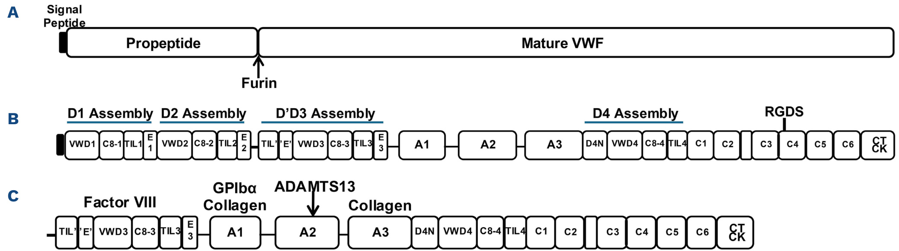
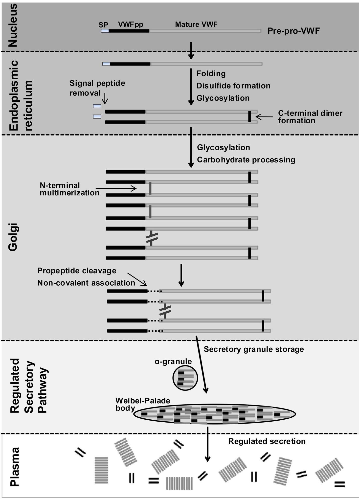
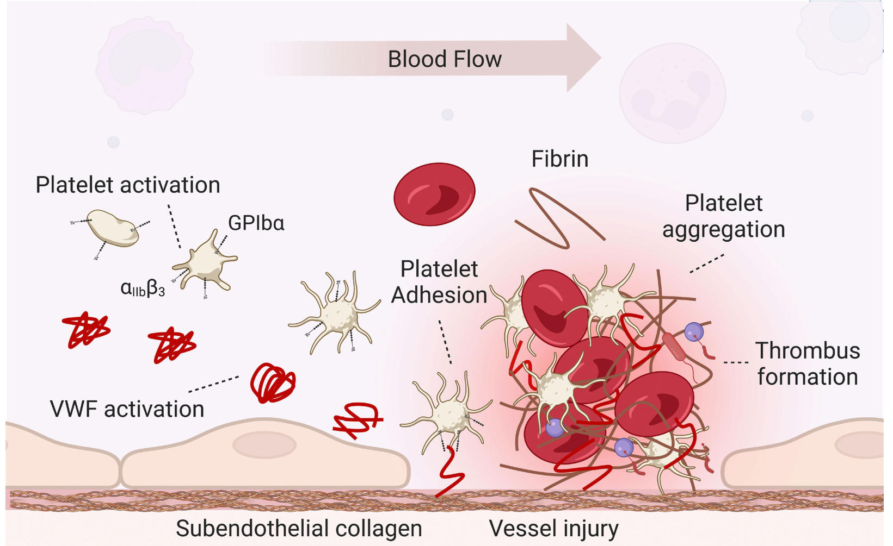
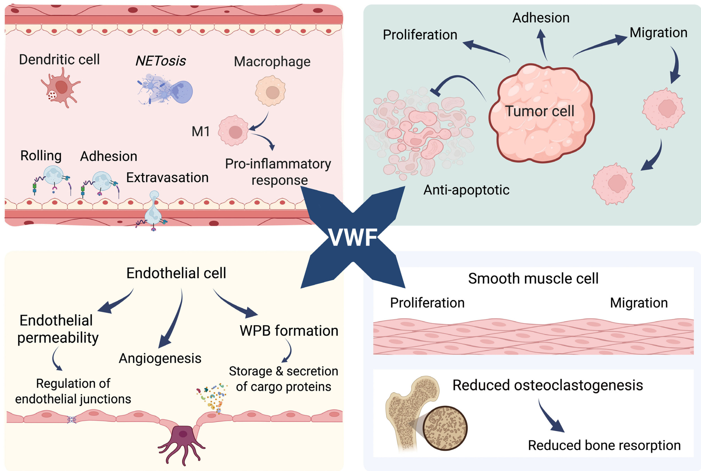

# STRUCTURE AND MULTIPLE FUNCTIONS OF VON WILLEBRAND FACTOR  

SANDRA l. hABERICHTER1 AND JAMES s. o'dONNELL2,3  

1vERSITI ï DIAGNOSTIC LABORATORIES AND BLOOD RESEARCH INSTITUTE, MILWAUKEE, wi, usa; 2iRISHcENTRE FOR VASCULAR BIOLOGY, SCHOOL OF PHARMACY AND BIOMOLECULAR SCIENCES, ROYAL COLLEGEOF SURGEONS IN IRELAND, DUBLIN, IRELAND AND 3nATIONAL COAGULATION CENTRE, sT JAMES'ShOSPITAL, DUBLIN, IRELAND  

CORRESPONDENCE: j. o'DONNELL JAMESODONNELL@RCSI.IE  

RECEIVED: APRIL 30, 2025.   
ACCEPTED: AUGUST 26, 2025.  

HTTPS://DOI.ORG/10.3324/HAEMATOL.2024.286029 2026 FERRATA STORTI FOUNDATION PUBLISHED UNDER A cc by-nc LICENSE  

# ABSTRACT  

SINCE THE FIRST DESCRIPTION OF A PATIENT WITH VON WILLEBRAND DISEASE (vwd) BACK IN 1926, SIGNIFICANT ADVANCES HAVE BEEN MADE IN UNDERSTANDING THE BIOLOGY OF VON WILLEBRAND FACTOR (vwf). UNDER NORMAL CONDITIONS, IN VIVO BIOSYNTHESIS OF vwf IS RESTRICTED TO ENDOTHELIAL CELLS AND MEGAKARYOCYTES ONLY. THIS BIOSYNTHESIS INVOLVES COMPLEX POST-TRANSLATIONAL MODIFICATIONS (INCLUDING GLYCOSYLATION AND MULTIMERIZATION) WHICH PLAY A KEY ROLE IN ENABLING THE HEMOSTATIC FUNCTIONS OF vwf. aS A RESULT, vwf CIRCULATES IN NORMAL PLASMA AS A SERIES OF HETEROGENEOUS MULTIMERS THAT CAN MODULATE TETHERING OF PLATELETS AND PRIMARY HEMOSTASIS AT SITES OF VASCULAR INJURY. iN ADDITION, vwf ALSO INFLUENCES SECONDARY HEMOSTASIS BY SERVING AS A CHAPERONE MOLECULE AND PROTECTING FACTOR viii FROM PROTEOLYSIS AND PREMATURE CLEARANCE. THE MOLECULAR MECHANISMS UNDERLYING THE PRO-HEMOSTATIC FUNCTIONS OF vwf HAVE BEEN COMPREHENSIVELY CHARACTERIZED. THESE INSIGHTS SERVE TO UNDERPIN THE CURRENT CLASSIFICATION OF DIFFERENT vwd SUBTYPES. INTERESTINGLY, ACCUMULATING EVIDENCE OVER THE PAST DECADE HAS IDENTIFIED AN ARRAY OF NEW LIGANDS THAT ARE ABLE TO BIND TO vwf. CONSISTENT WITH THESE DATA, RECENT STUDIES HAVE FURTHER SUGGESTED A SERIES OF NOVEL AND NON HEMOSTATIC BIOLOGICAL FUNCTIONS FOR vwf. THESE INCLUDE POTENTIAL ROLES FOR vwf IN REGULATING INFLAMMATION, WOUND HEALING, ANGIOGENESIS AND TUMOR CELL METASTASIS. FURTHER RESEARCH IN THE COMING YEARS WILL BE REQUIRED TO DETERMINE THE CLINICAL SIGNIFICANCE OF THESE NON HEMOSTATIC ROLES OF vwf. DEFINING THE MOLECULAR MECHANISMS INVOLVED MAY OFFER EXCITING OPPORTUNITIES TO DEVELOP NOVEL ANTI-vwf TARGETED TREATMENT APPROACHES FOR IMPORTANT UNMET CLINICAL NEEDS.  

# INTRODUCTION  

# STRUCTURE OF VON WILLEBRAND FACTOR  

VON WILLEBRAND FACTOR (vwf) IS A COMPLEX MULTIMERIC PLASMA GLYCOPROTEIN THAT PLAYS CRITICAL ROLES IN NORMAL HEMOSTASIS.1,2 FIRST, vwf BINDS TO EXPOSED COLLAGEN AT SITES OF VASCULAR INJURY AND THEN TETHERS PLATELETS TO THE SITE OF INJURY. SECOND, vwf ALSO SERVES AS A CHAPERONE PROTEIN FOR FACTOR viii (fviii).3,4 STUDIES OVER MANY YEARS HAVE DEMONSTRATED THAT QUANTITATIVE AND/OR QUALITATIVE REDUCTIONS IN PLASMA vwf ACTIVITY RESULT IN VON WILLEBRAND DISEASE (vwd).1,5 CONVERSELY, ELEVATED PLASMA vwf-fviii COMPLEX LEVELS ARE A RISK FACTOR FOR BOTH VENOUS AND ARTERIAL THROMBOSIS.6,7 iN THIS MANUSCRIPT, WE REVIEW OUR CURRENT UNDERSTANDING OF THE BIOSYNTHESIS AND STRUCTURE OF vwf. iN ADDITION, WE FURTHER CONSIDER THE MECHANISMS THROUGH WHICH THIS MULTIMERIC GLYCOPROTEIN CAN PLAY SUCH A CRITICAL ROLE IN NORMAL HEMOSTASIS. FINALLY, WE DISCUSS ACCUMULATING RECENT EVIDENCE THAT vwf MAY HAVE NOVEL BIOLOGICAL FUNCTIONS EXTENDING BEYOND COAGULATION.  

THE vwf GENE IS LOCALIZED TO CHROMOSOME 12 AND CONTAINS 52 EXONS THAT SPAN APPROXIMATELY 178 KB WITH EXON SIZE VARYING BETWEEN 40 BP AND 1.4 KB FOR EXON 28.8 THE PRIMARY TRANSLATION PRODUCT IS A 2,813 AMINO ACID PROTEIN. THE n-TERMINAL PORTION OF vwf INCLUDES A HYDROPHOBIC 22-AMINO ACID SIGNAL PEPTIDE FOLLOWED BY A 741-AMINO ACID PROPEPTIDE (vwfPP) AND THE 2,050-AMINO ACID MATURE vwf PROTEIN (FIGURE 1a). DURING BIOSYNTHESIS, THE PROPEPTIDE IS REMOVED FROM THE MATURE vwf PROTEIN PROTEOLYTICALLY BY THE ENZYME FURIN (FIGURE 1a). THE vwf PROTEIN WAS HISTORICALLY REPORTED TO CONTAIN A SERIES OF HOMOLOGOUS a, b, c AND d DOMAINS WITH THE PROPEPTIDE CONTAINING TWO d DOMAINS (d1 AND d2) AND THE MATURE vwf PROTEIN COMPRISED OF d'-d3-a1-a2-a3-d4-b1-b2-b3-c1-c2-ck DOMAINS. MORE RECENTLY, ZHOU AND COLLEAGUES HAVE UPDATED THE vwf DOMAIN STRUCTURE TO ASSIGN SPECIFIC NODULES, RELATING THESE NODULES TO STRUCTURE USING ELECTRON MICROSCOPY (FIGURE 1b).9 THE d DOMAINS HAVE BEEN UPDATED TO ASSEMBLIES OF SMALL NODULES AND THE b AND c DOMAINS HAVE BEEN RE-ANNOTATED AS SIX TANDEM VON WILLEBRAND c (vwc) DOMAINS AND vwcLIKE DOMAINS. MATURE vwf BINDS TO MULTIPLE PROTEINS AND THESE BINDING SITES HAVE BEEN MAPPED TO SPECIFIC vwf DOMAINS (FIGURE 1c).10  

  
FIGURE 7. DOMAIN STRUCTURE OF VON WILLEBRAND FACTOR. (a) VON WILLEBRAND FACTOR (vwf) IS SYNTHESIZED AS PRE-PRO-vwf CONTAINING A 22 AMINO ACID (AA) SIGNAL PEPTIDE, A 741 AA PROPEPTIDE (vwfPP) AND THE 2,050 AA MATURE vwf PROTEIN. (b) vwf DOMAIN STRUCTURE. vwfPP CONSISTING OF d1 AND d2 DOMAIN ASSEMBLIES. MATURE vwf COMPRISES THE REMAINDER. ) SITES WITHIN vwf FOR BINDING TO FACTOR viii, PLATELET gpiBDž, AND COLLAGENS. THE a2 DOMAIN CONTAINS THE CLEAVAGE SITE OF adamts13 (a DISINTEGRIN AND METALLOPROTEINASE WITH tHROMBOsPONDIN TYPE-1 REPEATS 13).  

# BIOSYNTHESIS OF VON WILLEBRAND FACTOR  

vwf IS SYNTHESIZED EXCLUSIVELY IN ENDOTHELIAL CELLS AND MEGAKARYOCYTES WHERE IT UNDERGOES A COMPLEX SEQUENCE OF PROCESSING.11,12 MUCH OF THE INFORMATION REGARDING vwf SYNTHESIS AND INTRACELLULAR PROCESSING HAS BEEN GAINED THROUGH STUDIES OF CULTURED ENDOTHELIAL CELLS OR TRANSFECTED MAMMALIAN CELLS AND FEWER STUDIES OF MEGAKARYOCYTES/ PLATELETS.13-20 vwf IS SYNTHESIZED AS PRE-PRO-vwf CONTAINING A SIGNAL PEPTIDE, PROPEPTIDE AND MATURE vwf PROTEIN. iN THE ENDOPLASMIC RETICULUM (er), THE SIGNAL PEPTIDE IS REMOVED, PRO-vwf PROTEIN IS FOLDED, AND DISULFIDE BONDS ARE FORMED (FIGURE 2). vwf IS RICH IN CYSTEINE RESIDUES WITH 64 CYSTEINES IN vwfPP AND 170 CYSTEINES IN MATURE vwf. WITH 170 CYSTEINES IN MATURE vwf, FOLDING AND DISULFIDE FORMATION IS A COMPLICATED PROCESS. ALTHOUGH OLDER REPORTS INDICATED NO FREE CYSTEINES IN THE MATURE vwf PROTEIN, MORE RECENT DATA ACQUIRED USING MORE SENSITIVE TECHNIQUES SUGGEST THAT THERE MAY BE SOME UNPAIRED CYSTEINES.21,22 THE MAPPING OF DISULFIDE BONDS HAS BEEN RESOLVED FOR MANY OF THE DISULFIDE BONDS; HOWEVER, MANY OTHERS REMAIN UNRESOLVED.9,23  

iN THE er, THE PRO-vwf PROTEINS FORM CARBOXYL-TERMINAL DIMERS. THE LARGE vwfPP IS NOT NECESSARY FOR DIMERIZATION AS EXPRESSION OF A PROPEPTIDE-DELETED MATURE vwf RESULTS IN A DIMERIC vwf PROTEIN SECRETED.1 THE PRO-vwf MOLECULE IS EXTENSIVELY MODIFIED IN THE er BY ADDITION OF n-LINKED GLYCANS (FIGURE 2). THE vwfPP CONTAINS FOUR n-LINKED GLYCOSYLATION SITES AND THE MATURE vwf PROTEIN CONTAINS 13 n-LINKED  

SITES.24 TOGETHER, THE n- AND o-LINKED GLYCANS ACCOUNT FORABOUT 20% OF THE TOTAL vwf PROTEIN MASS. GLYCOMIC ANALYSESHAVE DEFINED APPROXIMATELY 100 DISTINCT n-GLYCAN COMPOSI-TIONS, INCLUDING abo BLOOD GROUP ANTIGENS, AND A VARIETY OFSTRUCTURAL FEATURES.24 vwf DIMERIZATION, GLYCOSYLATION ANDPROPER PROTEIN FOLDING ARE REQUIRED FOR SUCCESSFUL EXIT OFvwf FROM THE er.25,26 MISFOLDED PROTEINS ARE SELECTED IN THEer FOR DEGRADATION, AND DEFECTIVE PROCESSING IN THE er MAYCONTRIBUTE TO THE vwd PHENOTYPE IN PATIENTS.  

WITHIN THE GOLGI, o-LINKED GLYCANS ARE ADDED, GLYCANS ARETRIMMED AND GALACTOSE AND SIALIC ACID ARE ADDED TO FORMCOMPLEX CARBOHYDRATES (FIGURE 2). CANIS AND COLLEAGUESIDENTIFIED 18 DISTINCT o-GLYCAN STRUCTURES INCLUDING BOTHCORE 1 AND CORE 2 STRUCTURES, AS WELL AS UNUSUAL TETRA-SI-ALYLATED CORE o-GLYCANS AND abh ANTIGEN-CONTAINING CORE2 GLYCANS.27 IMPORTANTLY, THE COMPLEX n- AND o-GLYCANS ONvwf HAVE BEEN SHOWN TO INFLUENCE MULTIPLE ASPECTS OFTHE GLYCOPROTEIN'S LIFECYCLE INCLUDING BIOSYNTHESIS, SUSCEP-TIBILITY TO PROTEOLYSIS AND CLEARANCE.28-30 THE LARGE vwfPPIS PROTEOLYTICALLY REMOVED FROM MATURE vwf IN THE GOLGIBY THE ENZYME FURIN, A GOLGI-RESIDENT PROTEIN. THE SITE OFvwfPP CLEAVAGE IS TARGETED BY THE SEQUENCE MOTIF ARG-XXX-ARG/LYS-ARG AT THE CARBOXYL-TERMINAL END OF vwfPP.31 THECLEAVED vwfPP REMAINS NON-COVALENTLY ASSOCIATED WITHMATURE vwf UNTIL SECRETION OF BOTH PROTEINS FROM THE CELL.iN THE GOLGI, THE vwf DIMERS FORM VERY LARGE AMINO TERMI-NAL-LINKED MULTIMERS (FIGURE 2) THAT CAN EXCEED 20 MILLIONdA IN SIZE.32 vwf DIMERIZATION AND MULTIMERIZATION HAVEBEEN SHOWN TO BE TWO INDEPENDENT PROCESSES.20 WHILE THEer IS THE MOST PROBABLE SITE FOR DISULFIDE BOND FORMATIONDUE TO THE NEUTRAL Ph AND PRESENCE OF OXIDOREDUCTASE EN-ZYMES SUCH AS PROTEIN DISULFIDE ISOMERASE, THE ACIDIC GOLGITHAT LACKS OXIDOREDUCTASES IS AN UNLIKELY ENVIRONMENT FORDISULFIDE BOND FORMATION. iN ADDITION, er-TO-GOLGI TRANS-PORT VESICLES ARE LIKELY UNABLE TO ACCOMMODATE THE VERYLARGE vwf MULTIMERS. vwf HAS A UNIQUE MECHANISM TO  

  
FIGURE 2. INTRACELLULAR PROCESSING OFVON WILLEBRAND FACTOR. iN THE ENDO-PLASMIC RETICULUM, THE VON WILLE-BRAND FACTOR (vwf) SIGNAL PEPTIDE(sp) IS REMOVED, vwf IS FOLDED, DI-SULFIDE-BONDED, GLYCOSYLATED ANDFORMS c-TERMINAL DIMERS. iN THE GOL-GI, FURTHER GLYCOSYLATION AND PRO-CESSING OCCURS, DIMERS ARE ASSEM-BLED INTO n-TERMINAL MULTIMERS, ANDvwf-PROPEPTIDE (vwfPP) IS CLEAVEDBUT REMAINS NON-COVALENTLY ASSOCI-ATED. FROM THE GOLGI, vwf IS TRAF-FICKED TO REGULATED SECRETORY GRAN-ULES, Dž-GRANULES IN PLATELETS ANDwEIBEL-PALADE BODIES IN ENDOTHELI-AL CELLS. ONCE SECRETED INTO PLASMA,vwf AND vwfPP DISASSOCIATE ANDCIRCULATE INDEPENDENTLY.  

FACILITATE MULTIMERIZATION IN THE GOLGI BY UTILIZING vwfPP.21 THIS ROLE FOR vwfPP IN MULTIMERIZATION OF vwf HAS BEEN INTENSELY STUDIED AND REPORTED IN NUMEROUS STUDIES. BOTH THE d1 AND d2 DOMAINS IN vwfPP CONTAIN VICINAL CYSTEINE MOTIFS (cxxc SEQUENCES) WHICH ARE SIMILAR TO THOSE FOUND IN DISULFIDE ISOMERASES THAT PARTICIPATE IN MULTIMERIZATION BY CATALYZING DISULFIDE BOND EXCHANGE.18 THUS, THE vwfPP FUNCTIONS AS AN OXIDOREDUCTASE TO FACILITATE MULTIMERIZATION OF vwf IN THE GOLGI.33 vwfPP REMAINS NON-COVALENTLY ASSOCIATED WITH MATURE vwf MULTIMERS WHEN THEY LEAVE GOLGI AND ARE BOTH STORED FOR REGULATED RELEASE (FIGURE 2)  

IN ENDOTHELIAL CELL WEIBEL-PALADE BODIES (wpb) OR PLATELET Dž-GRANULES.14,17  

# VON WILLEBRAND FACTOR SECRETORY PATHWAYS  

REGULATED SECRETION ALLOWS FOR THE SWIFT RELEASE OF vwfAT THE SITE OF VASCULAR INJURY. THE wpb IS A ROD-SHAPEDORGANELLE UP TO 2 UM IN WIDTH AND UP TO 4 ǐM IN LENGTH.34tHE PLATELET Dž-GRANULE APPEARS TO BE SOMEWHAT LIKE Awpb IN TERMS OF MORPHOLOGY.35 THESE STORAGE GRANULESCONTAIN SOME OF THE HIGHEST MOLECULAR WEIGHT vwf MULTI-MERS, WHICH ARE THE MOST ACTIVE FOR BINDING TO PLATELETS ORSUBENDOTHELIAL COLLAGEN. THE MECHANISMS INVOLVED IN THETRAFFICKING OF vwf TO REGULATED STORAGE GRANULES HAVE BEENEXTENSIVELY STUDIED UTILIZING CULTURED ENDOTHELIAL CELLS ANDTRANSFECTED MAMMALIAN CELLS.17,19,36,37 SEVERAL STUDIES HAVESHOWN THAT vwfPP IS ACTIVELY INVOLVED IN THE TRAFFICKINGOF vwf TO REGULATED STORAGE.17,19,36 vwfPP ALONE TRAFFICS TOwpb AND STUDIES HAVE SHOWN THAT vwfPP CONTAINS THENECESSARY SIGNAL (SEQUENCE OR CONFORMATION) FOR NAVIGAT-ING THE REGULATED STORAGE PATHWAY, AND CO-TRAFFICS MATUREvwf MULTIMERS THROUGH A NON-COVALENT ASSOCIATION.16,33 vwfMULTIMER FORMATION IS NOT A PREREQUISITE FOR vwf STORAGEIN wpb, ALTHOUGH MULTIMERIZATION IS ACCOMPLISHED PRIOR TOREGULATED STORAGE.38,39 SEVERAL vwf VARIANTS WITH ABNORMALMULTIMER STRUCTURE ARE STORED IN wpb AND UNDERGO REGU-LATED RELEASE.39,40 ALTHOUGH vwfPP PLAYS AN ACTIVE ROLE INvwf MULTIMERIZATION AND REGULATED STORAGE, THE REGIONSWITHIN vwfPP FOR EACH OF THESE PROCESSES APPEAR TO BEINDEPENDENT OF ONE ANOTHER.16 iN ADDITION, wpb BIOGENESISAPPEARS TO BE A vwf-DRIVEN EVENT. iN THE ABSENCE OF vwf,SUCH AS IN vwf-DEFICIENT MICE AND DOGS, ENDOTHELIAL CELLwpb ARE ABSENT.15,41 AFTER EXPRESSION OF vwf AND vwfPPIN ENDOTHELIAL CELLS HARVESTED FROM vwf-DEFICIENT DOGS,vwf-CONTAINING GRANULES WITH CLASSIC wpb MORPHOLOGYWERE OBSERVED.15 MORE RECENTLY, TUBULE ASSEMBLY SUCH ASFOUND IN wpb WAS OBSERVED IN VITRO FOLLOWING INCUBATION OFRECOMBINANT vwfPP AND THE d'-d3 DOMAIN OF vwf, WITH THEPROCESS BEING DEPENDENT ON ACIDIC Ph AND THE PRESENCE OFCALCIUM.42 THESE STUDIES HAVE DELINEATED THE REQUIREMENTFOR wpb BIOGENESIS TO THE d1-d3 DOMAINS OF vwf.  

vwf IS RELEASED FROM wpb FOLLOWING ENDOTHELIAL CELL EXPOSURE TO VARIOUS STIMULI INCLUDING EPINEPHRINE, THROMBIN, HISTAMINE AND DESMOPRESSIN.43 THESE SECRETAGOGUES TRIGGER ENDOTHELIAL CELLS TO RELEASE vwf AS WELL AS OTHER wpb PROTEINS SUCH AS p-SELECTIN, cd63, AND INTERLEUKIN 8.38,44,45 iN vwd PATIENTS, THE MOST COMMON TREATMENT IS DESMOPRESSIN, WHICH RESULTS IN THE RELEASE OF vwf. vwf-CONTAINING wpb ARE TRANSLOCATED FROM THE CYTOPLASM TO THE PLASMA MEMBRANE, FOLLOWED BY FUSION AND RELEASE INTO THE CIRCULATION. ONCE SECRETED FROM THE CELL, vwf AND vwfPP CIRCULATE INDEPENDENTLY OF ONE ANOTHER (FIGURE 2). vwf AND vwfPP ARE CLEARED FROM PLASMA WITH HALF-LIVES OF APPROXIMATELY 12 HOURS AND 2-3 HOURS, RESPECTIVELY.46  

# ROLES OF VON WILLEBRAND FACTOR IN HEMOSTASIS  

MULTIMERIC vwf PLAYS A CRITICAL ROLE IN PRIMARY HEMOSTASISAT SITES OF VASCULAR INJURY (FIGURE 3).2,47 FOLLOWING VESSELDAMAGE, CIRCULATING vwf BINDS TO EXPOSED COLLAGEN IN THESUBENDOTHELIAL MATRIX. LOCAL SHEAR STRESS CAUSES UNWINDINGOF GLOBULAR INACTIVE vwf MULTIMERS INTO AN ACTIVE ELON-  

GATED CONFORMATION.47 PREVIOUS STUDIES HAVE DEMONSTRATED THAT vwf BINDING TO PLATELETS INVOLVES TWO PRIMARY SITES OF INTERACTION. FIRST, THE vwf-a1 DOMAIN (RESIDUES tYR1271^ aSP1459) BINDS TO THE PLATELET-RECEPTOR GLYCOPROTEIN 1Ba (gp1BDž). SECOND, AN rgd SEQUENCE LOCATED IN THE vwf-c4 DOMAIN INTERACTS WITH THE DžLLBdžLLL PLATELET INTEGRIN RECEPTOR. CONSEQUENTLY, TETHERED vwf AT SITES OF INJURY CAN PROMOTE PLATELET ADHESION AND AGGREGATION, ULTIMATELY LEADING TO PLATELET PLUG FORMATION. iN ADDITION, LOCAL ENDOTHELIAL CELL ACTIVATION LEADS TO wpb EXOCYTOSIS OF STORED HIGH MOLECULAR WEIGHT MULTIMERS OF vwf (hmwm-vwf). UNDER SHEAR CONDITIONS AND IN THE ABSENCE OF EFFECTIVE PROTEOLYSIS BY adamts13 (a DISINTEGRIN AND METALLOPROTEINASE WITH tHROMBOsPONDIN TYPE-1 REPEATS 13), ULTRA-LARGE vwf STRINGS MAY BE FORMED AND REMAIN TETHERED TO THE SURFACE OF ACTIVATED ENDOTHELIAL CELLS VIA SEVERAL LIGANDS INCLUDING THE INTEGRIN DžVdž3 AND p-SELECTIN.48,49 ALTHOUGH THE PHYSIOLOGICAL AND PATHOLOGICAL SIGNIFICANCE OF THESE vwf STRINGS REMAINS POORLY UNDERSTOOD, STUDIES HAVE DEMONSTRATED THAT THAT THEY CAN EFFECTIVELY RECRUIT PLATELETS AND OTHER CELL TYPES TO THE ENDOTHELIAL CELL SURFACE.50  

iN ADDITION TO PLASMA AND ENDOTHELIAL CELL-DERIVED vwf, ACTIVATION OF PLATELETS AT THE SITE OF INJURY LEADS TO Dž-GRANULE SECRETION AND CONSEQUENTLY HIGH LOCAL CONCENTRATIONS OF PLATELET-DERIVED hmwm-vwf.51,52 THIS PLATELET-DERIVED vwf IS PARTIALLY RESISTANT TO adamts13 PROTEOLYSIS SINCE IT HAS SIGNIFICANTLY ALTERED n-TERMINAL GLYCOSYLATION COMPARED TO ENDOTHELIAL CELL-DERIVED vwf.53 CONSEQUENTLY, PLATELET-DERIVED vwf ALSO CONTRIBUTES TO PRIMARY HEMOSTASIS UNDER SHEAR CONDITIONS.51,52 FINALLY, PREVIOUS STUDIES HAVE SHOWN THAT ENDOTHELIAL CELLS ALSO SECRETE vwf DIRECTLY INTO THE SUBENDOTHELIAL MATRIX. HOWEVER, IT REMAINS UNCLEAR WHETHER THIS EXTRAVASCULAR vwf HAS ANY BIOLOGICAL ROLE IN REGULATING HEMOSTASIS.  

# INTERACTION OF VON WILLEBRAND FACTOR WITH gp1BDž  

UNDER STEADY STATE CONDITIONS IN NORMAL PLASMA, vwf AND PLATELET gp1BDž DO NOT INTERACT. RECENT STUDIES BY lI AND COLLEAGUES HAVE IDENTIFIED THE MECHANISM UNDERLYING THIS QUIESCENCE.54-56 THEY DEMONSTRATED THAT n-TERMINAL (gLN1238-hIS1268) AND c-TERMINAL (lEU1460-aSP1472) FLANKING PEPTIDES LOCATED EITHER SIDE OF THE vwf-a1 DOMAIN INTERACT TO FORM A SO-CALLED AUTOINHIBITORY MODULE (aim).54,56 THIS aim SERVES TO PREVENT BINDING OF gp1BDž TO THE vwf-a1 DOMAIN UNDER STATIC CONDITIONS.56 HOWEVER, IN THE PRESENCE OF SHEAR STRESS, HYDRODYNAMIC FORCES CAUSE DISSOCIATION OF THE TWO aim PEPTIDES, LEADING TO vwf-a1 DOMAIN ACTIVATION AND THEREBY ENABLING AN INTERACTION WITH gp1BDž.55 THUS, CONFORMATIONAL CHANGES AND vwf MULTIMERIC SIZE BOTH PLAY KEY ROLES IN REGULATING vwf HEMOSTATIC ACTIVITY.47,57 iN THE ABSENCE OF SHEAR STRESS, RISTOCETIN CAN BE USED AS A SURROGATE TO INDUCE vwf INTERACTION WITH PLATELET gp1B.58 CONSEQUENTLY, THE vwf RISTOCETIN COFACTOR ACTIVITY ASSAY (vwf:rco) HAS BEEN USED FOR MANY YEARS AS A GOLD STANDARD TEST OF vwf FUNCTION HOWEVER, RECENT STUDIES  

  
FIGURE 3. HEMOSTATIC FUNCTION OF VON WILLEBRAND FACTOR. TETHERED MULTIMERIC VON WILLEBRAND FACTOR (vwf) AT SITES OF VASCULAR DAMAGE IS UNWOUND BY SHEAR STRESS SUCH THAT THE BINDING SITE FOR PLATELET gp1BDž WITHIN THE vwf-a1 DOMAIN BECOMES ACCESSIBLE. THIS FACILITATES PLATELET RECRUITMENT, FOLLOWED BY PLATELET ACTIVATION AND AGGREGATION.  

HAVE DEMONSTRATED THAT vwf-a1 DOMAIN POLYMORPHISMS (NOTABLY d1472h) CAN SIGNIFICANTLY IMPAIR vwf BINDING TO RISTOCETIN.59 ALTHOUGH d1472h MAY THUS CAUSE SIGNIFICANTLY REDUCED vwf:rco LEVELS, IT IS NOT ASSOCIATED WITH ANY REDUCTION IN vwf FUNCTIONAL ACTIVITY IN VIVO, OR A BLEEDING TENDENCY. THESE FINDINGS ARE CLINICALLY IMPORTANT BECAUSE d1472h IS COMMON IN THE GENERAL POPULATION, PARTICULARLY IN AFRICAN-AMERICAN INDIVIDUALS.59  

# INTERACTION OF VON WILLEBRAND FACTOR WITH DžLLBdžLLL  

PLATELET ADHESION TO vwf TRIGGERS PLATELET ACTIVATION ANDINTRACELLULAR SIGNALING WHICH LEADS TO A CONFORMATIONALCHANGE IN THE DžLLBdžLLL INTEGRIN.29,60 THE ACTIVATED INTEGRINIS THEN ABLE TO INTERACT WITH FIBRINOGEN TO ENABLE PLATE-LET-PLATELET INTERACTION AND AGGREGATION. THE vwf-c4DOMAIN CONTAINS AN ARG-GLY-ASP-SER (rgds) MOTIF (RES-IDUES 2,507-2,510) THAT CAN ALSO INTERACT WITH DžLLBdžLLL TOSUPPORT FIBRINOGEN-INDEPENDENT PLATELET AGGREGATION.61,62iN CONTRAST TO THE gp1BDž INTERACTION, vwf CAN EFFICIENTLYBIND DžLLBdžLLL UNDER STATIC CONDITIONS AND vwf MULTIMERSIZE DOES NOT APPEAR TO AFFECT THE INTERACTION.47  

# INTERACTION OF VON WILLEBRAND FACTOR WITH COLLAGEN  

FOR vwf TO EFFICIENTLY MEDIATE PLATELET RECRUITMENT AT SITES OF VASCULAR INJURY, IT MUST BIND TO EXPOSED SUBENDOTHELIAL COLLAGEN. PREVIOUS STUDIES HAVE DEMONSTRATED THAT TWO DISTINCT vwf REGIONS PARTICIPATE IN BINDING, DEPENDING UPON THE TYPE OF COLLAGEN. THUS, THE vwf-a3 DOMAIN MEDIATES BINDING TO TYPES i AND iii COLLAGEN,63,64  

WHEREAS THE vwf-a1 DOMAIN INTERACTS WITH TYPES iv AND vi COLLAGEN.65,66 LIKE gp1BDž, hmwm-vwf DEMONSTRATES SIGNIFICANTLY ENHANCED BINDING TO COLLAGEN.67 HOWEVER, IN STRIKING CONTRAST TO gp1BDž, vwf CAN INTERACT WITH COLLAGEN UNDER STATIC CONDITIONS, SUGGESTING THAT THE COLLAGEN BINDING SITES ARE CONSTITUTIVELY EXPOSED.47  

# INTERACTION OF VON WILLEBRAND FACTOR WITH FACTOR viii  

FOR MORE THAN 40 YEARS IT HAS BEEN RECOGNIZED THAT vwf FUNCTIONS AS A NECESSARY CHAPERONE PROTEIN FOR fviii.3 STUDIES HAVE DEMONSTRATED THAT vwf BINDS TO fviii WITH HIGH AFFINITY (DISSOCIATION CONSTANT [kD] OF APPROXIMATELY 0.5 Nm).68,69 UNDER NORMAL CONDITIONS, AN ESTIMATED 95% OF fviii CIRCULATES BOUND TO vwf.3,68,69 INTERACTION WITH vwf PLAYS A KEY ROLE IN PROTECTING fviii FROM PROTEOLYSIS AND PREMATURE CLEARANCE.4 CONSEQUENTLY, IN PATIENTS WITH TYPE 3 vwd, ABSENCE OF vwf BINDING IS ASSOCIATED WITH A MARKED REDUCTION IN fviii HALF-LIFE IN VIVO (FROM APPROXIMATELY 12 HOURS TO 2 HOURS). RECENT ELECTRON MICROSCOPY STUDIES HAVE PROVIDED IMPORTANT INSIGHTS INTO THE MOLECULAR MECHANISMS THROUGH WHICH vwf INTERACTS WITH fviii, DEMONSTRATING THAT THE fviii LIGHT CHAIN (A3- a3-c1-c2) INTERACTS WITH THE n-TERMINAL d'd3 DOMAIN REGIONS OF vwf.70,71 THESE STUDIES HAVE HIGHLIGHTED THAT THE fviii c1-c2 DOMAINS INTERACT WITH THE vwf-d3 REGION, AND THE fviii A3-a3 DOMAINS BIND TO THE vwf-d' REGION.70,71 CONSISTENT WITH THESE STRUCTURAL DATA, EXPRESSION OF A DIMERIC TRUNCATED vwf-d'd3 FRAGMENT (SPANNING RESIDUES 764-1,035) HAS BEEN SHOWN TO BE SUFFICIENT TO  

NORMALIZE PLASMA fviii LEVELS IN A vwf-DEFICIENT MURINE MODEL.72 CURRENT EVIDENCE SUGGESTS THAT fviii BINDING IS NOT INFLUENCED BY EITHER vwf MULTIMER DISTRIBUTION OR SHEAR STRESS.47  

# INTERACTION OF VON WILLEBRAND FACTOR WITH adamts13  

THE MULTIMER DISTRIBUTION OF vwf IS A KEY DETERMINANT OF THE GLYCOPROTEIN'S FUNCTIONAL ACTIVITY, SINCE hmwm-vwf BINDS TO BOTH COLLAGEN AND PLATELET gpiBDž WITH INCREASED AFFINITY COMPARED TO LOW MOLECULAR WEIGHT MULTIMERS.47 iN NORMAL PLASMA, vwf MULTIMER DISTRIBUTION IS TIGHTLY REGULATED BY adamts13, WHICH INTERACTS WITH vwf FOLLOWING SECRETION FROM ENDOTHELIAL CELLS. RECENT CRYSTAL STUDIES HAVE PROVIDED NOVEL INSIGHTS INTO THE MECHANISMS THROUGH WHICH adamts13 EXOSITES INTERACT WITH DIFFERENT vwf DOMAINS TO ENABLE SPECIFIC CLEAVAGE AT tYR1605^mET1606 WITHIN THE vwf-a2 DOMAIN.73 IMPORTANTLY, vwf PROTEOLYSIS BY adamts13 IS SHEAR- AND MULTIMER-DEPENDENT IN NATURE.47,73 SEVERAL OTHER vwf-BINDING LIGANDS HAVE BEEN SHOWN TO MODULATE THE FACTOR'S SUSCEPTIBILITY TO adamts13 PROTEOLYSIS. t0 FOR EXAMPLE, fviLL BINDING TO THE d'd3 REGION AND gpLBDž BINDING TO THE a1 DOMAIN BOTH SIGNIFICANTLY ENHANCE vwf-a2 DOMAIN CLEAVAGE BY adamts13.73 iN CONTRAST, BINDING OF PLATELET FACTOR 4 AND THROMBOSPONDIN INHIBIT vwf PROTEOLYSIS BY adamts13.74,75 adamts13-MEDIATED REGULATION OF vwf MULTIMER DISTRIBUTION IS ESSENTIAL FOR NORMAL HEMOSTASIS. ENHANCED PROTEOLYSIS AND LOSS OF hmwm-vwf IN PATIENTS WITH TYPE 2a vwd RESULTS IN A SIGNIFICANT BLEEDING PHENOTYPE.1,5 CONVERSELY, INHERITED OR ACQUIRED adamts13 DEFICIENCY CAUSES ACCUMULATION OF PATHOLOGICAL ULTRA-LARGE vwf MULTIMERS AND THE FORMATION OF PLATELET-RICH THROMBI IN PATIENTS WITH THROMBOTIC THROMBOCYTOPENIC PURPURA.76 FURTHERMORE, REDUCED adamts13 LEVELS HAVE BEEN ASSOCIATED WITH AN INCREASED RISK OF MYOCARDIAL INFARCTION AND MAY BE IMPORTANT IN THE PATHOGENESIS OF OTHER MICROANGIOPATHIES INCLUDING CEREBRAL MALARIA AND CORONAVIRUS DISEASE 2019.7,77,78  

# OTHER LIGAND INTERACTIONS THAT INFLUENCE VON WILLEBRAND FACTOR ACTIVITY  

SEVERAL ADDITIONAL BINDING LIGANDS HAVE BEEN SHOWN TO INFLUENCE vwf BIOSYNTHESIS, PROTEOLYSIS AND CLEARANCE.10 FOR EXAMPLE, DURING POST-TRANSLATIONAL MODIFICATION IN ENDOTHELIAL CELLS, vwf INTERACTS WITH CHAPERONE BINDING PROTEINS INCLUDING BINDING-IMMUNOGLOBULIN PROTEIN AND PROTEIN DISULFIDE ISOMERASE.79 IMPORTANTLY, A SERIES OF CELL SURFACE RECEPTORS HAVE BEEN IDENTIFIED THAT BIND TO PLASMA vwf AND REGULATE ITS CLEARANCE IN VIVO. THESE INCLUDE c-TYPE LECTIN RECEPTORS SUCH AS THE ASIALO- GLYCOPROTEIN,80 MACROPHAGE GALACTOSE-TYPE LECTIN,81 AND c-TYPE LECTIN DOMAIN FAMILY 4 MEMBER m.82 iN ADDITION, SEVERAL SCAVENGER-TYPE RECEPTORS ALSO CONTRIBUTE TO vwf CLEARANCE, INCLUDING THE LOW-DENSITY LIPOPROTEIN RECEPTOR-RELATED PROTEIN (lrp)-1,83 SCAVENGER RECEPTOR CLASS a MEMBER 1,84 AND STABILIN-2.85  

# NON-HEMOSTATIC BIOLOGICAL ROLES OF VON WILLEBRAND FACTOR  

STUDIES OVER THE PAST DECADE HAVE SHOWN THAT AN ARRAY OF MORE THAN 50 DIFFERENT BINDING LIGANDS CAN INTERACT WITH vwf.10 FURTHERMORE, A SERIES OF NON-HEMOSTATIC BIOLOGICAL FUNCTIONS FOR vwf HAVE ALSO BEEN DESCRIBED, INCLUDING ROLES IN INFLAMMATION AND ANGIOGENESIS AND TUMOR CELL METASTASIS (FIGURE 4).10 EMERGING EVIDENCE SUGGESTS THAT THESE NON-HEMOSTATIC FUNCTIONS OF vwf MAY BE OF PHYSIOLOGICAL AND/OR PATHOLOGICAL SIGNIFICANCE.  

# VON WILLEBRAND FACTOR AND INFLAMMATION  

PREVIOUS STUDIES HAVE DESCRIBED THAT PLASMA vwf ANTIGEN (vwf:aG) AND vwfPP LEVELS CAN BE USEFUL AS BIOMARKERS OF ENDOTHELIAL CELL ACTIVATION AND DISEASE SEVERITY IN PATIENTS WITH A RANGE OF INFLAMMATORY CONDITIONS INCLUDING VARIOUS FORMS OF SEPSIS.86-88 HOWEVER, vwf HAS ALSO BEEN SHOWN TO BIND DIRECTLY TO IMMUNOREGULATORY CELLS AND PLAY ROLES IN PROMOTING PRO-INFLAMMATORY RESPONSES (FIGURE 4). FOR EXAMPLE, vwf HAS BEEN SHOWN TO BIND TO POLYMORPHONUCLEAR LEUKOCYTES (pmn).89 UNDER SHEAR CONDITIONS, INITIAL ROLLING OF pmn IS MEDIATED BY INTERACTION OF THE vwf-a1 DOMAIN WITH p-SELECTIN GLYCOPROTEIN LIGAND-1 ON THE LEUKOCYTE SURFACE. SUBSEQUENTLY, STABLE ADHESION IS MEDIATED BY BINDING OF THE vwf-d'd3 AND vwf-a1a3 DOMAINS TO dž2-INTEGRIN RECEPTORS ON LEUKOCYTES.89 iN ADDITION TO BINDING TO pmn, STUDIES IN MURINE MODELS HAVE DEMONSTRATED THAT vwf ALSO INFLUENCES VASCULAR PERMEABILITY AND THEREBY REGULATES LEUKOCYTE EXTRAVASATION AT SITES OF INFLAMMATION.90 iN THE ABSENCE OF vwf, SIGNIFICANTLY REDUCED ACCUMULATION OF IN VIVO pmn ACCUMULATION WAS OBSERVED IN MODELS OF THIOGLYCOLLATE-INDUCED PERITONITIS, IMMUNE-COMPLEX-MEDIATED VASCULITIS AND IRRITATIVE CONTACT DERMATITIS.90,91  

BESIDES pmn, RECENT DATA HAVE SHOWN THAT vwf ALSO BINDSTO MACROPHAGES UNDER BOTH STATIC AND SHEAR CONDITIONS(FIGURE 4).92-94 SEVERAL DIFFERENT MACROPHAGE SURFACE LECTINAND SCAVENGER RECEPTORS CAN INTERACT WITH DIFFERENT DOMAINSOF vwf.95 THESE INTERACTIONS PLAY A KEY ROLE IN REGULATINGTHE PHYSIOLOGICAL CLEARANCE OF PLASMA vwf. IMPORTANTLY,HOWEVER, RECENT STUDIES HAVE HIGHLIGHTED THAT vwf BINDINGTO MACROPHAGES CAN TRIGGER SIGNIFICANT PRO-INFLAMMATORYINTRACELLULAR SIGNALING PATHWAYS, LEADING TO ACTIVATION OF MI-TOGEN-ACTIVATED PROTEIN KINASE P38 (mapk P38) AND NUCLEARFACTOR-Kb.94 aS A RESULT, vwf BINDING CAUSES MACROPHAGES TODEVELOP A PRO-INFLAMMATORY m1 PHENOTYPE WITH ENHANCEDGLYCOLYSIS AND UPREGULATED PRO-INFLAMMATORY CYTOKINESECRETION.94 COLLECTIVELY, THESE FINDINGS SUGGEST THAT vwfNOT ONLY INITIATES PRIMARY HEMOSTASIS AT SITES OF VASCULARDAMAGE BUT ALSO ACTIVATES TISSUE-RESIDENT MACROPHAGESIN THE VICINITY TO PROMOTE LOCAL INNATE IMMUNE RESPONSES.ADDITIONAL ROLES THROUGH WHICH vwf CAN DIRECTLY IMPACTINFLAMMATION HAVE ALSO BEEN PROPOSED. FIRST, vwf HASBEEN SHOWN TO BIND TO DENDRITIC CELLS, AND THUS MAY AFFECTADAPTIVE IMMUNE RESPONSES.96 SECOND, ROLES FOR vwf IN  

  
FIGURE 4. NOVEL BIOLOGICAL FUNCTIONS OF VON WILLEBRAND FACTOR. ACCUMULATING DATA HAVE DEFINED IMPORTANT NON-HEMOSTATIC FUNCTIONS FOR VON WILLEBRAND FACTOR (vwf). WITH RESPECT TO INFLAMMATION, vwf CAN INTERACT WITH NEUTROPHILS TO INFLUENCE THEIR ADHESION TO ENDOTHELIAL CELL SURFACES AND SUBSEQUENT EXTRAVASATION. iN ADDITION, vwf CAN BIND TO MACROPHAGES TO TRIGGER PRO-INFLAMMATORY INTRACELLULAR SIGNALING. FURTHERMORE, vwf CAN BIND TO DENDRITIC CELLS AND INFLUENCE netOSIS. vwf CAN ALSO: (I) INTERACT WITH CANCER CELLS TO DIRECTLY INFLUENCE MULTIPLE ASPECTS OF TUMOR BIOLOGY; (I) INFLUENCE ANGIOGENESIS THROUGH MULTIPLE POTENTIAL PATHWAYS; (II) AFFECT SMOOTH MUSCLE PROLIFERATION; AND MIGRATION AND (IV) REGULATE OSTEOCLAST DIFFERENTIATION AND BONE RESORPTION.  

REGULATING netOSIS BY BINDING TO HISTONES AND EXTRACELLULAR dna HAVE BEEN DESCRIBED.97 FINALLY, vwf HAS ALSO BEEN REPORTED TO BIND TO VARIOUS MEMBERS OF THE COMPLEMENT FAMILY (INCLUDING c1Q, c3, c3B AND COMPLEMENT FACTOR h) AND TO INFLUENCE COMPLEMENT ACTIVATION.98,99  

# VON WILLEBRAND FACTOR AND ANGIOGENESIS  

FOR MANY YEARS, IT HAS BEEN RECOGNIZED THAT GASTROINTESTINAL ANGIODYSPLASIA IS COMMON IN PATIENTS WITH INHERITED AND ACQUIRED vwd, FOR EXAMPLE IN HEYDE SYNDROME ASSOCIATED WITH AORTIC STENOSIS.100 INTERESTINGLY, THIS ANGIODYSPLASIA MAY BE MORE MARKED IN vwd SUBTYPES THAT ARE ASSOCIATED WITH LOSS OF hmwm-vwf.  

CONSISTENT WITH THE HUMAN DATA, MORE RECENT STUDIES HAVE SHOWN SIGNIFICANTLY ENHANCED ANGIOGENESIS IN vwf-DEFICIENT MICE.101 FURTHERMORE, INHIBITION OF vwf EXPRESSION IN ENDOTHELIAL CELLS USING SMALL-INTERFERING rna LED TO SIGNIFICANTLY ENHANCED ANGIOGENESIS EX VIVO. CUMULATIVELY, THESE FINDINGS SUGGEST THAT vwf PLAYS A ROLE IN REGULATING ANGIO  

GENESIS. 101,102 ALTHOUGH THE BIOLOGICAL MECHANISMS INVOLVED HAVE NOT BEEN FULLY ELUCIDATED, vwf HAS BEEN SHOWN TO BIND TO BOTH ANGIOPOIETIN 2 AND GALECTIN 3, WHICH ARE BOTH INVOLVED IN REGULATING ANGIOGENESIS.100  

# ADDITIONAL NON-HEMOSTATIC FUNCTIONS FOR VON WILLEBRAND FACTOR  

BEYOND INFLAMMATION AND ANGIOGENESIS, ADDITIONAL NON-HEMOSTATIC FUNCTIONS FOR vwf HAVE BEEN PROPOSED.10 FOR EXAMPLE, RECENT STUDIES REPORTED A ROLE FOR vwf IN REGULATING WOUND HEALING, WITH SIGNIFICANTLY IMPAIRED WOUND HEALING IN vwf-DEFICIENT MICE.103 ALTHOUGH FURTHER STUDIES WILL BE REQUIRED TO DEFINE THE UNDERLYING MECHANISMS INVOLVED, THE vwf-a1 DOMAIN HAS BEEN SHOWN TO INTERACT WITH CRITICAL GROWTH FACTORS, INCLUDING VASCULAR ENDOTHELIAL GROWTH FACTOR-a, FIBROBLAST GROWTH FACTOR-2 AND PLATELET-DERIVED GROWTH FACTOR.103  

aS WELL AS BINDING TO PLATELETS, pmn AND MACROPHAGES,vwf CAN ALSO BIND TO VASCULAR SMOOTH MUSCLE CELLS (vsmc)  

(FIGURE 4).104 THIS INTERACTION IS MEDIATED AT LEAST IN PART BY vwf INTERACTION WITH lrp-4 AND Dždž3 RECEPTORS ON THE vsmc SURFACE. INTERESTINGLY, vwf BINDING HAS ALSO BEEN SHOWN TO INITIATE INTRACELLULAR SIGNALING (INCLUDING ACTIVATION OF mapk P38) THAT ULTIMATELY LEADS TO vsmc PROLIFERATION, ENHANCED MIGRATION AND INTIMAL HYPERPLASIA.104 iN ADDITION, A ROLE FOR vwf IN REGULATING OSTEOCLAST DIFFERENTIATION AND BONE RESORPTION HAS ALSO BEEN REPORTED.105 FINALLY, AS IN SEPSIS, ELEVATED PLASMA vwf LEVELS HAVE BEEN ASSOCIATED WITH SIGNIFICANTLY WORSE OUTCOMES IN PATIENTS WITH DIFFERENT TYPES OF CANCER (E.G., BREAST, GASTRIC AND HEMATOLOGIC MALIGNANCIES). 106,107 THIS LIKELY RELATES IN PART TO A HIGHER RISK OF CANCER-ASSOCIATED THROMBOSIS IN PATIENTS WITH MARKEDLY INCREASED vwf-fviii LEVELS. INTERESTINGLY, HOWEVER, RECENT DATA HAVE SHOWN THAT vwf BINDING TO CANCER CELLS CAN DIRECTLY INFLUENCE TUMOR CELL APOPTOSIS, PROLIFERATION AND METASTASIS (FIGURE 4).107,108  

# CONCLUSIONS  

SINCE THE ORIGINAL PUBLICATION OF ERIK VON WILLEBRAND BACK IN 1926, WE HAVE GAINED SIGNIFICANT INSIGHTS INTO THE STRUCTURE OF vwf. iN PARTICULAR, WE HAVE COME TO APPRECIATE THE UNIQUE SHEAR-BASED REGULATION OF MULTIMERIC vwf FUNCTION AND UNDERSTAND HOW THIS COMPLEX GLYCOPROTEIN IS ABLE TO REGULATE FORMATION OF PRIMARY HEMOSTASIS AT SITES OF VASCULAR INJURY. HOWEVER, RECENT STUDIES HAVE IDENTIFIED AN ARRAY OF OTHER PROTEINS THAT CAN BIND TO vwf AND SUGGESTED INTRIGUING BIOLOGICAL ROLES FOR vwf EXTENDING WELL BEYOND ITS CLASSICAL  

PRO-HEMOSTATIC FUNCTION. FURTHER RESEARCH IN THE COMING YEARS WILL BE REQUIRED TO DETERMINE THE CLINICAL SIGNIFICANCE OF THESE NOVEL NON-HEMOSTATIC ROLES OF vwf. HOWEVER, DEFINING THE UNDERLYING MOLECULAR MECHANISMS INVOLVED MAY OFFER EXCITING OPPORTUNITIES TO DEVELOP NOVEL TARGETED TREATMENT APPROACHES FOR IMPORTANT UNMET CLINICAL NEEDS.  

# DISCLOSURES  

jso'd HAS SERVED ON SPEAKERS' BUREAU FOR BAXTER, BAYER, NOVO NORDISK, SOBI, BOEHRINGER INGELHEIM, LEO PHARMA, TAKEDA AND OCTAPHARMA; HAS SERVED ON THE ADVISORY BOARDS OF BAXTER, SOBI, BAYER, OCTAPHARMA, csl BEHRING, DAIICHI SANKYO, BOEHRINGER INGELHEIM, TAKEDA AND PFIZER; AND ALSO RECEIVED RESEARCH GRANT FUNDING AWARDS FROM 3m, BAXTER, BAYER, PFIZER, SHIRE, TAKEDA AND NOVO NORDISK. slh HAS NO CONFLICTS OF INTEREST TO DISCLOSE.  

# CONTRIBUTIONS  

slh AND jso'd DESIGNED AND WROTE THE ARTICLE. BOTH AUTHORS PARTICIPATED IN THIS WORK, TAKE PUBLIC RESPONSIBILITY FOR THE CONTENT AND GAVE CONSENT TO THE FINAL VERSION OF THE ARTICLE.  

# ACKNOWLEDGMENTS  

THE FIGURES WERE MADE WITH BIORENDER  

# FUNDING  

jso'd IS SUPPORTED BY A SCIENCE FOUNDATION IRELAND FRONTIERS FOR THE FUTURE (ffp) AWARD (20/ffp-a/8952) AND THE nih FOR THE ZIMMERMAN PROGRAM (hl081588).  

# REFERENCES  

1. SEIDIZADEH o, EIKENBOOM jcj, DENIS cv, ET AL. VON WILLEBRAND DISEASE. NAT REV DIS PRIMERS. 2024;10(1):51.   
2. LENTING pj, CHRISTOPHE od, DENIS cv. VON WILLEBRAND FACTOR BIOSYNTHESIS, SECRETION, AND CLEARANCE: CONNECTING THE FAR ENDS. BLOOD. 2015;125(13):2019-2028.   
3. TURECEK pl, JOHNSEN jm, PIPE sw, o'DONNELL js; Ipath STUDY GROUP. BIOLOGICAL MECHANISMS UNDERLYING INTER-INDIVIDUAL VARIATION IN FACTOR viii CLEARANCE IN HAEMOPHILIA. HAEMOPHILIA. 2020;26(4):575-583.   
4. PIPE sw, MONTGOMERY rr, PRATT kp, LENTING pj, LILLICRAP d. LIFE IN THE SHADOW OF A DOMINANT PARTNER: THE fviii-vwf ASSOCIATION AND ITS CLINICAL IMPLICATIONS FOR HEMOPHILIA a. BLOOD. 2016;128(16):2007-2016.   
5. LEEBEEK fw, EIKENBOOM jc. VON WILLEBRAND'S DISEASE. n ENGL j MED. 2016;375(21):2067-2080.   
6. o'DONNELL j, LAFFAN m. ELEVATED PLASMA FACTOR viii LEVELS--A NOVEL RISK FACTOR FOR VENOUS THROMBOEMBOLISM. CLIN LAB. 2001;47(1-2):1-6.   
7. SONNEVELD ma, DE MAAT mp, LEEBEEK fw. VON WILLEBRAND FACTOR AND adamts13 IN ARTERIAL THROMBOSIS: A SYSTEMATIC REVIEW AND META-ANALYSIS. BLOOD REV. 2014;28(4):167-178.   
8. GINSBURG d, HANDIN ri, BONTHRON dt, ET AL. HUMAN VON WILLEBRAND FACTOR (Vwf): ISOLATION OF COMPLEMENTARY dna (Cdna) CLONES AND CHROMOSOMAL LOCALIZATION. SCIENCE. 1985;228(4706):1401-1406.   
9. ZHOU yf, ENG et, ZHU j, lU c, WALZ t, SPRINGER ta. SEQUENCE ANC STRUCTURE RELATIONSHIPS WITHIN VON WILLEBRAND FACTOR. BLOOD. 2012;120(2):449-458.   
10. ATIQ f, o'DONNELL js. NOVEL FUNCTIONS FOR VON WILLEBRAND FACTOR. BLOOD. 2024;144(12):1247-1256.   
11. JAFFE ea, HOYER lw, NACHMAN rl. SYNTHESIS OF VON WILLEBRAND FACTOR BY CULTURED HUMAN ENDOTHELIAL CELLS. PROC NATL ACAD SCI u s a. 1974;71(5):1906-1909.   
12. NACHMAN r, LEVINE r, JAFFE ea. SYNTHESIS OF FACTOR viii ANTIGEN BY CULTURED GUINEA PIG MEGAKARYOCYTES. j CLIN INVEST. 1977;60(4):914-921.   
13. JACOBI pm, GILL jc, FLOOD vh, JAKAB da, FRIEDMAN kd, HABERICHTER sl. INTERSECTION OF MECHANISMS OF TYPE 2a vwd THROUGH DEFECTS IN vwf MULTIMERIZATION, SECRETION, adamts-13 SUSCEPTIBILITY, AND REGULATED STORAGE. BLOOD. 2012;119(19):4543-4553.   
14. VISCHER um, WAGNER dd. VON WILLEBRAND FACTOR PROTEOLYTIC PROCESSING AND MULTIMERIZATION PRECEDE THE FORMATION OF WEIBEL-PALADE BODIES. BLOOD. 1994;83(12):3536-3544.   
15. HABERICHTER sl, MERRICKS ep, FAHS sa, CHRISTOPHERSON pa, NICHOLS tc, MONTGOMERY rr. rE-ESTABLISHMENT OF vwfDEPENDENT WEIBEL-PALADE BODIES IN vwd ENDOTHELIAL CELLS. BLOOD. 2005;105(1):145-152.   
16. HABERICHTER sl, JACOBI p, MONTGOMERY rr. CRITICAL INDEPENDENT REGIONS IN THE vwf PROPEPTIDE AND MATURE vwf THAT ENABLE NORMAL vwf STORAGE. BLOOD. 2003;101(4):1384 1391.   
17. HABERICHTER sl, FAHS sa, MONTGOMER rr. VON WILLEBRAND FACTOR STORAGE AND MULTIMERIZATION: INDEPENDENT INTRACELLULAR PROCESSES. BLOOD. 2000;96(5):1808 1815.   
18. JOURNET am, SAFFARIPOUR s WAGNER dd. REQUIREMENT FOR BOTH d DOMAINS OF THE PROPOLYPEPTIDE IN VON WILLEBRAND FACTOR MULTIMERIZATION AND STORAGE. THROMB HAEMOST.   
1993;70(6):1053-1057.   
19. WAGNER dd, SAFFARIPOUR s, BONFANTI r, ET AL. INDUCTION OF SPECIFIC STORAGE ORGANELLES BY VON WILLEBRAND FACTOR PROPOLYPEPTIDE. CELL. 1991;64(2):403-413.   
20. VOORBERG j, FONTIJN r, VAN MOURIK ja, PANNEKOEK h. DOMAINS INVOLVED IN MULTIMER ASSEMBLY OF VON WILLEBRAND FACTOR (Vwf): MULTIMERIZATION IS INDEPENDENT OF DIMERIZATION. embo j.   
1990;9(3):797-803.   
21. MAYADAS tn, WAGNER dd. iN VITRO MULTIMERIZATION OF VON WILLEBRAND FACTOR IS TRIGGERED BY LOW Ph. IMPORTANCE OF THE PROPOLYPEPTIDE AND FREE SULFHYDRYLS. j BIOL CHEM.   
1989;264(23):13497-13503.   
22. lI y, CHOI h, ZHOU z, ET AL. COVALENT REGULATION OF ulvwf STRING FORMATION AND ELONGATION ON ENDOTHELIAL CELLS UNDER FLOW CONDITIONS. THROMB HAEMOST. 2008;6(7):1135-1143.   
23. MARTI ROSSELET sj, TITANI k, WALSH ka. IDENTIFICATION OF DISULFIDE-BRIDGED SUBSTRUCTURES WITHIN HUMAN VON WILLEBRAND FACTOR. BIOCHEMISTRY. 1987;26(25):8099-8109.   
24. CANIS k, m CkINNON ta, NOWAK a, ET AL. MAPPING THE n-GLYCOME OF HUMAN VON WILLEBRAND FACTOR. BIOCHEM j. 2012;447(2):217-228   
25. HAMPTON ry. er-ASSOCIATED DEGRADATION IN PROTEIN QUALITY CONTROL AND CELLULAR REGULATION. CURR OPIN CELL BIOL.   
2002;14(4):476-482.   
26. BONIFACINO js, LIPPINCOTT-SCHWARTZ j. DEGRADATIONPR WITHIN THE ENDOPLASMIC RETICULUM. CURR OPIN CELL BIOL.   
1991;3(4):592-600.   
27. CANIS k, m CkINNON ta, NOWAK a, ET AL. THE PLASMA VON WILLEBRAND FACTOR o-GLYCOME COMPRISES A SURPRISING VARIETY OF STRUCTURES INCLUDING abh ANTIGENS AND DISIALOSYL MOTIFS. j THROMB HAEMOST. 2010;8(1):137-145.   
28. WARD s, o'SULLIVAN jm o'DONNELL js. VON WILLEBRAND FACTOR SIALYLATION A CRITICAL REGULATOR OF BIOLOGICAL FUNCTION. j THROMB HAEMOST. 2019;17(7):1018-1029.   
29. AGUILA s, LAVIN m, DALTON n, ET AL. INCREASED GALACTOSE EXPRESSION AND ENHANCED CLEARANCE IN PATIENTS WITH LOW VON WILLEBRAND FACTOR. BLOOD. 2019;133(14):1585-1596.   
30. KARAMPINI e, DOHERTY d, BURGISSER pe, ET AL. o-GLYCAN DETERMINANTS REGULATE vwf TRAFFICKING TO WEIBEL-PALADE BODIES. BLOOD ADV. 2024;8(12):3254-3266.   
31. REHEMTULLA a, KAUFMAN rj. PREFERRED SEQUENCE REQUIREMENTS FOR CLEAVAGE OF PRO-VON WILLEBRAND FACTOR BY PROPEPTIDEPROCESSING ENZYMES. BLOOD. 1992;79(9):2349- 2355.   
32. SADLER je, BUDDE u, EIKENBOOM jc, ET AL UPDATE ON THE PATHOPHYSIOLOGY AND CLASSIFICATION OF VON WILLEBRAND DISEASE: A REPORT OF THE SUBCOMMITTEE ON VON WILLEBRAND FACTOR. j THROMK HAEMOST. 2006;4(10):2103-2114.   
33. PURVIS ar, GROSS j, DANG lt, ET AL. TWO CYS RESIDUES ESSENTIAL FOR VON WILLEBRAND FACTOR MULTIMER ASSEMBLY THE GOLGI. PROC NATL ACAD SCI u s a. 2007;104(40):15647-15652.   
34. WEIBEL er, PALADE ge. NEW CYTOPLASMIC COMPONENTS IN ARTERIAL ENDOTHELIA. j CELL BIOL. 1964;23(1) :101-112.   
35. CRAMER em, MEYER d, LE MENN r, BRETON-GORIUS j. ECCENTRIC LOCALIZATION OF VON WILLEBRAND FACTOR IN AN INTERNAL STRUCTURE OF PLATELET ALPHA-GRANULE RESEMBLING THAT OF WEIBEL-PALADE BODIES. BLOOD. 1985 66(3):710-713.   
36. VOORBERG j, FONTIJN r, CALAFAT j, JANSSEN h, VAN MOURIK ja, PANNEKOEK h. BIOGENESIS OF VON WILLEBRAND FACTOR-CONTAINING ORGANELLES IN HETEROLOGOUS TRANSFECTED cv-1 CELLS. embo j. 1993;12(2):749-758.   
37. HOP c, FONTIJN r, VAN MOURIK ja, PANNEKOEK h. POLARITY OF CONSTITUTIVE AND REGULATED VON WILLEBRAND FACTOR SECRETION BY TRANSFECTED mdck-ii CELLS. EXP CELL RES. 1997;230(2):352-361.   
38. VISCHER um, WAGNER dd. cd63 IS A COMPONENT OF WEIBEL-PALADE BODIES OF HUMAN ENDOTHELIAL CELLS. BLOOD. 1993;82(4):1184-1191.   
39. MICHAUX g, HEWLETT j MESSENGER sl ET AL. ANALYSIS OF INTRACELLULAR STORAGE AND REGULATED SECRETION OF 3 VON WILLEBRAND DISEASE-CAUSING VARIANTS OF VON WILLEBRAND FACTOR. BLOOD. 2003;102(7):2452-2458.   
40. HOMMAIS STEPANIAN a FRESSINAUD e, ET AL. MUTATIONS c1157f AND c1234 4w OF VON WILLEBRAND FACTOR CAUSE INTRACELLULAR RETENTION WITH DEFECTIVE MULTIMERIZATION AND SECRETION. j THROMB HAEMOST. 2006;4(1):148-157.   
41. DENIS c, METHIA n, FRENETTE ps, ET AL. a MOUSE MODEL OF SEVERE VON WILLEBRAND DISEASE: DEFECTS IN HEMOSTASIS AND THROMBOSIS. PROC NATL ACAD SCI u s a. 1998;95(16):9524- 9529.   
42. HUANG rh, WANG y, ROTH r, ET AL. ASSEMBLY OF WEIBEL-PALADE BODY-LIKE TUBULES FROM n-TERMINAL DOMAINS OF VON WILLEBRAND FACTOR. PROC NATL ACAD SCI u s a. 2008;105(2):482-487.   
43. KAUFMANN je, OKSCHE a, WOLLHEIM cb, GUNTHER g, ROSENTHAL w, VISCHER um. VASOPRESSIN-INDUCED VON WILLEBRAND FACTOR SECRETION FROM ENDOTHELIAL CELLS INVOLVES v2 RECEPTORS AND camp. j CLIN INVEST. 2000;106(1):107-116.   
44. WOLFF b, BURNS ar, MIDDLETON j, ROT a. ENDOTHELIAL CELL "MEMORY" OF INFLAMMATORY STIMULATION: HUMAN VENULAR ENDOTHELIAL CELLS STORE INTERLEUKIN 8 IN WEIBEL-PALADE BODIES. j EXP MED. 1998;188(9):1757-1762.   
45. SHAHBAZI s, LENTING pj, FRIBOURG c, TERRAUBE v, DENIS cv, CHRISTOPHE od. CHARACTERIZATION oF THE INTERACTION BETWEEN VON WILLEBRAND FACTOR AND OSTEOPROTEGERIN. j THROMB HAEMOST. 2007;5(9):1956-1962.   
46. VAN MOURIK ja, BOERTJES HUISVELD a ET AL. VON WILLEBRAND FACTOR PROPEPTIDE IN VASCULAR DISORDERS: A TOOL TO DISTINGUISH BETWEEN ACUTE AND CHRONIC ENDOTHELIAL CELL PERTURBATION. BLOOD. 1999;94(1):179-185.   
47. LENTING pj, DENIS cv, cH ISTOPHE od. HOW UNIQUE STRUCTURAL ADAPTATIONS SUPPORT AND COORDINATE THE COMPLEX FUNCTION OF VON WILLEBRAND FACTOR. BLOOD. 2024;144(21):2174-2184.   
48. PADILLA a, MOAKE jl, BERNARDO a, ET AL. p- SELECTIN ANCHORS NEWLY RELEASED ULTRALARGE VON WILLEBRAND FACTOR MULTIMERS TO THE ENDOTHELIAL CELL SURFACE. BLOOD. 2004;103(6):2150-2156.   
49. HUANG ROTH r HEUSER je, SADLER je. INTEGRIN ALPHA(V)BETA(3) ON HUMAN ENDOTH ELIAL CELLS BINDS VON WILLEBRAND FACTOR STRINGS UNDER FLUID SHEAR STRESS. BLOOD. 2009;113(7):1589-1597.   
50. BRIDGES dj, BUNN j, VAN MOURIK ja, ET AL. RAPID ACTIVATION OF ENDOTHELIAL CELLS ENABLES PLASMODIUM FALCIPARUM ADHESION TO PLATELET-DECORATED VON WILLEBRAND FACTOR STRINGS. BLOOD. 2010;115(7):1472- 1474.   
51. m CgRATH rt, m CrAE e, SMITH op, o'DONNELL js. PLATELET VON WILLEBRAND FACTOR- -STRUCTURE, FUNCTION AND BIOLOGICAL IMPORTANCE. bR HAEMATOL. 2010;148(6) 834 843.   
52. MANNUCCI pm. PLATELET VOR WILLEBRAND FACTOR IN INHERITED AND ACQUIRED BLEEDING DISORDERS. PROC NATL ACAD SCI u s a. 1995;92(7):2428-2432.   
53. m CgRATH rt, VAN DEN BIGGELAAR m BYRNE b, ET AL. ALTERED GLYCOSYLATION OF PLATELET-DERIVED VON WILLEBRAND FACTOR CONFERS RESISTANCE TO adamts13 PROTEOLYSIS. BLOOD. 2013;122(25):4107 4110.   
54. ARCE na, CAO w, BROWN ak, ET AL. ACTIVATION OF VON WILLEBRAND FACTOR VIA MECHANICAL UNFOLDING OF ITS DISCONTINUOUS AUTOINHIBITORY MODULE. NAT COMMUN. 2021;12(1):2360.   
55. ARCE na, MARKHAM LEE z, LIANG q, ET AL. CONFORMATIONAL ACTIVATION AND INHIBITION OF VON WILLEBRAND FACTOR BY TARGETING ITS AUTOINHIBITORY MODULE. bL00D. 2024;143(19):1992-2004.   
56. DENG w, WANG y, DRUZAK sa, ET AL. a DISCONTINUOUS AUTOINHIBITORY MODULE MASKS THE a1 DOMAIN OF VON WILLEBRAND FACTOR. j THROMB HAEMOST. 2017;15(9):1867-1877.   
57. CHOPEK mw, GIRMA jp, FUJIKAWA k, DAVIE ew, TITANI k. HUMAN VON WILLEBRAND FACTOR: A MULTIVALENT PROTEIN COMPOSED OF IDENTICAL SUBUNITS. BIOCHEMISTRY. 1986;25(11):3146-3155.   
58. FOGARTY h, DOHERTY d, o'DONNELL js. NEW DEVELOPMENTS IN VON WILLEBRAND DISEASE. bR j HAEMATOL. 2020;191(3):329-339.   
59. FLOOD vh, GILL jc, MORATECK pa, ET AL. COMMON vwf EXON 28 POLYMORPHISMS IN AFRICAN AMERICANS AFFECTING THE vwf ACTIVITY ASSAY BY RISTOCETIN COFACTOR. BLOOD. 2010;116(2):280-286.   
60. PHILLIPS dr, FITZGERALD a, CHARO if, PARISE lv. THE PLATELET MEMBRANE GLYCOPROTEIN B/ILLA COMPLEX. STRUCTURE, FUNCTION, AND RELATIONSHIP TO ADHESIVE PROTEIN RECEPTORS IN NUCLEATED CELLS. ANN n y ACAD SCI. 1987;509:177-187.   
61. MARX CHRISTOPHE od, LENTING pj, ET AL. ALTERED THROMBUS FORMATION IN VON WILLEBRAND FACTOR-DEFICIENT MICE EXPRESSING VON WILLEBRAND FACTOR VARIANTS WITH DEFECTIVE BINDING TO COLLAGEN OR gpii BiLA. bLO0D. 2008;112(3):603-609.   
62. xU er, VON BULOW s, CHEN pc, ET AL. STRUCTURE AND DYNAMICS OF THE PLATELET INTEGRIN-BINDING c4 DOMAIN OF VON WILLEBRAND FACTOR. bLO0D. 2019;133(4):366-376.   
63. ROMIJN ra, BOUMA b, b, WUYSTER w, ET AL. IDENTIFICATION OF THE COLLAGEN-BINDING SITE OF THE VON WILLEBRAND FACTOR a3-DOMAIN. j BIOL CHEM. 2001;276(13):9985-9991.   
64. HUIZINGA eg, MARTIJN VAN DER PLAS r, KROON j, SIXMA jj, GROS p. CRYSTAL STRUCTURE OF THE a3 DOMAIN OF HUMAN VON WILLEBRAND FACTOR: IMPLICATIONS FOR COLLAGEN BINDING. STRUCTURE. 1997;5(9):1147-1156.   
65. FLOOD vh, SCHLAUDERAFF ac, HABERICHTER sl, ET AL. CRUCIAL ROLE FOR THE vwf a1 DOMAIN IN BINDING TO TYPE iv COLLAGEN. BLOOD. 2015;125(14):2297-2304.   
66. FLOOD vh, GILL jc, CHRISTOPHERSON pa, ET AL. CRITICAL VON WILLEBRAND FACTOR a1 DOMAIN RESIDUES INFLUENCE TYPE vi COLLAGEN BINDING. j THROMB HAEMOST. 2012;10(7):1417-1424.   
67. SANTORO sa. PREFERENTIAL BINDING OF HIGH MOLECULAR WEIGHT FORMS OF VON WILLEBRAND FACTOR TO FIBRILLAR COLLAGEN. BIOCHIM BIOPHYS ACTA. 1983;756(1):123-126.   
68. VLOT aj, KOPPELMAN sj, VAN DEN BERG mh, BOUMA bn, SIXMA jj. THE AFFINITY AND STOICHIOMETRY OF BINDING OF HUMAN FACTOR viii TO VON WILLEBRAND FACTOR. BLOOD. 1995;85(11):3150-3157.   
69. DIMITROV jd, CHRISTOPHE od, KANG j, ET AL. THERMODYNAMIC ANALYSIS OF THE INTERACTION OF FACTOR viii WITH VON WILLEBRAND FACTOR. BIOCHEMISTRY. 2012;51(20):4108- 4116.   
70. CHIU pl, BOU- BOU-ASSAF gm, CHHABRA es, ET AL. MAPPING THE INTERACTION BETWEEN FACTOR viii AND VON WILLEBRAND FACTOR BY ELECTRON MICROSCOPY AND MASS SPECTROMETRY. BLOOD. 2015;126(8):935-938.   
71. YEE a, OLESKIE an, DOSEY am, ET AL. VISUALIZATION OF AN n-TERMINAL FRAGMENT OF VON WILLEBRAND FACTOR IN COMPLEX WITH FACTOR viii. BLOOD. 2015;126(8):939-942.   
72. YEE a, GILDERSLEEVE rd, gU gU s, ET AL. a VON WILLEBRAND FACTOR FRAGMENT CONTAINING THE d'd3 DOMAINS IS SUFFICIENT TO STABILIZE COAGULATION FACTOR viii IN MICE. bLO0D. 2014;124(3):445-452.   
73. CRAWLEY jt, DE GROOT r, XIANG y, LUKEN bm, LANE da. UNRAVELING THE SCISSILE BOND: HOW adamts1 RECOGNIZES AND CLEAVES VON WILLEBRAND FACTOR. BLOOD. 2011;118(12):3212-3221.   
74. WANG a, LIU f, DONG n, ET AL. THROMBOSPONDIN-1 AND adamts13 COMPETITIVELY BIND TO vwf a2 AND a3 DOMAINS IN VITRO. THROMB RES. 2010;126(4):E260-265.   
75. NAZY i, ELLIOTT td, ARNOLD dm. PLATELET FACTOR 4 INHIBITS adamts13 ACTIVITY AND REGULATES THE MULTIMERIC DISTRIBUTION OF VON WILLEBRAND FACTOR. bR j HAEMATOL. 2020;190(4):594-598.   
76. MOAKE jl, RUDY RUDY ck, TROLL jh, ET AL. UNUSUALLY LARGE PLASMA FACTOR viii: VON WILLEBRAND FACTOR MULTIMERS IN CHRONIC RELAPSING THROMBOTIC THROMBOCYTOPENIC PURPURA. n ENGL j MED. 1982;307(23):1432-1435.   
77. FOGARTY h, WARD se, TOWNSEND l, ET AL. SUSTAINED vwfadamts-13 AXIS IMBALANCE AND ENDOTHELIOPATHY IN LONG covid SYNDROME IS RELATED TO IMMUNE DYSFUNCTION. j THROMB HAEMOST. 2022;20(10):2429-2438.   
78. o'REGAN n, GEGENBAUER k, o'SULLIVAN jm, ET AL. a NOVEL ROLE FOR VON WILLEBRAND FACTOR IN THE PATHOGENESIS OF EXPERIMENTAL CEREBRAL MALARIA. BLOOD. 2016;127(9):1192- 1201.   
79. DORNER aj, BOLE dg, KAUFMAN rj. THE RELATIONSHIP OF n-LINKED GLYCOSYLATION AND HEAVY CHAIN-BINDING PROTEIN ASSOCIATION WITH THE SECRETION OF GLYCOPROTEINS. j CELL BIOL. 1987;105(6 pT 1):2665-2674.   
80. GREWAL pk, UCHIYAMA s, DITTO d, ET AL. THE ASHWELL RECEPTOR MITIGATES THE LETHAL COAGULOPATHY OF SEPSIS. NAT MED. 2008;14(6):648-655.   
81. WARD se, o'SULLIVAN jm, MORAN ab, ET AL. SIALYLATION ON o-LINKED GLYCANS PROTECTS VON WILLEBRAND FACTOR FROM MACROPHAGE GALACTOSE LECTIN-MEDIATED CLEARANCE. HAEMATOLOGICA. 2022;107(3):668-679.   
82. RYDZ n, SWYSTUN ll, NOTLEY c, ET AL. THE c-TYPE LECTIN RECEPTOR clec4m BINDS, INTERNALIZES, AND CLEARS VON WILLEBRAND FACTOR AND CONTRIBUTES TO THE VARIATION IN PLASMA VON WILLEBRAND FACTOR LEVELS. BLOOD. 2013;121(26):5228-5237.   
83. RASTEGARLARI g, PEGON jn, CASARI c, ET AL. MACROPHAGE lrp1 CONTRIBUTES TO THE CLEARANCE OF VON WILLEBRAND FACTOR. BLOOD. 2012;119(9):2126-2134.   
84. WOHNER n, MUCZYNSKI v, MOHAMADI a, ET AL. MACROPHAGE SCAVENGER RECEPTOR sr-ai CONTRIBUTES TO THE CLEARANCE OF VON WILLEBRAND FACTOR. HAEMATOLOGICA. 2018;103(4):728-737.   
85. SWYSTUN ll, LAI jd, NOTLEY c, ET AL. THE ENDOTHELIAL CELL RECEPTOR STABILIN-2 REGULATES vwf-fviii COMPLEX HALF-LIFE AND IMMUNOGENICITY. j CLIN INVEST. 2018;128(9):4057-4073.   
86. o'SULLIVAN jm, PRESTON rj, o'REGAN n, o'DONNELL js. js. EMERGING ROLES FOR HEMOSTATIC DYSFUNCTION IN MALARIA PATHOGENESIS. BLOOD. 2016;127(19):2281-2288.   
87. CHEN j, HOBBS we, we, lE j, lE j, LENTING pj\` DE GROOT pg, LOPEZ ja. ja. THE RATE OF HEMOLYSIS IN SICKLE CELL DISEASE CORRELATES WITH THE QUANTITY OF ACTIVE VON WILLEBRAND FACTOR IN THE PLASMA. BLOOD. 2011;117(13):3680 3683.   
88. WARD se, CURLEY gf, LAVIN m, ET AL. VON WILLEBRAND FACTOR PROPEPTIDE IN SEVERE CORONAVIRUS DISEASE 2019 (covid-19): EVIDENCE OF ACUTE AND SUSTAINED ENDOTHELIAL CELL ACTIVATION. bR j HAEMATOL. 2021;192(4):714-719.   
89. PENDU r, TERRAUBE v, CHRISTOPHE od, ET AL. p-SELECTIN GLYCOPROTEIN LIGAND AND BETA2- BETA2-INTEGRINS COOPERATE IN THE ADHESION OF LEUKOCYTES TO VON WILLEBRAND FACTOR. BLOOD. 2006;108(12):3746-3752.   
90. PETRI b, BROERMANN lI h, ET AL. VON WILLEBRAND FACTOR PROMOTES LEUKOCYTE EXTRAVASATION. BLOOD. 2010;116(22):4712-4719.   
91. HILLGRUBER c, STEINGRABER ak, POPPELMANN b, ET AL. BLOCKING VON WILLEBRAND FACTOR FOR TREATMENT OF CUTANEOUS INFLAMMATION. j INVEST DERMATOL. 2014;134(1):77-86.   
92. VAN SCHOOTEN cj, SHAHBAZI s, GROOT e, ET AL. MACROPHAGES CONTRIBUTE TO THE CELLULAR UPTAKE OF VON WILLEBRAND FACTOR AND FACTOR viii IN VIVO. BLOOD. 2008;112(5):1704-1712.   
93. CHION a, o'SULLIVAN jm, DRAKEFORD c, ET AL. n-LINKED GLYCANS WITHIN THE a2 DOMAIN OF VON WILLEBRAND FACTOR MODULATE MACROPHAGE MEDIATED CLEARANCE. BLOOD. 2016;128(15):1959-1968   
94. DRAKEFORD c, AGUILA s, ROCHE f, ET AL. VON WILLEBRAND FACTOR LINKS PRIMARY HEMOSTASIS TO INNATE IMMUNITY. NAT COMMUN.   
2022;13(1):6320.   
95. o'SULLIVAN jm, WARD s, LAVIN m, o'DONNELL js. VON WILLEBRAND FACTOR CLEARANCE BIOLOGICAL MECHANISMS AND CLINICAL SIGNIFICANCE. bR j HAEMATOL. 2018;183(2):185-195.   
96. SORVILLO n, HARTHOLT rb, BLOEM e, ET AL. VON WILLEBRAND FACTOR BINDS TO THE SURFACE OF DENDRITIC CELLS AND MODULATES PEPTIDE PRESENTATION OF FACTOR viii. HAEMATOLOGICA. 2016;101(3):309-318.   
97. GRASSLE s, HUCK v, PAPPELBAUM ki, ET AL. VON WILLEBRAND FACTOR DIRECTLY INTERACTS WITH dna FROM NEUTROPHIL EXTRACELLULAR TRAPS. ARTERIOSCLER THROMB VASC BIOL. 2014;34(7):1382-1389.   
98. FENG s, LIANG x, CRUZ ma, ET AL. THE INTERACTION BETWEEN FACTOR h AND VON WILLEBRAND FACTOR. pl Os ONE. 2013;8(8):E73715.   
99. NOLASCO jg, NOLASCO lh, dA q, ET AL. COMPLEMENT COMPONENT c3 BINDS TO THE a3 DOMAIN OF VON WILLEBRAND FACTOR. th OPEN.   
2018;2(3):E338-E345.   
100. RANDI am, LAFFAN ma. VON WILLEBRAND FACTOR AND ANGIOGENESIS: BASIC AND APPLIED ISSUES. j THROMB HAEMOST. 2017;15(1):13-20.   
101. STARKE rd, FERRARO f, PASCHALAKI ke, ET AL. ENDOTHELIAL VON WILLEBRAND FACTOR REGULATES ANGIOGENESIS. BLOOD. 2011;117(3):1071-1080.   
102. STARKE rd, PASCHALAKI ke, DYER ce, ET AL. CELLULAR AND MOLECULAR BASIS OF VON WILLEBRAND DISEASE: STUDIES ON BLOOD OUTGROWTH ENDOTHELIAL CELLS. BLOOD. 2013;121(14):2773-2784.   
103. ISHIHARA j, ISHIHARA a, STARKE rd, ET AL. THE HEPARIN BINDING DOMAIN OF VON WILLEBRAND FACTOR BINDS TO GROWTH FACTORS AND PROMOTES ANGIOGENESIS IN WOUND HEALING. BLOOD. 2019;133(24):2559-2569.   
104. LAGRANGE j, WOROU me, MICHEL jb, ET AL. THE vwf/lrp4/ ALPHAvBETA3-AXIS REPRESENTS A NOVEL PATHWAY REGULATING PROLIFERATION OF HUMAN VASCULAR SMOOTH MUSCLE CELLS. CARDIOVASC RES. 2022;118(2):622-637.   
105. BAUD'HUIN m, DUPLOMB l, TELETCHEA s, ET AL. FACTOR viii-VON WILLEBRAND FACTOR COMPLEX INHIBITS OSTEOCLASTOGENESIS AND CONTROLS CELL SURVIVAL. j BIOL CHEM. 2009;284(46):31704-31713.   
106. DHAMI sps, PATMORE s, COMERFORD c, ET AL. BREAST CANCER CELLS MEDIATE ENDOTHELIAL CELL ACTIVATION, PROMOTING VON WILLEBRAND FACTOR RELEASE, TUMOR ADHESION, AND TRANSENDOTHELIAL MIGRATION. j THROMB HAEMOST. 2022;20(10):2350-2365.   
107. o'SULLIVAN jm, PRESTON rjs, ROBSON t, o'DONNELL js. EMERGING ROLES FOR VON WILLEBRAND FACTOR IN CANCER CELL BIOLOGY. SEMIN THROMB HEMOST. 2018;44(2):159-166.   
108. TERRAUBE v, PENDU r, BARUCH d, ET AL. INCREASED METASTATIC POTENTIAL OF TUMOR CELLS IN VON WILLEBRAND FACTOR-DEFICIENT MICE. j THROMB HAEMOST. 2006;4(3):519-526.  