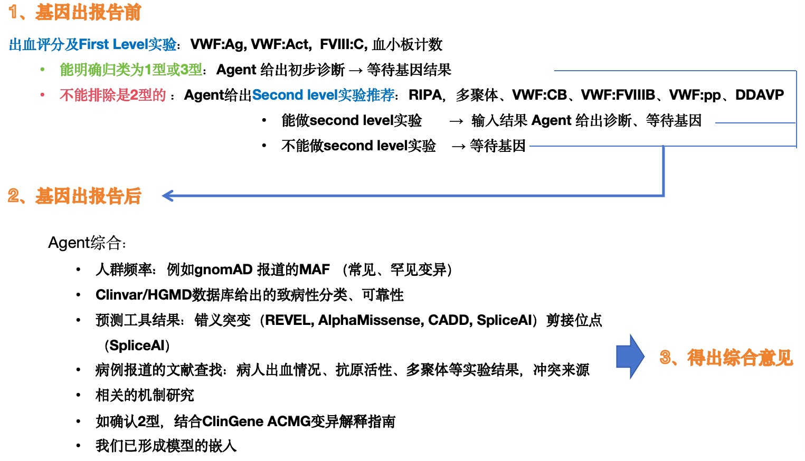
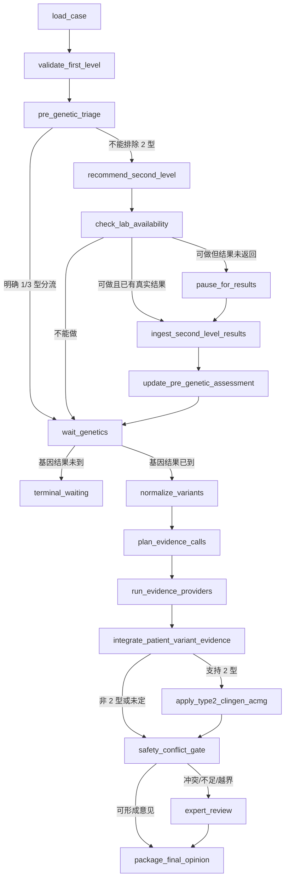

# VWD Clinical Workflow Agent — LangGraph V0 实施方案

**版本：** 2026-08-25（医生修正版流程）

**状态：** 服务器端实现的权威交接文档；与此前草案冲突时，以本文为准。

**定位：** 回顾性研究和临床专家复核工具，不是自主诊断系统。

## 1. V0 要回答的问题

V0 只解决两个边界清晰的问题：

1. 在基因报告前，Agent 能否根据 First Level 结果，正确选择“直接形成初步分流并等待基因”或“不能排除 2 型，需要给出排序后的 Second Level 检查建议”？
2. 在基因报告后，Agent 能否调用允许的证据工具，给出可追溯、可拒答的患者级综合意见，并在证据冲突或不足时升级专家？

首轮评价重点是 **动作空间中的输出是否临床可接受**，其次才是分型是否准确。第二层检查历史上“做了什么”不能自动等同于唯一正确答案；gold label 必须由专家给出 `preferred / acceptable / inappropriate` 集合。

## 2. 医生确认的临床流程



### 2.1 基因报告前

输入的 First Level 检查为：

- `VWF:Ag`
- `VWF:Act`
- `FVIII:C`
- 血小板计数

出血评分在 1 型和 2 型中常缺乏特异性，只作为支持信息；早期数据也可能缺失，或不是诊断/未治疗基线状态。

流程分支：

- 若能明确归为 1 型或 3 型：输出“初步分流 + 依据 + 不确定性”，进入 `WAIT_GENETICS`。
- 只要不能完全排除 2 型：输出按信息价值和本中心可用性排序的 Second Level 检查建议。
- 可选 Second Level 动作：`RIPA`、`VWF_MULTIMER`、`VWF_CB`、`VWF_FVIIIB`、`VWF_PP`、`DDAVP_0_1_4H`。
- 如果检验科具备条件且检查能做：等待真实结果录入；Agent 再更新诊断，然后进入 `WAIT_GENETICS`。
- 如果不能做：记录 `not_available` 及原因，直接进入 `WAIT_GENETICS`。

这里的“能做”表示 **当前检验科是否具备开展条件**，不是“历史病例是否曾经做过”。回顾性 replay 中禁止生成未做检查的虚构结果。

### 2.2 基因报告后

Agent 需要综合：

- gnomAD 人群频率和数据质量；
- ClinVar/HGMD 的致病性分类、review status、时间和冲突；
- 错义预测：REVEL、AlphaMissense、CADD；
- 剪接预测：SpliceAI；
- 病例报告：出血情况、VWF:Ag、VWF 活性、多聚体、RIPA、VWF:CB、FVIII、DDAVP 等；
- 机制研究和功能实验；
- 若最终支持 2 型，结合 VWD ClinGen/ACMG 变异解释指南；
- 本项目已有 AlphaGenome、结构/界面、MD/FoldX 等机制模型输出。

终点不是一个无来源的标签，而是：

- 患者级综合意见；
- 候选分型集合与置信度；
- 支持证据、反证、冲突和缺失；
- 下一步验证动作；
- 完整 provenance 和中间状态；
- 必要时 `EXPERT_REVIEW`。

## 3. V0 技术选择

采用 **LangGraph 单状态图 + Pydantic 结构化 schema + 一个可替换的 LLM adapter + 确定性安全门**。

V0 不做自由式 multi-agent swarm。临床动作空间已经明确，适合用显式状态、条件边和受控工具。这样方便检查中间状态，也与团队其他 LangGraph 项目保持一致。

可参考相邻项目 `TiantanBM_Agent_V9_LangGraph` 的以下实现模式：

- state schema 与 reducer；
- graph builder 和 conditional edge；
- model factory；
- checkpoint、trace recorder 与 run manifest；
- golden-set evaluator。

不得从相邻仓库做运行时 import；只复制通用模式，VWF 项目必须可独立安装和运行。

推荐依赖：

```text
langgraph
langchain-core
pydantic>=2
httpx
pandas
pyarrow
openpyxl        # 仅服务端读取 xlsx；研究交付表已去标识化
tenacity
python-dotenv
pytest
```

LangGraph 官方资料：

- [LangGraph overview](https://docs.langchain.com/oss/python/langgraph/overview)
- [Persistence](https://docs.langchain.com/oss/python/langgraph/persistence)
- [Interrupts / human-in-the-loop](https://docs.langchain.com/oss/python/langgraph/interrupts)

## 4. 状态图



### 4.1 两种运行模式

`retrospective`：

- 只读取历史决策时点真实存在的数据；
- 未做检查返回 `not_observed`，不能合成结果；
- 可评价“推荐是否合理”，不能评价不存在的下游反事实结果。

`interactive`：

- 使用 LangGraph `interrupt()` 暂停；
- 医生/检验科填写检查可用性或真实结果后恢复同一 checkpoint；
- 所有恢复操作记录操作者、时间和变更字段。

## 5. 核心 State schema

建议定义 `VWDWorkflowState(TypedDict)`，字段至少包括：

```python
class VWDWorkflowState(TypedDict, total=False):
    run_id: str
    case_id: str
    episode_id: str
    mode: Literal["retrospective", "interactive"]
    decision_time: datetime | None

    first_level: FirstLevelLabs
    bleeding_context: BleedingContext
    second_level_availability: dict[str, TestAvailability]
    second_level_results: dict[str, ObservedTestResult]

    pre_genetic_hypotheses: list[Hypothesis]
    recommended_actions: list[ClinicalAction]
    missing_critical_fields: list[str]

    variants: list[VariantContext]
    evidence_plan: list[EvidenceQuery]
    evidence_items: list[EvidenceItem]
    mechanism_verdicts: list[ExpertVerdict]

    candidate_subtypes: list[SubtypeVerdict]
    conflicts: list[EvidenceConflict]
    safety_flags: list[SafetyFlag]
    final_opinion: FinalClinicalPackage | None

    trace: list[TraceEvent]
    status: Literal[
        "running", "waiting_second_level", "waiting_genetics",
        "expert_review", "completed", "failed"
    ]
```

### 5.1 First Level 数据规则

- 所有数值必须连同 `unit`、`reference_range`、`collection_time`、`assay_method` 保存；缺失时显式标记。
- 计算 `VWF:Act / VWF:Ag` 前检查分母、单位和时间点是否一致。
- `0` 是观测值，不得自动转换成缺失。
- `NA`、空白、`not_done`、`not_available`、`pending` 必须分开。
- 多变异病例的 First Level 检查属于 patient/episode 层，不能按变异行重复视为独立患者。
- 初版表格缺少单位与参考范围，因此 V0 只能使用经医生确认的配置规则；默认应偏保守并允许 `unresolved`。

### 5.2 分流规则的实现边界

- 决策规则放在版本化 YAML/JSON policy 中，不埋在 prompt。
- `VWF:Act/VWF:Ag < 0.70` 可作为“不能排除 2 型”的研究性默认筛查条件，但必须标记为 `provisional_research_rule`，可由医生配置覆盖。
- “明确 1 型或 3 型”不应仅由 LLM 自由判断。没有单位、参考范围或医生确认规则时，路由到 `unresolved` 或 Second Level，而不是强判。
- 出血评分只作为支持上下文，不作为 1/2 型的单独分流器。

## 6. 动作空间

动作枚举固定为：

```text
COMPLETE_FIRST_LEVEL
RIPA
VWF_MULTIMER
VWF_CB
VWF_FVIIIB
VWF_PP
DDAVP_0_1_4H
WAIT_SECOND_LEVEL_RESULTS
WAIT_GENETICS
EXPERT_REVIEW
```

每个动作输出统一结构：

```json
{
  "action_code": "RIPA",
  "rank": 1,
  "status": "recommended",
  "availability": "unknown",
  "clinical_hypothesis": ["type_2B", "platelet_type_vwd"],
  "expected_discriminator": "区分增强血小板依赖结合表型，并与多聚体/遗传结果共同解释",
  "rationale": "必须引用当前病例中的输入字段，不允许只输出通用指南句子",
  "requires_human_confirmation": true,
  "provenance": ["policy:vwd_second_level_v0@2026-08-25"]
}
```

约束：

- Agent 可以排序多个动作，但不得生成枚举之外的新检查名；新动作必须先经过 schema 和专家评审。
- 每个动作必须给出 `hypothesis → expected discriminator → availability → rationale`。
- `DDAVP` 在 V0 中是诊断/反应评估动作，不扩展到治疗决策。
- 1 型中的 1C 可能需要 DDAVP 细分，但医生已说明可作为后续迭代；V0 先保留动作，不单独建立 1C 自动分支。

## 7. 节点职责

| 节点 | 必须做 | 禁止做 |
|---|---|---|
| `load_case` | 从去标识化表构建 patient、episode、variant 三层对象 | 将 59 行当作 59 个患者 |
| `validate_first_level` | 检查缺失、单位、时间点、0/NA、ratio 可计算性 | 用默认值填补缺失临床结果 |
| `pre_genetic_triage` | 用版本化规则形成候选分流和不确定性 | 由自由文本 prompt 直接定型 |
| `recommend_second_level` | 从固定动作空间排序并给出判别目标 | 固定给所有病例同一 panel |
| `check_lab_availability` | 读取真实可用性或 interrupt | 猜测“医院应该能做” |
| `ingest_second_level_results` | 只接收真实观测结果 | 模拟 counterfactual 数值 |
| `normalize_variants` | HGVS/build/transcript/相位质控 | 猜测 cis/trans |
| `plan_evidence_calls` | 按变异类型和临床问题选择工具 | 无差别调用所有工具 |
| `run_evidence_providers` | 返回统一 EvidenceItem 和失败信息 | 将 API 无结果解释为良性 |
| `integrate_*` | 汇总支持、反证、冲突、适用范围 | 用模型分数覆盖临床证据 |
| `apply_type2_clingen_acmg` | 仅在支持 2 型时调用对应规则 | 把计算预测单独升级为致病 |
| `safety_conflict_gate` | 处理冲突、缺失、越界和拒答 | 为提高 coverage 强制 one-hot |
| `package_final_opinion` | 输出证据卡、动作、限制、trace | 自动写入最终病历或签署 |

## 8. 工具接口和增补路线

所有外部/内部工具实现同一接口：

```python
class EvidenceProvider(Protocol):
    name: str
    version: str

    async def lookup(self, query: EvidenceQuery) -> list[EvidenceItem]: ...
```

`EvidenceItem` 至少包含：

```text
source, source_record_id, query, retrieved_at, source_version,
supports, refutes, conclusion, confidence, evidence_level,
provenance_url, citation, raw_payload_hash, limitations, raw_excerpt_locator
```

禁止把网页摘要或模型生成文字直接当作事实；每条结论必须能回到来源记录。

### 8.1 V0：先把图跑通

实现以下 provider，并允许 fixture/offline cache：

1. `LocalWorkbookProvider`：读取去标识化 patient/variant 输入。
2. `ClinGenERepoProvider`：查询或读取冻结的 VWD VCEP snapshot；原始 UI 入口为 [ClinGen Evidence Repository](https://erepo.genome.network/evrepo/ui/summary/classifications?columns=ep&values=von%20Willebrand%20Disease%20VCEP&matchTypes=exact&matchMode=and&pgSize=25&pg=2)。
3. `LocalGuidelineProvider`：加载本地、版本化的 ClinGen/ACMG 规则配置；对应参考文件为 `ClinGen_ACMG变异解释指南_2N(1).pdf` 和 `ClinGen_ACMG变异解释指南_2A 2B 2M.pdf`。PDF 不应在运行时通过 LLM 任意解读，先由研究团队整理成可审核规则表。
4. `RepoMechanismProvider`：封装当前 `AgenticVWFClassifier`、AlphaGenome、AF3/Boltz/MD/FoldX 已有输出；返回 `supports/refutes/indeterminate` 和适用范围，不直接下临床诊断。
5. `StaticEvidenceFixtureProvider`：用于无网络单元测试。

### 8.2 V0.1：结构化变异证据

- `GnomADProvider`：AF/亚群/coverage/filter/build；
- `ClinVarProvider`：classification、review status、submitter conflict、日期；
- `PredictorProvider`：REVEL、AlphaMissense、CADD、SpliceAI；
- `HGMDProvider`：仅在有机构授权和允许的运行环境中启用；缺少许可时显式返回 `disabled_by_license`。

### 8.3 V0.2：文献检索

- `PubMedProvider`：检索生物医学文献并获取 PMID/摘要；
- `CrossrefMetadataProvider`：用题名、作者、年份或 DOI 解析 DOI、出版信息，并用于去重；
- `FullTextProvider`：仅从 PMC、开放获取或机构许可渠道取得全文；
- `CaseEvidenceExtractor`：抽取患者出血、Ag、Act、FVIII、多聚体、RIPA、VWF:CB、DDAVP、遗传方式和功能实验。

**Crossref 的角色要严格限定：** Crossref 是学术出版物 DOI 与书目信息注册/查询服务，不是临床证据库，也通常不提供论文全文。它适合做 metadata resolution、DOI 校验和文献去重；临床结论仍要回到 PubMed/全文及原始论文。API 可从 `https://api.crossref.org/works` 调用，并应设置含项目名和联系方式的 `User-Agent`、缓存结果、限速和记录查询式。

### 8.4 V0.3：规则和功能证据深化

- ClinGen PP4/PS3 等 criteria candidate 计算器；
- 经专家批准的功能实验 registry；
- 相位/家系共分离工具；
- CNV、VWF pseudogene/exon 28 和技术盲区检查。

## 9. 已有机制模型的嵌入方式

现有 `agentic_vwf_classifier.py` 作为工具而不是外层 orchestrator。包装输出建议：

```python
class ExpertVerdict(BaseModel):
    tool_name: str
    tool_version: str
    variant_id: str
    mechanism_axis: str
    supports: list[str]
    refutes: list[str]
    verdict: Literal["supports", "refutes", "indeterminate", "not_applicable"]
    confidence: float | None
    applicability: str
    limitations: list[str]
    artifact_paths: list[str]
```

必须保留已有失败模式作为安全回归测试：

- R1205H/Vicenza：不能被宽泛结构域规则直接强判 2N；
- V1316M：经典 2B 场景不得被错误推成 2M 后静默通过；
- P1266Q：结构域路由空档必须显式暴露；
- 多变异病例：相位未知时不得自动推断复合机制。

## 10. 数据输入和隐私

本分支提交的数据文件：

```text
data/clinical_agent_pilot/vwd_agentic_workflow_deidentified_v3.xlsx
```

工作簿包含：

- `README_去标识化`
- `Sheet1`：医生修正版流程图
- `1.基因前`：First Level 数据
- `2.基因后`：变异数据

原始姓名已替换为 `CASE_###` 或 `CASE_###_VARIANT_n`，没有保存可逆姓名映射。原始含姓名文件不得提交、不得放入 prompt、trace、cache 或远程日志。

当前数据审计：

- 47 个唯一病例；
- 59 条病例/变异记录；
- 有多变异病例；
- 没有完整 Second Level 结果、专家最终分型或动作 gold set；
- 因此它适合工程 smoke test 和待标注样本集，不足以单独宣称诊断准确率。

## 11. V0 首轮实验

### 11.1 实验臂

| Arm | Controller | 目的 |
|---|---|---|
| A | 确定性 policy baseline | 验证数据、动作和安全门 |
| B | one-shot LLM + 同一结构化输入 | 测试无工具推理基线 |
| C | LangGraph tool-using Agent | 测试工具选择和中间状态 |
| D | C + deterministic conflict/abstention gate | 测试安全门增益 |

所有实验臂使用同一病例时间切片、同一工具 snapshot 和同一输出 schema。

### 11.2 动作 gold set

至少两名 VWD 专家独立标注，每例包含：

```text
required_missing_information
preferred_actions
acceptable_actions
inappropriate_actions
must_not_miss_actions
pre_genetic_subtype_set
final_subtype_set_if_available
abstention_expected
rationale
```

分歧经第三位专家 adjudication。历史实际检查只作为上下文，不直接变成 gold。

### 11.3 主要指标

- `top1_preferred_action_accuracy`
- `topk_acceptable_action_recall`
- `inappropriate_action_rate`
- `must_not_miss_action_recall`
- `critical_missing_information_recall`
- `subtype_set_exact_match` 与 macro-F1（有 gold 时）
- `abstention_sensitivity`、coverage-risk curve
- evidence citation/provenance completeness
- fabricated-result rate（目标 0）
- cross-patient leakage rate（目标 0）
- latency、token 和工具调用成本

### 11.4 数据泄漏控制

- train/dev/test 按患者、家系和同一变异分组；同一变异不能跨集合。
- 所有在线数据库冻结 snapshot、查询时间和 hash。
- 如果 gold label 来自 ClinGen ERepo，则对应样本评测时关闭该直接 lookup，或只做工具检索能力评测，不能把查表结果包装成独立诊断推理准确率。
- prompt、policy 和阈值在看 test 结果前冻结。

### 11.5 V0 可先完成的结果

在 gold set 尚未补齐前，只报告：

- 47/47 病例能否构建 patient state；
- 59 条变异能否链接到正确 patient；
- 缺失值和多变异是否正确识别；
- 所有 episode 是否到达 `waiting_* / expert_review / completed`；
- 推荐动作是否均来自允许枚举；
- 是否存在虚构检查结果；
- trace、provider 版本和来源是否完整。

## 12. 建议代码结构

```text
src/vwd_clinical_agent/
├── __init__.py
├── config.py
├── schemas.py
├── graph.py
├── nodes/
│   ├── ingest.py
│   ├── pre_genetic.py
│   ├── second_level.py
│   ├── variant_normalization.py
│   ├── evidence.py
│   ├── synthesis.py
│   └── safety.py
├── providers/
│   ├── base.py
│   ├── local_workbook.py
│   ├── clingen_erepo.py
│   ├── local_guideline.py
│   ├── repo_mechanism.py
│   └── fixtures.py
├── policies/
│   ├── first_level_v0.yaml
│   └── second_level_actions_v0.yaml
├── prompts/
│   └── synthesis_v0.md
└── tracing.py

scripts/run_vwd_langgraph_v0.py
scripts/evaluate_vwd_langgraph_v0.py
tests/clinical_agent_v0/
fixtures/clinical_agent_v0/
output/vwd_langgraph_v0/
```

## 13. 实施顺序

### Milestone 0 — 数据与 schema

- 建立 patient/episode/variant 三层 schema；
- 读取去标识化工作簿；
- 处理重复患者、多变异、0/NA；
- 建立动作枚举、EvidenceItem、trace event；
- 单元测试覆盖 47 人/59 行。

### Milestone 1 — 可运行状态图

- 实现从 `load_case` 到 `terminal_waiting` 的所有 pre-genetic 节点；
- 同时支持 retrospective 和 interrupt-based interactive mode；
- 用 SQLite checkpointer；
- CLI 可单例和批量运行。

### Milestone 2 — 本地/fixture 证据

- 接入 ClinGen ERepo snapshot、local guideline、repo mechanism；
- provider 统一 schema、retry、timeout、cache、failure state；
- 实现 conflict gate 和 abstention。

### Milestone 3 — 初测与专家标注导出

- 输出每例 JSON、summary CSV、trace JSONL；
- 生成专家 annotation template；
- 跑 47 例 smoke test；
- 汇总失败类型，不声称临床准确率。

## 14. CLI 与输出契约

预期命令：

```bash
python scripts/run_vwd_langgraph_v0.py \
  --workbook data/clinical_agent_pilot/vwd_agentic_workflow_deidentified_v3.xlsx \
  --mode retrospective \
  --provider-profile fixture \
  --output-dir output/vwd_langgraph_v0/smoke

python scripts/evaluate_vwd_langgraph_v0.py \
  --predictions output/vwd_langgraph_v0/smoke/cases.jsonl \
  --gold annotations/vwd_action_gold_v0.csv

pytest -q tests/clinical_agent_v0
```

每次 run 产生：

```text
run_manifest.json
cases.jsonl
summary.csv
trace.jsonl
provider_calls.jsonl
annotation_template.csv
metrics.json                 # 无 gold 时只输出工程指标
```

## 15. Definition of Done

V0 合并前必须满足：

- [ ] 47 个唯一病例、59 条记录读取一致；
- [ ] 原始姓名不出现在代码、fixture、日志或输出；
- [ ] 0 与缺失正确区分；
- [ ] 同一病例多个变异保留 patient link，未知相位不猜；
- [ ] 所有动作来自固定枚举，并带 rank/rationale/availability/provenance；
- [ ] retrospective mode 不生成任何未观测检查结果；
- [ ] interactive mode 可 interrupt/resume，checkpoint 可复现；
- [ ] provider 失败不会被解释成阴性证据；
- [ ] 机制模型只返回证据，不直接覆盖临床结论；
- [ ] 冲突病例触发 abstention/expert review；
- [ ] 每个最终结论可追到 evidence item 和 source record；
- [ ] 无 gold 时不输出误导性的“诊断准确率”；
- [ ] 单元测试、47 例 smoke test 和运行说明通过。

## 16. 给服务器 Agent 的执行指令

1. 先阅读根目录 `AGENTS.md` 和本文。
2. 不提交原始含姓名工作簿；只使用 `data/clinical_agent_pilot/vwd_agentic_workflow_deidentified_v3.xlsx`。
3. 先实现 Milestone 0–2 的最小闭环，不扩展 UI、治疗建议、自由式多 Agent 或大规模 RAG。
4. 保留当前 classifier 和输出文件；通过 adapter 只读接入，不重写现有模型。
5. 所有临床路由规则写入版本化 policy；LLM 只做 schema 内的证据综合和理由生成。
6. 默认运行 fixture/offline profile，在线工具逐个开启；每个工具都有 timeout、cache、snapshot 和 provenance。
7. 完成后提交：代码 diff、测试结果、47 例工程指标、失败案例清单，以及下一批必须补齐的临床字段/工具。
